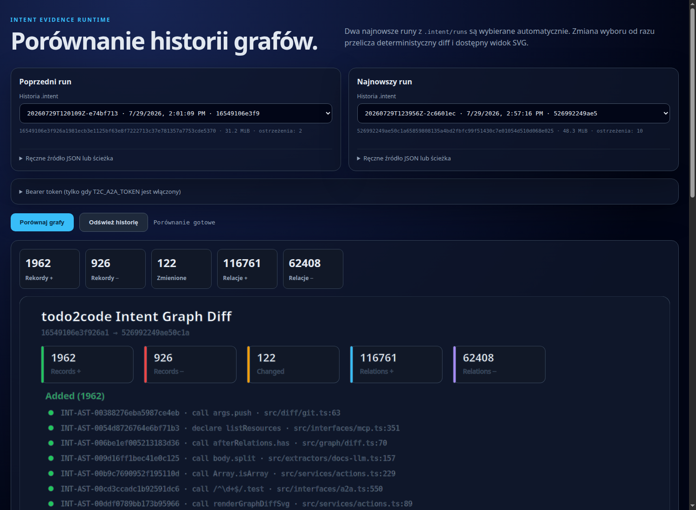

# todo2code (`t2c`)


`todo2code` buduje wspólny **Intent Evidence DSL** z poleceń, historii Git, aktualnego kodu, list zadań, changelogu i dokumentacji. Następnie łączy rekordy w graf przepływu wiedzy, wykrywa rozbieżności i generuje raport dla zespołu.

Projekt działa na Node.js/TypeScript. Wielojęzykowe fakty kodu dostarczają
adaptery TypeScript/JavaScript, Python (`ast`), Go (`go/ast`), Java (JDK
Compiler Tree API) i Rust (`syn`). Toolchainy poza Node są opcjonalne — brak
narzędzia daje jawne ostrzeżenie tylko wtedy, gdy repo zawiera pasujące źródła.
Integracje są dostępne przez CLI, MCP/stdio i A2A v1.0/JSON-RPC.

## Stan projektu

Wersja `0.5.0` ma działającą ścieżkę źródła → kanoniczny DSL → graf →
diagnostyka/Intent vs Reality → raport oraz zamknięty, reviewowalny przepływ
`DSL2TODO`. Kontrakty `t2c.conclusion/v1`, `t2c.todo-proposal/v1` i
`t2c.todo-patch/v1` są walidowane w runtime. CLI, MCP, A2A i wszystkie pięć SDK
potrafią syntetyzować zadania, klasyfikować duplikaty, renderować audytowany
`TODO.patch` i zastosować go wyłącznie po jawnej akceptacji jego hasha. Główny
pipeline może zapisać artefakty review przez `--task-mode`, lecz nigdy sam nie
modyfikuje `TODO.md`.

Aktualna macierz komponentów, wyniki walidacji, znane ograniczenia i projekt
docelowego `DSL2TODO` znajdują się w
[`docs/PROJECT_STATUS.md`](docs/PROJECT_STATUS.md). Priorytety implementacyjne
są utrzymywane w [`TODO.md`](TODO.md).

Komunikację zespołu można zapisywać append-only w `project/<ticket>/`. Główny
pipeline domyślnie zachowuje uczestnika i rolę `human|agent`, porównuje
wypowiedzi z dowodami Git/AST, zapisuje analizę w manifeście i dodaje problemy
do diagnostyki. Claim agenta pozostaje claimem, nigdy faktem wykonania.
Kontrakt plików i gotowe polecenia opisuje
[`docs/TEAM_COMMUNICATION.md`](docs/TEAM_COMMUNICATION.md).
Opcjonalny `project/participants.json` wiąże kanoniczne `human:<id>` i
`agent:<id>` z autorami Git, identyfikatorami A2A oraz aliasami ludzi bez
zgadywania tożsamości na podstawie nazw wyświetlanych.

Praktyczny przebieg CLI — od instalacji przez tryb offline/LLM po diff,
Intent vs Reality, komunikację i automatyczną kontrolę wszystkich przykładów —
opisuje [`docs/CLI_GUIDE.md`](docs/CLI_GUIDE.md).

## Reality vs Intent


## GUI


## Granica LLM

| Etap | Mechanizm | LLM |
|---|---|---:|
| NL → DSL | OpenRouter structured output; jawny fallback heurystyczny/TensorFlow | **tak, domyślnie preferowany** |
| 10 commitów Git → DSL | `git log`, diff, heurystyki symboli | nie |
| TypeScript/JavaScript/Python/Go/Java/Rust AST → DSL | natywne parsery języków; Java Tree API, Rust `syn` | nie |
| TODO + CHANGELOG → DSL | deterministyczna struktura + audytowane wzbogacanie OpenRouter | **tak, domyślnie preferowany** |
| Dokumentacja → DSL | deterministyczny baseline + opcjonalne OpenRouter structured outputs | **opcjonalnie** |
| JSON/YAML/TOML, Docker i CI → DSL | deterministyczny konwerter struktury konfiguracji | nie |
| `project/<ticket>/` komunikacja → DSL + synteza per uczestnik | deterministyczny kontrakt; opcjonalne audytowane wzbogacanie OpenRouter | **opcjonalnie, domyślnie nie** |
| Linkowanie i diagnostyka | deterministyczny graf relacji | nie |
| Graf + diagnostyka → propozycje TODO | OpenRouter structured output; jawny pusty fallback bez pozornej syntezy | **tak** |
| Propozycje → patch → approved apply | deterministyczna walidacja, renderer i atomowy zapis | nie |
| Graf DSL → `t2c.conclusion/v1` → raport NL | OpenRouter structured output; runtime waliduje cytowania przed deterministycznym renderingiem Markdown | **tak** |

Moduły deterministyczne nie importują klienta OpenRouter. Sprawdzają to
`npm run verify:no-llm` oraz bezcykliczny graf modułów `npm run verify:modules`.
Kompletność i brak duplikatów zmiennych sprawdza `npm run verify:env`.
Osobny wymagany job CI instaluje Temurin JDK 17 i uruchamia fixture adaptera
Java z `T2C_REQUIRE_JAVA_TEST=1`, co zamienia brak runtime w błąd zamiast skipu.
Wersjonowany benchmark semantyczny uruchamia `npm run evaluate:gold`; mierzy on
precision/recall ekstrakcji i linkowania, kompletność cytowań DSL2TODO,
deduplikację oraz stabilność dwóch identycznych przebiegów offline.
Rzeczywiste kontrakty NL → DSL oraz graf → wnioski można sprawdzić osobno przez
`npm run live:check`. Kontrola jest opt-in, używa `require-llm`, zapisuje tylko
zredagowany audyt latencji/tokenów/kosztu i bez klucza kończy się jako `SKIPPED`;
wymagane testy offline nigdy nie zależą od dostępności providera.

## Szybki start

Wymagania: Node.js 20+ i Git. Opcjonalne adaptery wymagają odpowiednio Python
3.10+, Go, JDK 17+ lub Cargo/Rust.

```bash
cp .env.example .env
npm install
npm run build
node dist/src/cli.js doctor
```

Zwykłe `npm install` i `make install` instalują wyłącznie rdzeń, dla którego
audyt z 2026-07-29 ma 0 podatności. `make install-tf` instaluje
`@tensorflow/tfjs-node@4.22.0` w odizolowanym `adapters/tensorflow/node_modules`;
jego 8 zgłoszeń nie trafia do drzewa zależności rdzenia. Nie należy stosować
`npm audit fix --force`, ponieważ proponuje niekompatybilny downgrade.

## Demonstracja działania 0.5.0

Poniższa demonstracja używa wersjonowanego repozytorium `examples/`, nie wymaga
klucza ani połączenia z OpenRouter i pozostawia jednoznaczny audyt. Uruchom:

```bash
make demo
```

Polecenie wykonuje kolejno NL → DSL, Git → DSL, AST → DSL, osobne konwertery
TODO/CHANGELOG, deterministyczne konwertery dokumentacji i konfiguracji,
linker, diagnostykę i deterministyczne podsumowanie. Następnie
analizuje komunikację `examples/project/DEMO-101` osobno dla ludzi i agentów.
Wyniki trafiają do `examples/.intent-demo/runs/<run-id>/` oraz
`examples/.intent-communication/`. Stan ostatniego runu można wyświetlić bez
dodatkowych narzędzi:

```bash
node --input-type=module <<'NODE'
import { readFile } from 'node:fs/promises';

const latest = JSON.parse(await readFile('examples/.intent-demo/latest.json', 'utf8'));
const manifest = JSON.parse(await readFile(`examples/${latest.runDirectory}/manifest.json`, 'utf8'));
const graph = JSON.parse(await readFile(`examples/${manifest.files.graph}`, 'utf8'));
const stages = Object.fromEntries(Object.entries(manifest.stages).map(([name, stage]) => [name, {
  status: stage.status,
  effectiveMode: stage.effectiveMode,
  reason: stage.reason?.code ?? null,
  runtimeVersion: stage.runtimeVersion,
}]));
console.log({ status: manifest.status, runtime: manifest.runtime, stages });
console.log({ records: graph.records.length, relations: graph.relations.length, bySource: graph.stats.bySource });
NODE
```

Weryfikowany wynik dla `0.5.0` ma 225 rekordów, w tym 5 wersjonowanych rekordów
komunikacji. Liczba relacji zależy również od
ostatnich 10 commitów Git, dlatego po każdym commicie może się prawidłowo
zmienić i należy odczytać ją z bieżącego grafu:

```text
status: succeeded, runtime: todo2code 0.5.0
naturalLanguageExtraction: succeeded / deterministic
markdownExtraction:        succeeded / deterministic
documentationExtraction:   succeeded / deterministic
summary:                   skipped / deterministic / LLM_DISABLED
records: 225, relations: <zależne od ostatnich 10 commitów>
bySource: agent_log=5, ast=190, changelog=2, document=4, git=10, nl=7, system=4, todo=3
```

Demo jawnie wyłącza LLM dokumentacji i podsumowania, więc nie korzysta z
prywatnego `.env`, sieci ani fallbacku. Każdy audyt zawiera `runtimeVersion`, requested/effective
mode, model, czas, licznik rekordów/ostrzeżeń, powód i bezpieczne parametry;
`apiKey` nigdy nie jest zapisywany.

### Demonstracja z prawdziwym LLM

`make demo` jest celowo deterministyczne. Aby uruchomić pełny pipeline
semantyczny z prawdziwym OpenRouterem i bez możliwości ukrycia błędu
fallbackiem, ustaw klucz w prywatnym `.env` i uruchom:

```bash
make demollm
```

Target używa LLM dla NL, TODO/CHANGELOG, dokumentacji, komunikacji, syntezy
zadań i podsumowania. Kończy się sukcesem tylko wtedy, gdy manifest potwierdza
`succeeded / llm / degraded=false` oraz metadane odpowiedzi dla każdego z tych
sześciu etapów. Szczegółowy przepływ, diagram sekwencji i opis artefaktów są w
[`docs/DEMOLLM.md`](docs/DEMOLLM.md).

Artefakty trafiają do `examples/.intent-demo-llm`. Manifest zawiera model,
provider, response ID, czas, tokeny i koszt, ale nie zawiera klucza, promptu
ani surowej odpowiedzi modelu.

Zweryfikowany przebieg z 2026-07-30:

```text
demollm PASS: 20260730T162248Z-3e22b6d6
naturalLanguageExtraction: google/gemini-3.6-flash · llm
markdownExtraction: qwen/qwen3.7-plus · llm
documentationExtraction: qwen/qwen3.7-plus · llm
communicationAnalysis: deepseek/deepseek-v4-pro · llm
taskSynthesis: qwen/qwen3.7-plus · llm
summary: qwen/qwen3.7-flash · llm
```

Brak klucza, timeout, niepoprawny kontrakt albo zdegradowany etap daje błąd.
Polecenie jest kosztowym testem live; walidacja offline pozostaje w `make demo`
i `npm run verify`.

### A2A, SDK i UI

Uruchom backend:

```bash
npm run a2a
```

Następnie otwórz `http://localhost:8787/ui`. Widok pobierze historię z
`GET /api/runs`, domyślnie wybierze dwa ostatnie kompletne runy i pokaże ich
diff SVG. Stan serwera można sprawdzić przez:

```bash
curl -fsS http://localhost:8787/healthz
# {"status":"ok","service":"todo2code","protocol":"A2A","version":"1.0"}
```

Ten sam runtime jest dostępny przez SDK. Przykład TypeScript wykonuje
deterministyczne NL → DSL i sprawdza audyt, zamiast zakładać, że LLM zadziałał:

```ts
import { Todo2CodeClient } from 'todo2code/sdk';

const client = new Todo2CodeClient({ baseUrl: 'http://localhost:8787' });
const result = await client.extractNl('TASK.md', '.', 'deterministic');

console.log(result.records.length);                 // 10 dla bieżącego TASK.md
console.log(result.audit?.status);                  // succeeded
console.log(result.audit?.effectiveMode);           // deterministic
console.log(result.audit?.runtimeVersion);          // 0.5.0
console.log(result.audit?.configuration);           // bez apiKey
```

Odpowiedniki `extractNl`/`extractDocs` są dostępne również w Pythonie, Go,
Ruście i PHP; kompletne uruchamialne przykłady znajdują się w `sdk/*/examples/`.

### Widoczna awaria LLM

`require-llm` nigdy nie przechodzi po cichu na parser deterministyczny. Ten
kontrolowany test kończy się kodem procesu `1`:

```bash
OPENROUTER_API_KEY= T2C_NL_MODE=require-llm \
node dist/src/cli.js pipeline examples \
  --task task.md --todo TODO.md --changelog CHANGELOG.md \
  --no-docs-llm --out .intent-failure-demo
```

Mimo błędu powstaje `examples/.intent-failure-demo/runs/<run-id>/manifest.json`:

```json
{
  "status": "failed",
  "failure": {
    "stage": "naturalLanguageExtraction",
    "code": "LLM_NOT_CONFIGURED",
    "message": "OPENROUTER_API_KEY is not configured"
  },
  "graphFingerprint": null,
  "files": {}
}
```

Manifest zachowuje pełny audyt nieudanego etapu i wersję runtime, ale nie
publikuje nieistniejącego grafu ani nie zmienia `latest.json`. Przy błędnym ID
modelu kod `LLM_INVALID_MODEL` zawiera dodatkowo aktualną, posortowaną listę ID
z endpointu OpenRouter `/models`.

Pełny pipeline bez połączeń LLM (również wtedy, gdy lokalny `.env` zawiera klucz):

```bash
node dist/src/cli.js pipeline examples \
  --task task.md \
  --todo TODO.md \
  --changelog CHANGELOG.md \
  --docs 'docs/**/*.md' \
  --nl-mode deterministic \
  --markdown-mode deterministic \
  --no-docs-llm \
  --no-summary-llm \
  --out .intent-demo
```

Pełny pipeline z OpenRouter:

```bash
# w .env:
# OPENROUTER_API_KEY=...
# T2C_NL_MODE=prefer-llm
# T2C_MARKDOWN_MODE=prefer-llm
# T2C_COMMUNICATION_MODE=prefer-llm
# OPENROUTER_NL_MODEL=qwen/qwen3.7-plus
# OPENROUTER_MARKDOWN_MODEL=qwen/qwen3.7-plus
# OPENROUTER_COMMUNICATION_MODEL=qwen/qwen3.7-plus
# OPENROUTER_DOC_MODEL=openrouter/auto-beta
# OPENROUTER_SUMMARY_MODEL=openrouter/auto-beta
# OPENROUTER_TASK_MODEL=qwen/qwen3.7-plus

node dist/src/cli.js pipeline /ścieżka/do/repo \
  --task project/ticket-014/README.md \
  --todo TODO.md \
  --changelog CHANGELOG.md \
  --docs 'README.md,docs/**/*.md,project/**/*.md'
```

Tryb ciągły skanuje repozytorium deterministycznie i generuje raport najwyżej
raz na wskazany interwał:

```bash
node dist/src/cli.js watch . \
  --interval 60 \
  --scan-interval 2 \
  --no-docs-llm \
  --out .intent
```

Watcher scala reguły z `.gitignore`, `.dockerignore` i `.intentignore`, pomija
symlinki oraz po raporcie odświeża snapshot, więc własne artefakty nie tworzą
pętli. `t2c init` instaluje bazowy `.intentignore`; `--no-initial-report`
pozwala czekać na pierwszą rzeczywistą zmianę.

## CLI

```text
t2c init [root]
t2c doctor

t2c extract nl <file> [--root .] [--out nl.intent.jsonl]
t2c extract git [--root .] [--count 10] [--out git.intent.jsonl]
t2c extract ast [root] [--out ast.intent.jsonl]
t2c extract config [root] [--out configuration.intent.jsonl]
t2c extract markdown [--todo TODO.md] [--changelog CHANGELOG.md] [--markdown-mode deterministic|prefer-llm|require-llm]
t2c extract docs [--patterns 'README.md,docs/**/*.md']

t2c link <*.intent.jsonl>... --out intent.graph.json
t2c diagnose intent.graph.json --out diagnostics.json
t2c diff before.graph.json after.graph.json --out graph.diff.json --svg graph.diff.svg
t2c diff --mode files before.ts after.ts --svg files.diff.svg --html files.diff.html
t2c diff --mode git . --rev HEAD --svg worktree.diff.svg
t2c reality intent.graph.json --diagnostics diagnostics.json --svg reality.svg --md reality.md
t2c summarize intent.graph.json --diagnostics diagnostics.json --mode prefer-llm --out team-summary.md
t2c watch [root] [--interval 60] [--scan-interval 2] [--task TASK.md|none] [--no-summary-llm] [--no-initial-report]
t2c compare-workspace [root] [--base origin/main] [--task TASK.md] [--docs-llm]
t2c pipeline [root] --task TASK.md --todo TODO.md --changelog CHANGELOG.md
t2c mcp
t2c a2a
```

`extract nl`, `extract markdown`, `extract communication`, `extract docs` i `summarize` mogą korzystać z
OpenRouter. Dla NL, Markdown oraz `summarize` `prefer-llm` jest trybem domyślnym: awaria daje
oznaczony fallback; `require-llm` kończy operację błędem, a `deterministic`
świadomie pomija sieć. W Markdown LLM nie może zmienić checkboxa, lifecycle,
wersji, daty, kategorii ani provenance — wzbogaca wyłącznie semantykę wpisu.
Komunikacja jest domyślnie deterministyczna; `--communication-mode prefer-llm`
tworzy uziemioną syntezę per uczestnik bez oddawania modelowi kontroli nad
identity, rolą, ticketem, źródłem, lifecycle lub klasą epistemiczną.
Dokumentacja bez klucza jest pomijana, a `t2c summarize --mode deterministic`
świadomie nie wykonuje żądania sieciowego. Dawne `--fallback` pozostaje aliasem
zgodności, ale nowe integracje powinny używać `--mode`.
Etap dokumentacji ma osobne limity fragmentu, liczby fragmentów, rekordów,
współbieżności i timeoutu (`T2C_DOC_*`). Najpierw analizuje fragmenty pasujące
do ścieżek, symboli, ticketów i wersji wykrytych w pozostałych źródłach; obcięcie
budżetu zapisuje ostrzeżenie `DOC_CHUNK_BUDGET`.

Każdy rekord `t2c.intent/v1` zawsze zawiera runtime-owned
`metadata.generation`: generator i jego wersję, wersję todo2code, tryb żądany i
użyty oraz stan fallbacku. Rekord LLM dodatkowo wymaga providera, rozstrzygniętego
modelu i response ID; rekord deterministyczny ma te trzy pola jawnie równe
`null`. Brak lub niespójna provenance jest błędem kontraktu, a nie opcjonalną
metadaną. Pełny kształt opisuje [`docs/DSL.md`](docs/DSL.md).

## Origin vs bieżący workspace

Porównanie nie wykonuje checkoutu w katalogu użytkownika. Runtime rozwiązuje bazę
do pełnego SHA, tworzy prywatny tymczasowy Git worktree i uruchamia ten sam
TypeScript pipeline na bazie oraz aktualnym filesystemie:

```bash
node dist/src/cli.js compare-workspace . --base origin/main --out .intent
```

Stan workspace obejmuje lokalne commity, indeks, zmiany unstaged i pliki
untracked. Wynik `t2c.workspace-comparison/v1` zawiera `ahead`/`behind`, listę
zmienionych plików, diff rekordów i relacji oraz zmianę metryk Intent vs Reality:
pełne `alignmentRate`, pokrycie deklarowanej intencji implementacją, udział kodu
posiadającego plan i dokumentację, `gaps` oraz liczniki diagnostyk. Trend może być
`improved`, `regressed`, `mixed` albo `unchanged`. Artefakty trafiają do:

```text
.intent/comparisons/<comparison-id>/
├── comparison.json
├── trend.md
├── intent-diff.svg
├── base.graph.json
├── workspace.graph.json
├── base-reality.md
├── workspace-reality.md
└── workspace-reality.svg
```

Narracyjne podsumowania obu przebiegów są zawsze deterministyczne i nie wykonują
zbędnych zapytań LLM. Dokumentacja LLM po obu stronach jest opcjonalna, ponieważ
podwaja liczbę zapytań i może wprowadzać niedeterministyczny szum. Jeśli podano
`--task`, ekstrakcja NL respektuje `T2C_NL_MODE` i jest osobno audytowana:

```bash
t2c compare-workspace . --base origin/main --docs-llm \
  --docs 'README.md,docs/**/*.md,.intent/runs/<run-id>/team-summary.md' \
  --doc-excludes 'node_modules/**,.git/**,dist/**,TODO.md,CHANGELOG.md'
```

Usunięcie `.intent/**` z `--doc-excludes` jest wymagane tylko dla jawnie
wskazanego historycznego raportu. Nie należy używać szerokiego `.intent/**/*.md`,
bo bieżące raporty zaczęłyby zasilać kolejne runy.

## Tryb obserwowania

`t2c watch` pilnuje lokalnych zmian i generuje świeży raport **najwyżej raz na minutę**:

```bash
node dist/src/cli.js watch . --no-docs-llm --no-summary-llm
```

Istniejący `TASK.md` jest czytany domyślnie; `--task none` wyłącza to źródło.
Opcja `--no-summary-llm` eliminuje sieciowy etap podsumowania z każdego cyklu.

Obowiązują dwa niezależne czasy:

| Opcja | Domyślnie | Znaczenie |
|---|--:|---|
| `--scan-interval` | 2 s | jak szybko zmiana zostaje zauważona |
| `--interval` | 60 s | minimalny odstęp między dwoma raportami |

Zmiany napływające częściej niż `--interval` są kumulowane, a nie kolejkowane: po
upływie progu powstaje jeden raport obejmujący wszystko, co się zmieniło. Raport
nigdy nie startuje, gdy poprzedni jeszcze trwa, więc wolny pipeline nie tworzy
nakładających się runów. `--no-initial-report` pomija raport startowy i czeka na
pierwszą realną zmianę.

Detekcja opiera się na cyklicznym skanowaniu (rozmiar + mtime), a nie na
`fs.watch`, który zależy od platformy i gubi zdarzenia pod obciążeniem. Skan jest
tani, bo katalogi wykluczone są odcinane przed odczytem — `node_modules` nigdy
nie jest czytane.

### Pliki ignorowane

Watch pomija ścieżki wymienione w trzech plikach, czytanych w tej kolejności:

1. `.gitignore`
2. `.dockerignore`
3. `.intentignore`

Późniejszy plik wygrywa, więc `.intentignore` może przywrócić ścieżkę przez `!wzorzec`.

`.intentignore` jest zakładany przez `t2c init` i wyklucza m.in. **wszystkie katalogi
kropkowe** (`.*/` — `.git`, `.idea`, `.venv`, `.github`, `.cache`), katalog `.intent/`
z własnymi raportami, wyjścia buildu (`node_modules/`, `dist/`, `target/`,
`__pycache__/`), lockfile'e oraz logi i pliki tymczasowe.

Składnia jest zgodna z gitignore: komentarze `#`, negacja `!`, końcowy `/`
ogranicza regułę do katalogów, wzorzec bez ukośnika dopasowuje się na dowolnej
głębokości, a `**` przechodzi przez katalogi. Reguły `.dockerignore` są
interpretowane tą samą semantyką, czyli nieco szerzej niż robi to Docker
(kotwiczący wzorce do korzenia kontekstu) — wpisy w tym pliku nazywają wyjścia
buildu, więc wykluczenie zagnieżdżonej kopii jest zamierzone.

## Artefakty runu

```text
.intent/
├── latest.json
└── runs/<run-id>/
    ├── nl.intent.jsonl
    ├── git.intent.jsonl
    ├── ast.intent.jsonl
    ├── todo.intent.jsonl
    ├── changelog.intent.jsonl
    ├── document.intent.jsonl
    ├── intent.graph.json
    ├── diagnostics.json
    ├── summary-conclusions.json
    ├── team-summary.md
    └── manifest.json
```

Każdy rekord zawiera identyfikator, statement, lifecycle, dokładne źródło, hash treści, klasę epistemiczną, confidence i podstawy wnioskowania. Fakty AST mają confidence `1.0`. Rekordy wygenerowane przez LLM są oznaczone jako `llm_inference` i mają pułap zależny od struktury źródła: `0.94` dla wzbogaconych pozycji TODO/CHANGELOG, `0.90` dla prozy NL i `0.85` dla dokumentacji. Żaden z nich nie sięga poziomu obserwacji deterministycznej — pełną tabelę zawiera [`docs/DSL.md`](docs/DSL.md).

`summary-conclusions.json` jest strukturalnym źródłem raportu: zawiera wyłącznie
zwalidowane `t2c.conclusion/v1`, a `team-summary.md` jest jego deterministyczną
projekcją połączoną z sekcjami faktów grafu. `manifest.json` zapisuje również
`runtime.version`, bezpieczny snapshot i
fingerprint konfiguracji oraz statusy `naturalLanguageExtraction`,
`markdownExtraction`, `documentationExtraction` i `summary`. Status runu `degraded` jest pokazywany
w CLI, `GET /api/runs` i UI. Parametry obejmują modele, timeout, temperaturę,
limit tokenów, budżet dokumentów, konfigurację adapterów i tryb structured
output; klucz API nigdy nie jest zapisywany. Odpowiedzi LLM zapisują zwrócone
przez provider `responseId`, resolved model/provider oraz usage/cost. Każdy
audyt ekstrakcji zawiera też wersję runtime i bezpieczne parametry. Każda awaria
pipeline po utworzeniu runu tworzy manifest `status=failed` z kodem i etapem, ale bez
nieistniejącego grafu ani aktualizacji `latest.json`.

## MCP

Uruchomienie serwera stdio:

```bash
node dist/src/interfaces/mcp.js
```

Przykładowa konfiguracja hosta MCP:

```json
{
  "mcpServers": {
    "todo2code": {
      "command": "node",
      "args": ["/absolute/path/todo2code/dist/src/interfaces/mcp.js"],
      "env": {
        "T2C_ROOT": "/absolute/path/workspace",
        "OPENROUTER_API_KEY": "${OPENROUTER_API_KEY}"
      }
    }
  }
}
```

Dostępne narzędzia: `extract_nl`, `extract_git`, `extract_ast`, `extract_config`, `extract_markdown`, `extract_docs`, `extract_communication`, `analyze_communication`, `link`, `diagnose`, `diff`, `diff_files`, `diff_git`, `reality`, `compare_workspace`, `summarize`, `pipeline`, `propose_todo`, `render_todo`, `apply_todo`. Serwer udostępnia też zasoby `t2c://latest/*`, w tym analizę komunikacji i artefakty review/apply.

## Diff DSL, SVG i SDK

Porównanie dwóch grafów zwraca kanoniczny `t2c.diff/v1` z rekordami `added`, `removed`, `changed` i liczbą elementów bez zmian. `--mode files` tworzy deterministyczny diff linii `t2c.filediff/v1`, a `--mode git` stosuje ten sam silnik do rewizji, indeksu lub drzewa roboczego. Dostępne są widoki SVG, HTML oraz unified diff; nie wymagają bibliotek renderujących i nie wykonują treści pochodzącej z plików.

Polecenie `t2c reality` projektuje pojedynczy graf do `t2c.reality/v1`: zestawia deklaracje z taska, TODO i dokumentacji z faktami Git/AST, a rozbieżności pokazuje jako SVG albo tabelę Markdown.

Po uruchomieniu A2A dostępne są:

- frontend: `http://localhost:8787/ui` — pobiera historię z `.intent/runs`, domyślnie wybiera dwa najnowsze kompletne runy i automatycznie pokazuje ich diff SVG;
- historia runów: `GET http://localhost:8787/api/runs`;
- REST diff: `POST http://localhost:8787/api/diff`;
- A2A/MCP action: `diff`.

`POST /api/diff` domyślnie zwraca pełny `t2c.diff/v1`. Ustawienie `compact: true`
zwraca projekcję przeznaczoną dla UI: fingerprinty, liczniki `summary` i opcjonalny
SVG, bez pełnych tablic rekordów oraz relacji.

SDK TypeScript/JavaScript:

```ts
import { Todo2CodeClient } from 'todo2code/sdk';

const client = new Todo2CodeClient({ baseUrl: 'http://localhost:8787' });
const result = await client.diffGraphs(beforeGraph, afterGraph);
console.log(result.diff.summary, result.svg);

const files = await client.diffTextFiles('before.ts', 'after.ts', { includeHtml: true });
const reality = await client.reality(afterGraph);
const comparison = await client.compareWorkspace({ root: '.', base: 'origin/main' });
```

SDK Python nie ma zewnętrznych zależności:

```python
from sdk.python import Todo2CodeClient

client = Todo2CodeClient("http://localhost:8787")
result = client.diff_graphs(before_graph, after_graph)
print(result["diff"]["summary"])

files = client.diff_text_files("before.ts", "after.ts", include_html=True)
reality = client.reality(after_graph)
comparison = client.compare_workspace(root=".", base="origin/main")
```

Można go także zainstalować przez `python3 -m pip install ./sdk/python` i importować jako `todo2code_sdk`.

Uruchamialne przykłady znajdują się w `examples/sdk/typescript.mjs` i `examples/sdk/python.py`.

Pomiary oraz bezpieczne i semantycznie istotne dalsze optymalizacje opisuje `docs/OPTIMIZATION.md`.

### SDK dla pięciu języków

Katalog [`sdk/`](sdk/) zawiera pełne klienty A2A v1.0 udostępniające **wszystkie** akcje runtime'u (nie tylko diff), wraz z typami Intent DSL:

| Język | Katalog | Zależności | Klasa |
|---|---|---|---|
| TypeScript / Node | [`sdk/typescript/`](sdk/typescript/) | brak | `T2CClient` |
| Python 3.10+ | [`sdk/python/`](sdk/python/) | brak | `T2CClient` |
| Go 1.21+ | [`sdk/go/`](sdk/go/) | brak | `todo2code.Client` |
| Rust 1.70+ | [`sdk/rust/`](sdk/rust/) | `serde_json` | `todo2code::Client` |
| PHP 8.1+ | [`sdk/php/`](sdk/php/) | brak | `Todo2Code\Client` |

Każdy język ma uruchamialny przykład w `sdk/<język>/examples/`. Wszystkie przepuszczają ten sam zbiór rekordów przez `link` i muszą otrzymać identyczny fingerprint grafu — to test wierności round-tripu typów. Szczegóły: [`sdk/README.md`](sdk/README.md).

Python udostępnia także lokalny `TypeScriptRuntime`. Nie kopiuje implementacji
DSL do Pythona, tylko uruchamia przez Node.js skompilowany `dist/src/cli.js`:

```bash
make python-wheel
python3 -m pip install .intent-packages/python/todo2code_sdk-*.whl
T2C_TYPESCRIPT_CLI="$PWD/dist/src/cli.js" python3 sdk/python/examples/local_runtime.py
```

Most obsługuje `pipeline`, `diagnose`, graph diff oraz `reality` bez serwera
A2A. Szczegóły i przykład API: [`sdk/python/README.md`](sdk/python/README.md).

## Przykładowe repozytoria

`examples/backend` (HTTP API bez zależności) i `examples/frontend` (panel DOM bez frameworka) to gotowe wejścia dla runtime'u DSL. Każde ma `task.md`, `TODO.md`, `CHANGELOG.md`, `README.md` i `src/`, i celowo zawiera rozbieżności plan↔kod, żeby `t2c reality` miał co pokazać:

```bash
node dist/src/cli.js pipeline examples/backend \
  --task task.md --todo TODO.md --changelog CHANGELOG.md \
  --docs 'README.md' --no-docs-llm --out .intent

node dist/src/cli.js reality examples/backend/.intent/runs/<run-id>/intent.graph.json \
  --diagnostics examples/backend/.intent/runs/<run-id>/diagnostics.json \
  --svg reality.svg --md reality.md
```

## A2A v1.0

```bash
node dist/src/interfaces/a2a.js
```

Agent Card:

```bash
curl http://localhost:8787/.well-known/agent-card.json
```

Uruchomienie pipeline przez `SendMessage`:

```bash
curl -s http://localhost:8787/a2a \
  -H 'Content-Type: application/json' \
  -H 'A2A-Version: 1.0' \
  -d '{
    "jsonrpc":"2.0",
    "id":"req-1",
    "method":"SendMessage",
    "params":{
      "message":{
        "messageId":"msg-1",
        "role":"ROLE_USER",
        "parts":[{
          "data":{
            "action":"pipeline",
            "input":{
              "root":".",
              "task":"TASK.md",
              "includeDocsLlm":false
            }
          },
          "mediaType":"application/json"
        }]
      }
    }
  }'
```

Interfejs A2A jest v1-only: nagłówek `A2A-Version: 1.0` (albo parametr zapytania o tej nazwie) jest wymagany. Brak nagłówka oznacza protokół 0.3 i jest odrzucany kodem `-32009`; aliasy metod v0.3 nie są przyjmowane. `GetTask` i `CancelTask` zwracają task bez wrappera, a `ListTasks` obsługuje filtry, cursor pagination, `historyLength` oraz `includeArtifacts` (domyślnie `false`).

Ustawienie `T2C_A2A_TOKEN` włącza Bearer authentication i izolację tasków według principalu. Domyślnie MCP i A2A nie mogą analizować ścieżek poza `T2C_ROOT`; wyjątek wymaga jawnego `T2C_ALLOW_OUTSIDE_ROOT=true`.

Domyślny task store A2A pozostaje pamięciowy. Aby zachować taski po restarcie
i współdzielić je między replikami używającymi tego samego wolumenu, ustaw:

```dotenv
T2C_A2A_TASK_STORE=.intent/a2a-tasks.json
```

Snapshot jest zapisywany atomowo z uprawnieniami `0600`. Blokada katalogowa
chroni idempotency i aktualizacje między procesami; ścieżka podlega tym samym
ograniczeniom `T2C_ROOT` co pozostałe operacje runtime'u.

## OpenRouter

Runtime używa `POST /api/v1/chat/completions`. Ekstraktory NL i dokumentacji
oraz synteza zadań proszą o `response_format: json_schema`, wymuszają
`provider.require_parameters`, a przy braku wsparcia endpointu próbują
kontrolowanego fallbacku `json_object`. Opcjonalny plugin `response-healing`
jest sterowany przez `.env`. Osobny `OPENROUTER_TASK_MODEL` wybiera model dla
graf + diagnostyka → zadania i domyślnie dziedziczy `OPENROUTER_MODEL`.

Klucz nie jest zapisywany do artefaktów, logów ani odpowiedzi MCP/A2A. `doctor` pokazuje jedynie status `configured/not configured`.

Ten sam etap jest dostępny przez CLI i publiczne API TypeScript:

```bash
node dist/src/cli.js propose-todo .intent/runs/<run>/intent.graph.json \
  --diagnostics .intent/runs/<run>/diagnostics.json \
  --mode require-llm --out .intent/runs/<run>/task-synthesis.json
```

Odpowiedniki `render-todo` i `apply-todo` opisuje
[`docs/CLI_GUIDE.md`](docs/CLI_GUIDE.md). API biblioteki pozostaje dostępne:

```ts
import { readFile } from 'node:fs/promises';
import { getConfig, synthesizeTodoProposals } from 'todo2code';

const graph = JSON.parse(await readFile('.intent/runs/<run>/intent.graph.json', 'utf8'));
const diagnostics = JSON.parse(await readFile('.intent/runs/<run>/diagnostics.json', 'utf8'));
const result = await synthesizeTodoProposals(graph, diagnostics, getConfig(), 'require-llm');
console.log(JSON.stringify(result, null, 2));
```

W `prefer-llm` awaria daje puste `conclusions`/`proposals` i osobne
`rawDiagnosticActions`; nie są one oznaczane jako wynik semantycznej syntezy.

### Review i zastosowanie `TODO.patch`

`writeTodoPatchArtifacts` przyjmuje wyłącznie zwalidowane `newProposalIds` i
zapisuje obok siebie czytelny `TODO.patch` oraz audyt `TODO.patch.json`.
Renderer zachowuje kolejność zależność-przed-zadaniem, grupuje kolejne zadania
według P0–P3 i pokazuje kryteria akceptacji, targety, zależności oraz wszystkie
ID dowodów. Nie modyfikuje źródłowego `TODO.md`.

```ts
import { applyTodoPatch, writeTodoPatchArtifacts } from 'todo2code';

const written = await writeTodoPatchArtifacts({
  directory: '.intent/runs/<run>',
  todoPath: 'TODO.md',
  todoContent,
  graph,
  diagnostics,
  conclusions: result.conclusions,
  proposals: result.proposals,
  validation: result.validation,
  synthesisAudit: result.audit,
});

// Człowiek najpierw przegląda written.patchPath i kopiuje hash z audytu.
await applyTodoPatch({
  todoPath: 'TODO.md',
  patchPath: written.patchPath,
  auditPath: written.auditPath,
  receiptPath: '.intent/runs/<run>/TODO.patch.receipt.json',
  approval: { actor: 'reviewer@example.com', patchHash: written.artifact.renderedPatchHash },
});
```

Apply odrzuca brak lub błędny hash akceptacji, zmieniony `TODO.md` i zmieniony
patch. Aktualizacja `TODO.md` używa pliku tymczasowego, `fsync` i atomowego
rename, zachowując dotychczasowe prawa pliku. Receipt zapisuje aktora, czas,
hash źródła, patcha i wyniku. Powtórzenie tej samej operacji zwraca wynik
idempotentny bez ponownego dopisania. Jeżeli proces zakończy się po rename, ale
przed zapisem receipt, następne wywołanie rozpozna dokładny suffix i hash
oryginału, po czym bezpiecznie odtworzy receipt. Każda inna zmiana wymaga
ponownej syntezy i przeglądu.

## Opcjonalny TensorFlow

NL i Git zawsze mają deterministyczny klasyfikator słownikowy. Lokalny model TensorFlow można włączyć przez:

```dotenv
T2C_ENABLE_TF=true
T2C_TF_MODEL_PATH=/models/action/model.json
T2C_TF_MODULE_PATH=adapters/tensorflow/node_modules/@tensorflow/tfjs-node/dist/index.js
T2C_TF_LABELS=add,fix,remove,refactor,test,document,configure,analyze,unknown
```

Najpierw należy wykonać `make install-tf`. Obok `model.json` musi znajdować się
`vocabulary.json`, czyli mapa token → indeks. Model powinien przyjmować tensor
`[1, vocabulary_size]` i zwracać rozkład klas. Przy braku adaptera lub błędzie
modelu runtime wraca do heurystyk i zapisuje `heuristic_fallback:<powód>`.

## Docker i Makefile

```bash
make setup
make verify
make demo
make docker-build
make docker-smoke
make docker-up
```

Jedynym plikiem Compose jest `docker-compose.yml`. Montuje repozytorium
`T2C_WORKSPACE` pod `/workspace`, wystawia kontenerowy port `8787` jako
`T2C_DOCKER_HOST_PORT` i zachowuje `.intent` w analizowanym workspace. Przy
zmianie portu hosta należy odpowiednio ustawić również publiczny
`T2C_A2A_PUBLIC_URL` oraz kliencki `T2C_A2A_URL`.
`DOCKER_SMOKE_IMAGE` pozwala zmienić lokalny tag używany przez smoke test.

## Diagnostyka

Wbudowane klasy obejmują m.in.:

- `PLANNED_NOT_IMPLEMENTED`;
- `IMPLEMENTED_NOT_PLANNED`;
- `IMPLEMENTED_NOT_DOCUMENTED`;
- `CHANGELOG_WITHOUT_IMPLEMENTATION`;
- `CONFLICTING_INTENT`;
- `AMBIGUOUS_REQUIREMENT`;
- `UNLINKED_RECORD`.

`ALIGNED` oznacza wyłącznie brak wykrytej blokującej rozbieżności w dostępnych źródłach. Nie nadaje automatycznie statusu `DONE` i nie zastępuje decyzji człowieka.

## Dokumentacja projektu

- [`docs/PIPELINE_DSL_NL.md`](docs/PIPELINE_DSL_NL.md) — diagramy krok po kroku: zbiory → konwertery → Intent DSL → graf → wnioski → raport NL;
- [`docs/ARCHITECTURE.md`](docs/ARCHITECTURE.md) — komponenty i przepływ;
- [`docs/DSL.md`](docs/DSL.md) — model danych i relacje;
- [`docs/REQUIREMENTS.md`](docs/REQUIREMENTS.md) — śledzenie wymagań;
- [`docs/PROTOCOLS.md`](docs/PROTOCOLS.md) — MCP, A2A i OpenRouter;
- [`docs/SECURITY.md`](docs/SECURITY.md) — granice dostępu i sekretów;
- [`docs/VALIDATION.md`](docs/VALIDATION.md) — zakres oraz wynik walidacji paczki;
- [`docs/OPTIMIZATION.md`](docs/OPTIMIZATION.md) — zmierzone wąskie gardła runtime'u i zastosowane usprawnienia;
- [`sdk/README.md`](sdk/README.md) — SDK dla TypeScript, Pythona, Go, Rusta i PHP;
- [`docs/reference/original-monitoring-design.md`](docs/reference/original-monitoring-design.md) — materiał wejściowy dostarczony do projektu.

## Licencja

Projekt jest udostępniany na warunkach [Apache License 2.0](LICENSE).
