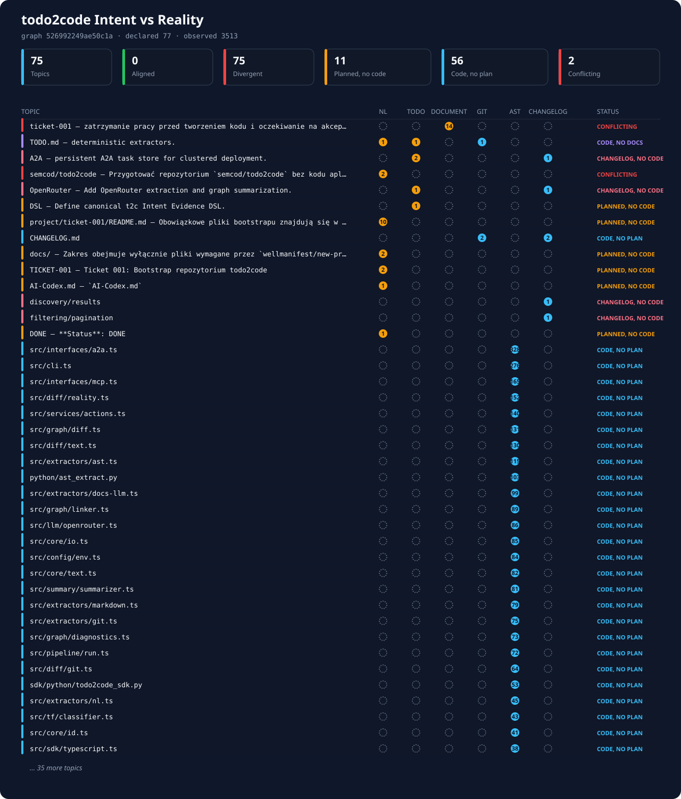

# todo2code (`t2c`)

`todo2code` buduje wspólny **Intent Evidence DSL** z poleceń, historii Git, aktualnego kodu, list zadań, changelogu i dokumentacji. Następnie łączy rekordy w graf przepływu wiedzy, wykrywa rozbieżności i generuje raport dla zespołu.

Projekt działa na Node.js/TypeScript. Python i Go są używane wyłącznie jako małe adaptery do swoich standardowych parserów (`ast` oraz `go/ast`); żaden z nich nie ma zewnętrznych zależności. Oba toolchainy są opcjonalne — ich brak degraduje się do ostrzeżenia. Integracje są dostępne przez CLI, MCP/stdio i A2A v1.0/JSON-RPC.

## Reality vs Intent


## GUI


## Granica LLM

| Etap | Mechanizm | LLM |
|---|---|---:|
| NL → DSL | reguły, słowniki, heurystyki; opcjonalny lokalny TensorFlow | nie |
| 10 commitów Git → DSL | `git log`, diff, heurystyki symboli | nie |
| TypeScript/JavaScript/Python/Go AST → DSL | TypeScript Compiler API, Python `ast`, Go `go/ast` | nie |
| TODO + CHANGELOG → DSL | deterministyczny parser Markdown | nie |
| Dokumentacja → DSL | OpenRouter structured outputs | **tak** |
| Linkowanie i diagnostyka | deterministyczny graf relacji | nie |
| Graf DSL → raport NL | OpenRouter; wejściem jest tylko graf i diagnostyka | **tak** |

Moduły deterministyczne nie importują klienta OpenRouter. Sprawdza to `npm run verify:no-llm`.

## Szybki start

Wymagania: Node.js 20+, npm, Git i opcjonalnie Python 3.10+.

```bash
cp .env.example .env
npm install
npm run build
node dist/src/cli.js doctor
```

Pełny pipeline bez połączeń LLM:

```bash
node dist/src/cli.js pipeline examples \
  --task task.md \
  --todo TODO.md \
  --changelog CHANGELOG.md \
  --docs 'docs/**/*.md' \
  --no-docs-llm \
  --out .intent-demo
```

Pełny pipeline z OpenRouter:

```bash
# w .env:
# OPENROUTER_API_KEY=...
# OPENROUTER_DOC_MODEL=openrouter/auto-beta
# OPENROUTER_SUMMARY_MODEL=openrouter/auto-beta

node dist/src/cli.js pipeline /ścieżka/do/repo \
  --task project/ticket-014/README.md \
  --todo TODO.md \
  --changelog CHANGELOG.md \
  --docs 'README.md,docs/**/*.md,project/**/*.md'
```

## CLI

```text
t2c init [root]
t2c doctor

t2c extract nl <file> [--root .] [--out nl.intent.jsonl]
t2c extract git [--root .] [--count 10] [--out git.intent.jsonl]
t2c extract ast [root] [--out ast.intent.jsonl]
t2c extract markdown [--todo TODO.md] [--changelog CHANGELOG.md]
t2c extract docs [--patterns 'README.md,docs/**/*.md']

t2c link <*.intent.jsonl>... --out intent.graph.json
t2c diagnose intent.graph.json --out diagnostics.json
t2c diff before.graph.json after.graph.json --out graph.diff.json --svg graph.diff.svg
t2c diff --mode files before.ts after.ts --svg files.diff.svg --html files.diff.html
t2c diff --mode git . --rev HEAD --svg worktree.diff.svg
t2c reality intent.graph.json --diagnostics diagnostics.json --svg reality.svg --md reality.md
t2c summarize intent.graph.json --diagnostics diagnostics.json --out team-summary.md
t2c pipeline [root] --task TASK.md --todo TODO.md --changelog CHANGELOG.md
t2c mcp
t2c a2a
```

`extract docs` i `summarize` wymagają `OPENROUTER_API_KEY`. Pipeline może działać bez klucza: dokumentacja LLM zostaje jawnie pominięta, a raport może użyć oznaczonego fallbacku deterministycznego.

## Artefakty runu

```text
.intent/
├── latest.json
└── runs/<run-id>/
    ├── nl.intent.jsonl
    ├── git.intent.jsonl
    ├── ast.intent.jsonl
    ├── todo.intent.jsonl
    ├── changelog.intent.jsonl
    ├── document.intent.jsonl
    ├── intent.graph.json
    ├── diagnostics.json
    ├── team-summary.md
    └── manifest.json
```

Każdy rekord zawiera identyfikator, statement, lifecycle, dokładne źródło, hash treści, klasę epistemiczną, confidence i podstawy wnioskowania. Fakty AST mają confidence `1.0`; rekordy z dokumentacji LLM są oznaczone jako `llm_inference` i mają confidence maksymalnie `0.85`.

## MCP

Uruchomienie serwera stdio:

```bash
node dist/src/interfaces/mcp.js
```

Przykładowa konfiguracja hosta MCP:

```json
{
  "mcpServers": {
    "todo2code": {
      "command": "node",
      "args": ["/absolute/path/todo2code/dist/src/interfaces/mcp.js"],
      "env": {
        "T2C_ROOT": "/absolute/path/workspace",
        "OPENROUTER_API_KEY": "${OPENROUTER_API_KEY}"
      }
    }
  }
}
```

Dostępne narzędzia: `extract_nl`, `extract_git`, `extract_ast`, `extract_markdown`, `extract_docs`, `link`, `diagnose`, `diff`, `diff_files`, `diff_git`, `reality`, `summarize`, `pipeline`. Serwer udostępnia też zasoby `t2c://latest/*`.

## Diff DSL, SVG i SDK

Porównanie dwóch grafów zwraca kanoniczny `t2c.diff/v1` z rekordami `added`, `removed`, `changed` i liczbą elementów bez zmian. `--mode files` tworzy deterministyczny diff linii `t2c.filediff/v1`, a `--mode git` stosuje ten sam silnik do rewizji, indeksu lub drzewa roboczego. Dostępne są widoki SVG, HTML oraz unified diff; nie wymagają bibliotek renderujących i nie wykonują treści pochodzącej z plików.

Polecenie `t2c reality` projektuje pojedynczy graf do `t2c.reality/v1`: zestawia deklaracje z taska, TODO i dokumentacji z faktami Git/AST, a rozbieżności pokazuje jako SVG albo tabelę Markdown.

Po uruchomieniu A2A dostępne są:

- frontend: `http://localhost:8787/ui` — pobiera historię z `.intent/runs`, domyślnie wybiera dwa najnowsze kompletne runy i automatycznie pokazuje ich diff SVG;
- historia runów: `GET http://localhost:8787/api/runs`;
- REST diff: `POST http://localhost:8787/api/diff`;
- A2A/MCP action: `diff`.

`POST /api/diff` domyślnie zwraca pełny `t2c.diff/v1`. Ustawienie `compact: true`
zwraca projekcję przeznaczoną dla UI: fingerprinty, liczniki `summary` i opcjonalny
SVG, bez pełnych tablic rekordów oraz relacji.

SDK TypeScript/JavaScript:

```ts
import { Todo2CodeClient } from 'todo2code/sdk';

const client = new Todo2CodeClient({ baseUrl: 'http://localhost:8787' });
const result = await client.diffGraphs(beforeGraph, afterGraph);
console.log(result.diff.summary, result.svg);

const files = await client.diffTextFiles('before.ts', 'after.ts', { includeHtml: true });
const reality = await client.reality(afterGraph);
```

SDK Python nie ma zewnętrznych zależności:

```python
from sdk.python import Todo2CodeClient

client = Todo2CodeClient("http://localhost:8787")
result = client.diff_graphs(before_graph, after_graph)
print(result["diff"]["summary"])

files = client.diff_text_files("before.ts", "after.ts", include_html=True)
reality = client.reality(after_graph)
```

Można go także zainstalować przez `python3 -m pip install ./sdk/python` i importować jako `todo2code_sdk`.

Uruchamialne przykłady znajdują się w `examples/sdk/typescript.mjs` i `examples/sdk/python.py`.

Pomiary oraz bezpieczne i semantycznie istotne dalsze optymalizacje opisuje `docs/OPTIMIZATION.md`.

### SDK dla pięciu języków

Katalog [`sdk/`](sdk/) zawiera pełne klienty A2A v1.0 udostępniające **wszystkie** akcje runtime'u (nie tylko diff), wraz z typami Intent DSL:

| Język | Katalog | Zależności | Klasa |
|---|---|---|---|
| TypeScript / Node | [`sdk/typescript/`](sdk/typescript/) | brak | `T2CClient` |
| Python 3.10+ | [`sdk/python/`](sdk/python/) | brak | `T2CClient` |
| Go 1.21+ | [`sdk/go/`](sdk/go/) | brak | `todo2code.Client` |
| Rust 1.70+ | [`sdk/rust/`](sdk/rust/) | `serde_json` | `todo2code::Client` |
| PHP 8.1+ | [`sdk/php/`](sdk/php/) | brak | `Todo2Code\Client` |

Każdy język ma uruchamialny przykład w `sdk/<język>/examples/`. Wszystkie przepuszczają ten sam zbiór rekordów przez `link` i muszą otrzymać identyczny fingerprint grafu — to test wierności round-tripu typów. Szczegóły: [`sdk/README.md`](sdk/README.md).

Python udostępnia także lokalny `TypeScriptRuntime`. Nie kopiuje implementacji
DSL do Pythona, tylko uruchamia przez Node.js skompilowany `dist/src/cli.js`:

```bash
make python-wheel
python3 -m pip install .intent-packages/python/todo2code_sdk-*.whl
T2C_TYPESCRIPT_CLI="$PWD/dist/src/cli.js" python3 sdk/python/examples/local_runtime.py
```

Most obsługuje `pipeline`, `diagnose`, graph diff oraz `reality` bez serwera
A2A. Szczegóły i przykład API: [`sdk/python/README.md`](sdk/python/README.md).

## Przykładowe repozytoria

`examples/backend` (HTTP API bez zależności) i `examples/frontend` (panel DOM bez frameworka) to gotowe wejścia dla runtime'u DSL. Każde ma `task.md`, `TODO.md`, `CHANGELOG.md`, `README.md` i `src/`, i celowo zawiera rozbieżności plan↔kod, żeby `t2c reality` miał co pokazać:

```bash
node dist/src/cli.js pipeline examples/backend \
  --task task.md --todo TODO.md --changelog CHANGELOG.md \
  --docs 'README.md' --no-docs-llm --out .intent

node dist/src/cli.js reality examples/backend/.intent/runs/<run-id>/intent.graph.json \
  --diagnostics examples/backend/.intent/runs/<run-id>/diagnostics.json \
  --svg reality.svg --md reality.md
```

## A2A v1.0

```bash
node dist/src/interfaces/a2a.js
```

Agent Card:

```bash
curl http://localhost:8787/.well-known/agent-card.json
```

Uruchomienie pipeline przez `SendMessage`:

```bash
curl -s http://localhost:8787/a2a \
  -H 'Content-Type: application/json' \
  -H 'A2A-Version: 1.0' \
  -d '{
    "jsonrpc":"2.0",
    "id":"req-1",
    "method":"SendMessage",
    "params":{
      "message":{
        "messageId":"msg-1",
        "role":"ROLE_USER",
        "parts":[{
          "data":{
            "action":"pipeline",
            "input":{
              "root":".",
              "task":"TASK.md",
              "includeDocsLlm":false
            }
          },
          "mediaType":"application/json"
        }]
      }
    }
  }'
```

Interfejs A2A jest v1-only: nagłówek `A2A-Version: 1.0` (albo parametr zapytania o tej nazwie) jest wymagany. Brak nagłówka oznacza protokół 0.3 i jest odrzucany kodem `-32009`; aliasy metod v0.3 nie są przyjmowane. `GetTask` i `CancelTask` zwracają task bez wrappera, a `ListTasks` obsługuje filtry, cursor pagination, `historyLength` oraz `includeArtifacts` (domyślnie `false`).

Ustawienie `T2C_A2A_TOKEN` włącza Bearer authentication i izolację tasków według principalu. Domyślnie MCP i A2A nie mogą analizować ścieżek poza `T2C_ROOT`; wyjątek wymaga jawnego `T2C_ALLOW_OUTSIDE_ROOT=true`.

## OpenRouter

Runtime używa `POST /api/v1/chat/completions`. Ekstraktor dokumentacji prosi o `response_format: json_schema`, wymusza `provider.require_parameters`, a przy braku wsparcia endpointu próbuje kontrolowanego fallbacku `json_object`. Opcjonalny plugin `response-healing` jest sterowany przez `.env`.

Klucz nie jest zapisywany do artefaktów, logów ani odpowiedzi MCP/A2A. `doctor` pokazuje jedynie status `configured/not configured`.

## Opcjonalny TensorFlow

NL i Git zawsze mają deterministyczny klasyfikator słownikowy. Lokalny model TensorFlow można włączyć przez:

```dotenv
T2C_ENABLE_TF=true
T2C_TF_MODEL_PATH=/models/action/model.json
T2C_TF_LABELS=add,fix,remove,refactor,test,document,configure,analyze,unknown
```

Obok `model.json` musi znajdować się `vocabulary.json`, czyli mapa token → indeks. Model powinien przyjmować tensor `[1, vocabulary_size]` i zwracać rozkład klas. Przy błędzie modelu runtime wraca do heurystyk i zapisuje podstawę fallbacku w rekordzie.

## Docker i Makefile

```bash
make setup
make verify
make demo
make docker-build
make docker-up
```

`docker compose` montuje repozytorium pod `/workspace`, uruchamia A2A na porcie `8787` i zachowuje `.intent` w analizowanym workspace.

## Diagnostyka

Wbudowane klasy obejmują m.in.:

- `PLANNED_NOT_IMPLEMENTED`;
- `IMPLEMENTED_NOT_PLANNED`;
- `IMPLEMENTED_NOT_DOCUMENTED`;
- `CHANGELOG_WITHOUT_IMPLEMENTATION`;
- `CONFLICTING_INTENT`;
- `AMBIGUOUS_REQUIREMENT`;
- `UNLINKED_RECORD`.

`ALIGNED` oznacza wyłącznie brak wykrytej blokującej rozbieżności w dostępnych źródłach. Nie nadaje automatycznie statusu `DONE` i nie zastępuje decyzji człowieka.

## Dokumentacja projektu

- [`docs/ARCHITECTURE.md`](docs/ARCHITECTURE.md) — komponenty i przepływ;
- [`docs/DSL.md`](docs/DSL.md) — model danych i relacje;
- [`docs/REQUIREMENTS.md`](docs/REQUIREMENTS.md) — śledzenie wymagań;
- [`docs/PROTOCOLS.md`](docs/PROTOCOLS.md) — MCP, A2A i OpenRouter;
- [`docs/SECURITY.md`](docs/SECURITY.md) — granice dostępu i sekretów;
- [`docs/VALIDATION.md`](docs/VALIDATION.md) — zakres oraz wynik walidacji paczki;
- [`docs/OPTIMIZATION.md`](docs/OPTIMIZATION.md) — zmierzone wąskie gardła runtime'u i zastosowane usprawnienia;
- [`sdk/README.md`](sdk/README.md) — SDK dla TypeScript, Pythona, Go, Rusta i PHP;
- [`docs/reference/original-monitoring-design.md`](docs/reference/original-monitoring-design.md) — materiał wejściowy dostarczony do projektu.
