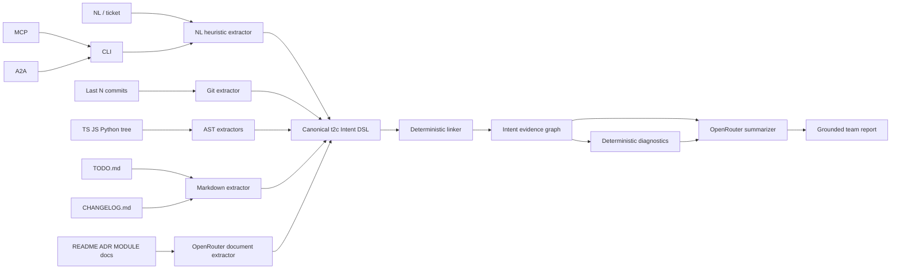

# Architektura todo2code

## Przepływ

## Komponenty

### `src/extractors/nl.ts`

Segmentuje linie i zdania, rozpoznaje modalność, negację, akcję, obiekt, ścieżki, symbole, tickety i wersje. Może użyć lokalnego klasyfikatora TensorFlow, lecz nigdy nie korzysta z OpenRouter.

### `src/extractors/git.ts`

Czyta ostatnie N commitów, autorów, timestampy, message/body, statusy plików, numstat i diff. Każdy commit ma oddzielny rekord; commit dokumentacyjny nie znika, tylko dostaje `docOnly=true`.

### `src/extractors/ast.ts` i `python/ast_extract.py`

TypeScript Compiler API dostarcza fakty o importach, eksportach, symbolach i wywołaniach. Python używa standardowego `ast`. AST jest faktem o stanie implementacji, a nie intencją człowieka.

### `src/extractors/markdown.ts`

TODO i CHANGELOG są parsowane osobno. Checkbox określa lifecycle planu, a wersja i kategoria changelogu określają claim wydania.

### `src/extractors/docs-llm.ts`

Dokumentacja jest dzielona według nagłówków i limitu znaków. OpenRouter zwraca strukturalny JSON. Runtime nadpisuje źródło, ogranicza zakres linii i confidence, dlatego model nie może podmienić provenance.

### `src/graph/linker.ts`

Kandydaci są indeksowani po ticketach, symbolach, ścieżkach i tokenach obiektu. Linker przyznaje punkty za dowody i tworzy relacje deterministycznie. Nie wykonuje zapytań sieciowych.

### `src/graph/diagnostics.ts`

Porównuje plany, claimy Git/CHANGELOG i fakty AST. Wynik nie zatwierdza pracy — identyfikuje ryzyka i wymagane decyzje.

### `src/summary/summarizer.ts`

Do OpenRouter trafia wyłącznie skompaktowany graf i diagnostyka. Surowy kod, diff i pełne dokumenty nie są wejściem summarizera.

## Zaufanie do źródeł

Rekord nie jest „prawdą” bez kontekstu epistemicznego:

1. `declaration` — polecenie/ticket;
2. `plan` — TODO;
3. `fact` — AST;
4. `claim` — Git i CHANGELOG;
5. `llm_inference` — interpretacja dokumentacji przez OpenRouter.

System zachowuje różnicę między planem, twierdzeniem autora i stanem kodu. Relacja nie zmienia klasy epistemicznej rekordów.

## Determinizm

Identyfikatory i fingerprint grafu bazują na SHA-256 stabilnie serializowanych danych. `observedAt` i timestamp runu mogą się zmieniać; treść rekordów dla tego samego wejścia pozostaje stabilna. TensorFlow jest opcjonalny, dlatego powtarzalność wymaga przypiętego modelu i słownika.
