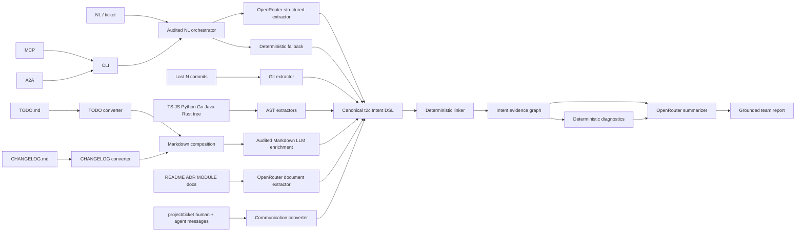

# Architektura todo2code

## Przepływ

## Komponenty

### `src/extractors/nl-llm.ts` i `src/extractors/nl.ts`

Orkiestrator LLM ma trzy jawne tryby: `deterministic`, `prefer-llm` i
`require-llm`. Structured output jest normalizowany przez runtime, nie może
podnieść lifecycle ponad `proposed` i zapisuje model oraz provenance. W
`prefer-llm` błąd dostaje stabilny kod (`LLM_TIMEOUT`, `LLM_INVALID_MODEL`, …),
a deterministyczny parser przejmuje operację z `degraded=true`. Sam `nl.ts`
segmentuje tekst i rozpoznaje modalność, negację, akcję, obiekt oraz targets;
może użyć lokalnego TensorFlow, lecz nie importuje OpenRouter.

### `src/extractors/git.ts`

Czyta ostatnie N commitów, autorów, timestampy, message/body, statusy plików, numstat i diff. Każdy commit ma oddzielny rekord; commit dokumentacyjny nie znika, tylko dostaje `docOnly=true`.

### Wielojęzykowe adaptery AST

TypeScript Compiler API dostarcza fakty o importach, eksportach, symbolach i
wywołaniach. Python używa standardowego `ast`, Go `go/ast`, Java oficjalnego
JDK Compiler Tree API, a Rust parsera `syn` w izolowanym helperze Cargo. Każdy
adapter zwraca tę samą kopertę JSON `{facts, warnings}`, więc rdzeń nie zależy
od modelu AST konkretnego języka. Adapter nie uruchamia toolchainu, gdy nie ma
pasujących plików; brak dostępnego toolchainu daje ostrzeżenie, nie błąd całego
runu. AST jest faktem o stanie implementacji, a nie intencją człowieka.

### `src/extractors/todo.ts`, `src/extractors/changelog.ts` i `src/extractors/markdown.ts`

Każdy format ma własny konwerter i testowalny publiczny entrypoint. Checkbox
określa lifecycle planu, a wersja i kategoria changelogu określają claim
wydania. `markdown.ts` wyłącznie składa wyniki, nie miesza semantyki źródeł.

### `src/extractors/markdown-llm.ts`

Deterministyczne rekordy TODO/CHANGELOG są wysyłane w jednym ograniczonym
żądaniu structured output. Model zwraca dokładnie jedno wzbogacenie na istniejący
identyfikator i może zmienić tylko action, actor, object, polarity, targets oraz
acceptance evidence. Runtime zachowuje strukturę Markdown, lifecycle, wersję,
datę, kategorię, source lines i klasę epistemiczną. Brak klucza, timeout, błędny
model albo niepełna odpowiedź uruchamia jawny fallback lub błąd w `require-llm`.

### `src/extractors/docs-llm.ts`

Dokumentacja jest dzielona według nagłówków i konfigurowalnego limitu znaków.
Fragmenty są oceniane względem celów już znalezionych w NL/Git/AST/Markdown,
a następnie ograniczane przez maksymalną liczbę chunków. Osobny timeout,
współbieżność i limit rekordów wyznaczają górną granicę pracy. OpenRouter zwraca
strukturalny JSON; runtime nadpisuje źródło, ogranicza zakres linii i confidence,
dlatego model nie może podmienić provenance.

Każdy standalone wynik NL/Markdown/dokumentacji zawiera `audit.runtimeVersion`
i bezpieczne `audit.configuration` (model, URL, timeout, token budget,
temperatura i tryb structured output), bez klucza API. Dokumentacyjne rekordy
LLM mają ten sam `metadata.generation` co NL i Markdown.

### `src/extractors/communication.ts` i `src/communication/analyzer.ts`

Pliki `project/<ticket>/*.md|txt` mają płaski front matter z uczestnikiem,
rolą `human|agent`, typem wiadomości i opcjonalnymi aliasami autora Git.
Konwerter emituje `agent_log` bez LLM. Analizator grupuje rekordy per uczestnik
i zestawia ich deklaracje/plany/claimy z komunikacją innych osób oraz dowodami
Git/AST. Brak tożsamości pozostaje jawnym problemem; raport agenta nie jest
podnoszony do klasy `fact`.

### `src/graph/linker.ts`

Kandydaci są indeksowani po ticketach, symbolach, ścieżkach i tokenach obiektu.
Wspólny normalizator kanonizuje separatory ścieżek oraz symbole takie jak
`crate::Runtime::validateContract()`, `Runtime.validateContract` i
`validateContract`, zachowując aliasy do dopasowania między językami. Linker
przyznaje punkty za dowody i tworzy relacje deterministycznie. Nie wykonuje
zapytań sieciowych.

### `src/graph/diagnostics.ts`

Porównuje plany, claimy Git/CHANGELOG i fakty AST. Wynik nie zatwierdza pracy — identyfikuje ryzyka i wymagane decyzje.

### `src/summary/summarizer.ts`

Do OpenRouter trafia wyłącznie skompaktowany graf i diagnostyka. Surowy kod, diff i pełne dokumenty nie są wejściem summarizera.

### `src/comparison/workspace.ts`

Rozwiązuje bazę (`origin/main` lub dowolny ref) do SHA i tworzy prywatny,
tymczasowy Git worktree. Ten sam `runPipeline` analizuje bazę oraz aktualny
filesystem, więc porównanie uwzględnia lokalne commity, staged, unstaged i
untracked bez modyfikowania katalogu użytkownika. Wynikiem jest diff grafów,
dwie projekcje reality oraz trend pokrycia. Narracyjne podsumowania przebiegów
bazowego i lokalnego są generowane deterministycznie; etap LLM summary jest
jawnie oznaczony jako `skipped`, aby porównanie nie wykonywało dwóch kosztownych
i semantycznie zbędnych zapytań. Worktree jest usuwany w `finally`.

### Granice modułów

`src/core` przechowuje wyłącznie modele, I/O, bezpieczeństwo i deterministyczne
prymitywy. Ekstraktory nie zależą od interfejsów; pipeline składa ekstraktory i
graf; `services/actions.ts` jest wspólną granicą CLI/MCP/A2A/SDK. Skrypt
`verify-module-boundaries.mjs` odrzuca cykle i importy z `core` do wyższych
warstw, a `verify-no-llm-imports.mjs` chroni deterministyczną część grafu.
`core/schema.ts` sprawdza pełny kontrakt `t2c.intent/v1`, `t2c.graph/v1` i
`t2c.diff/v1` na granicach linkera, diagnostyki, diffu i podsumowania.

### Trwałość tasków A2A

`src/interfaces/a2a.ts` utrzymuje szybki store pamięciowy, a po ustawieniu
`T2C_A2A_TASK_STORE` otacza operacje transakcją plikową. Snapshot zawiera taski
wraz z właścicielem, historią i artefaktami; indeks idempotency jest odtwarzany
z wiadomości użytkownika. Blokada katalogowa koordynuje repliki, a zapis przez
plik tymczasowy i `rename` zapobiega częściowym snapshotom po awarii procesu.
Ścieżka jest sprawdzana względem `T2C_ROOT` również pod kątem symlinków.

### `src/watch/watcher.ts` i `src/core/ignore.ts`

Watcher cyklicznie buduje posortowany snapshot `mtime:size`, nie korzysta z
platformowo zależnego rekursywnego `fs.watch`. Katalogi wykluczone przez
`.gitignore`, `.dockerignore` i `.intentignore` są odcinane przed wejściem do
drzewa, a symlinki pomijane. Osobny interwał skanowania wykrywa zmiany, natomiast
minimalny interwał raportu agreguje je i ogranicza koszt pipeline'u oraz LLM.

## Zaufanie do źródeł

Rekord nie jest „prawdą” bez kontekstu epistemicznego:

1. `declaration` — polecenie/ticket;
2. `plan` — TODO;
3. `fact` — AST;
4. `claim` — Git i CHANGELOG;
5. `llm_inference` — interpretacja NL lub dokumentacji przez OpenRouter.

System zachowuje różnicę między planem, twierdzeniem autora i stanem kodu. Relacja nie zmienia klasy epistemicznej rekordów.

## Determinizm

Identyfikatory i fingerprint grafu bazują na SHA-256 stabilnie serializowanych
danych. `observedAt` i timestamp runu mogą się zmieniać. Część deterministyczna
jest powtarzalna; porównanie z `--docs-llm` oraz NL w trybie LLM zależą od
odpowiedzi modelu, dlatego manifest zapisuje model, zwrócone metadane odpowiedzi,
parametry, fingerprint konfiguracji i status każdego etapu. Nieudany
`require-llm` zachowuje manifest awarii bez grafu. TensorFlow jest opcjonalny i
odizolowany od rdzenia, dlatego jego powtarzalność wymaga przypiętego adaptera,
modelu i słownika.
