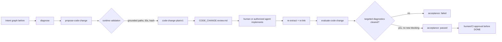

# Ugruntowane plany zmiany kodu

`todo2code` potrafi przekształcić otwarte diagnostyki implementacyjne w
walidowany `t2c.code-change-plan/v1`, wyrenderować hash-bound brief
`CODE_CHANGE.review.md` (`t2c.code-change-review/v1`), a po zmianie kodu
sprawdzić wynik jako `t2c.code-change-acceptance/v1`. Runtime **nie generuje
diffów źródeł**, **nie stosuje** zmian w tree i **nie oznacza** zadania jako
DONE.



## 1. Utworzenie planów

Każdy udany `t2c pipeline` zapisuje automatycznie w katalogu runu (etap
`codeChangePlanning`, tryb deterministyczny, bez LLM):

- `code-change-plans.json` — zbiór planów `t2c.code-change-plan-set/v1`;
- `CODE_CHANGE.review.md` — brief reviewowy;
- `CODE_CHANGE.review.json` — audit z `renderedPatchHash`.

Można też zbudować je osobno:

```bash
t2c pipeline . --task TASK.md --todo TODO.md --no-docs-llm --no-summary-llm --out .intent
# artefakty: .intent/runs/<run>/code-change-plans.json
#            .intent/runs/<run>/CODE_CHANGE.review.md
#            .intent/runs/<run>/CODE_CHANGE.review.json

t2c propose-code-change .intent/runs/<run>/intent.graph.json \
  --diagnostics .intent/runs/<run>/diagnostics.json \
  --out .intent/runs/<run>/code-change-plans.json

t2c render-code-change .intent/runs/<run>/code-change-plans.json \
  --patch CODE_CHANGE.review.md \
  --audit CODE_CHANGE.review.json
```

Runtime tworzy plan wyłącznie dla diagnostyki
`PLANNED_NOT_IMPLEMENTED` lub `CHANGELOG_WITHOUT_IMPLEMENTATION`, której
dowody wskazują konkretną ścieżkę. Nie zgaduje brakujących plików. Każdy plan
zawiera:

- dokładne `recordIds` i `diagnosticIds` oraz opcjonalne `conclusionIds` i
  `proposalIds`;
- `target.paths`, symbole, kryteria akceptacji i listę proponowanych zmian;
- jawny poziom ryzyka i instrukcję rollbacku;
- content-bound `id` i `planHash`;
- `generation` z nazwą/wersją generatora i wersją todo2code.

Plan ma zawsze status `proposed`. Zmiana `changes[].path` poza
`target.paths`, parent traversal, obce ID, zmiana treści bez przeliczenia hasha
lub brak provenance powodują błąd kontraktu.

## 2. Implementacja i ponowna analiza

Wybierz jeden obiekt z `plans[]`, zapisz go jako `plan.json`, wprowadź zmiany
w normalnym reviewowalnym workflow, a następnie ponownie uruchom pipeline.

```bash
t2c evaluate-code-change plan.json \
  --before-graph .intent/runs/<before>/intent.graph.json \
  --before-diagnostics .intent/runs/<before>/diagnostics.json \
  --after-graph .intent/runs/<after>/intent.graph.json \
  --after-diagnostics .intent/runs/<after>/diagnostics.json \
  --out acceptance.json
```

`accepted=true` jest możliwe tylko wtedy, gdy wszystkie diagnostyki wskazane w
planie zniknęły i nie pojawiła się nowa diagnostyka `blocking`. Artefakt
zapisuje zbiory `cleared`, `remaining` i `newBlocking`, fingerprinty obu grafów
oraz deterministyczne provenance. Pozytywny wynik jest dowodem dla review, nie
automatycznym zatwierdzeniem `DONE`.

## 3. Brief reviewowy (`t2c.code-change-review/v1`)

`CODE_CHANGE.review.md` jest **stabilną projekcją** planów, nie patch'em
źródeł. Zawiera ścieżki, akcje `create|modify|delete`, kryteria akceptacji,
ID diagnostyk/rekordów, risk i rollback. `CODE_CHANGE.review.json` trzyma
`renderedPatchHash = sha256(markdown)` oraz listę `planIds`/`planHashes`, więc
każda zmiana treści briefu jest wykrywalna. Runtime **nie apply'uje** tego
pliku do tree.

## 4. MCP, A2A i SDK

Te same operacje są dostępne jako `propose_code_change`, `render_code_change`
i `evaluate_code_change`. Wszystkie ścieżki plikowe przechodzą przez granicę
`T2C_ROOT`; dane można też przekazać inline. Karta A2A publikuje umiejętność
`review_code_changes`. Żaden z tych interfejsów nie wykonuje zapisu do plików
źródłowych.

## 5. Structured source patch (`t2c.code-change-source-patch/v1`)

Z planu powstaje **propozycja edycji źródeł** (instrukcje per plik + opcjonalny
unified diff), nadal bez apply:

```bash
t2c propose-source-patch plan.json --out source-patch.json
# albo zbiór planów:
t2c propose-source-patch code-change-plans.json --out source-patches.json
```

Pipeline zapisuje automatycznie `code-change-source-patches.json`. Każdy patch:

- jest powiązany z dokładnie jednym `planId` / `planHash`;
- zawiera wyłącznie ścieżki z `target.paths`;
- ma content-bound `id` / `patchHash`;
- może dostać `unifiedDiff` (walidacja nagłówków `---/+++`, zakaz `..` i
  absolutnych pathów, heurystyka na oczywiste sekrety);
- ma zawsze `status: proposed`.

LLM może w przyszłości wypełniać `unifiedDiff`, ale runtime nadal wymusza
granice planów. Apply do worktree **nie istnieje** w tej paczce.

## 6. Zamknięcie pętli (`close-code-change`)

Po implementacji i ponownym pipeline (after graph) można ocenić jeden plan albo
cały plan-set:

```bash
t2c close-code-change .intent/runs/<before>/code-change-plans.json \
  --before-graph .intent/runs/<before>/intent.graph.json \
  --before-diagnostics .intent/runs/<before>/diagnostics.json \
  --after-graph .intent/runs/<after>/intent.graph.json \
  --out close.json
```

Wynik `t2c.code-change-close-result/v1` zawiera `acceptances[]`, liczniki
accepted/rejected oraz `allAccepted`. Nadal **nie** oznacza DONE.

## 7. Co nie jest w zakresie

- auto-apply patchy do repozytorium;
- automatyczne `DONE` po `accepted=true`;
- pełny codegen LLM end-to-end (kontrakt structured patch jest gotowy na
  dołączenie modelu, ale domyślnie jest deterministyczny).
