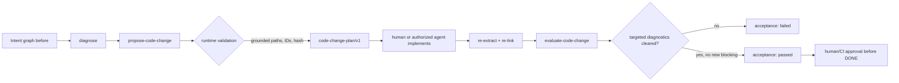

# Ugruntowane plany zmiany kodu

`todo2code` potrafi przekształcić otwarte diagnostyki implementacyjne w
walidowany `t2c.code-change-plan/v1`, a po zmianie kodu sprawdzić wynik jako
`t2c.code-change-acceptance/v1`. Runtime nie generuje i nie stosuje patcha oraz
nie oznacza zadania jako wykonane.



## 1. Utworzenie planów

Każdy udany `t2c pipeline` zapisuje automatycznie
`code-change-plans.json` w katalogu runu (etap `codeChangePlanning`, tryb
deterministyczny, bez LLM). Można też zbudować plany osobno:

```bash
t2c pipeline . --task TASK.md --todo TODO.md --no-docs-llm --no-summary-llm --out .intent
# artefakt: .intent/runs/<run>/code-change-plans.json

t2c propose-code-change .intent/runs/<run>/intent.graph.json \
  --diagnostics .intent/runs/<run>/diagnostics.json \
  --out .intent/runs/<run>/code-change-plans.json
```

Runtime tworzy plan wyłącznie dla diagnostyki
`PLANNED_NOT_IMPLEMENTED` lub `CHANGELOG_WITHOUT_IMPLEMENTATION`, której
dowody wskazują konkretną ścieżkę. Nie zgaduje brakujących plików. Każdy plan
zawiera:

- dokładne `recordIds` i `diagnosticIds` oraz opcjonalne `conclusionIds` i
  `proposalIds`;
- `target.paths`, symbole, kryteria akceptacji i listę proponowanych zmian;
- jawny poziom ryzyka i instrukcję rollbacku;
- content-bound `id` i `planHash`;
- `generation` z nazwą/wersją generatora i wersją todo2code.

Plan ma zawsze status `proposed`. Zmiana `changes[].path` poza
`target.paths`, parent traversal, obce ID, zmiana treści bez przeliczenia hasha
lub brak provenance powodują błąd kontraktu.

## 2. Implementacja i ponowna analiza

Wybierz jeden obiekt z `plans[]`, zapisz go jako `plan.json`, wprowadź zmiany
w normalnym reviewowalnym workflow, a następnie ponownie uruchom pipeline.

```bash
t2c evaluate-code-change plan.json \
  --before-graph .intent/runs/<before>/intent.graph.json \
  --before-diagnostics .intent/runs/<before>/diagnostics.json \
  --after-graph .intent/runs/<after>/intent.graph.json \
  --after-diagnostics .intent/runs/<after>/diagnostics.json \
  --out acceptance.json
```

`accepted=true` jest możliwe tylko wtedy, gdy wszystkie diagnostyki wskazane w
planie zniknęły i nie pojawiła się nowa diagnostyka `blocking`. Artefakt
zapisuje zbiory `cleared`, `remaining` i `newBlocking`, fingerprinty obu grafów
oraz deterministyczne provenance. Pozytywny wynik jest dowodem dla review, nie
automatycznym zatwierdzeniem `DONE`.

## 3. MCP i A2A

Te same operacje są dostępne jako `propose_code_change` i
`evaluate_code_change`. Wszystkie ścieżki plikowe przechodzą przez granicę
`T2C_ROOT`; dane można też przekazać inline. Karta A2A publikuje umiejętność
`review_code_changes`. Żaden z tych interfejsów nie wykonuje zapisu do plików
źródłowych.
