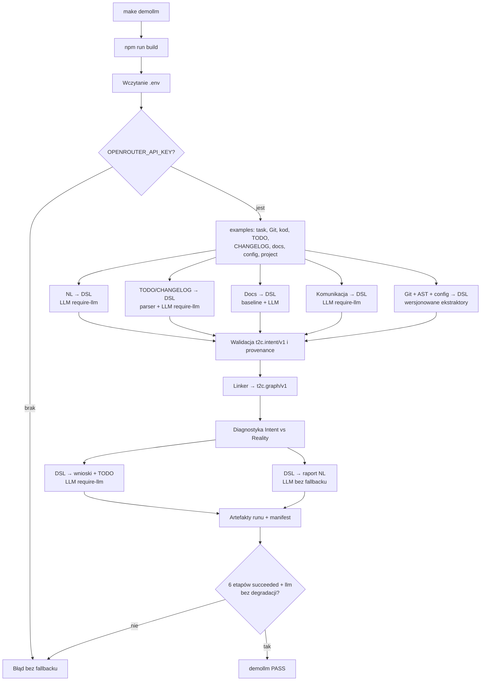
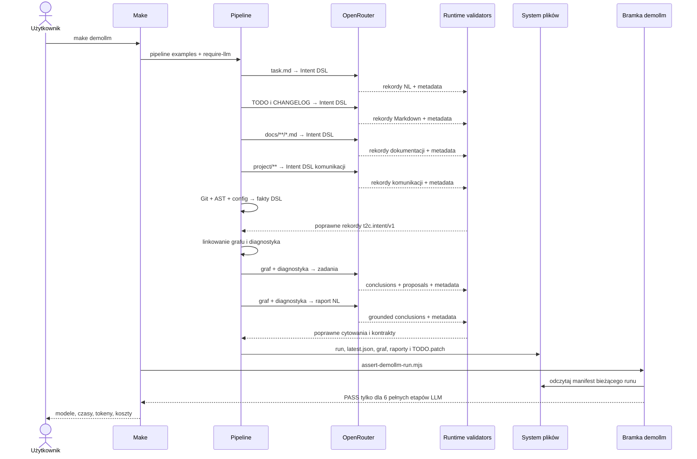

# Proces `make demollm`

`make demollm` uruchamia pełny pipeline przykładowego projektu z prawdziwym
OpenRouterem. Nie jest aliasem `make demo`: nie zeruje `OPENROUTER_API_KEY`, nie
ustawia trybów deterministycznych i nie przekazuje `--no-docs-llm` ani
`--no-summary-llm`.

Sukces oznacza, że wszystkie sześć etapów semantycznych rzeczywiście użyło LLM:

1. polecenie NL → Intent DSL;
2. TODO i CHANGELOG → Intent DSL;
3. dokumentacja → Intent DSL;
4. komunikacja zespołu → Intent DSL;
5. graf i diagnostyka → wnioski oraz propozycje TODO;
6. graf i diagnostyka → raport NL.

Git, AST oraz konfiguracja są nadal konwertowane przez deterministyczne,
wersjonowane ekstraktory. W tych źródłach LLM nie jest potrzebny do odczytania
faktów strukturalnych.

## Uruchomienie

W prywatnym `.env` ustaw co najmniej:

```dotenv
OPENROUTER_API_KEY=...
```

Modele można wybrać przez `OPENROUTER_NL_MODEL`,
`OPENROUTER_MARKDOWN_MODEL`, `OPENROUTER_DOC_MODEL`,
`OPENROUTER_COMMUNICATION_MODEL`, `OPENROUTER_TASK_MODEL` i
`OPENROUTER_SUMMARY_MODEL`. Następnie uruchom:

```bash
make demollm
```

Target podnosi timeout pojedynczego żądania do 300 sekund, ponieważ synteza
zadań z całego grafu bywa znacznie wolniejsza niż ekstrakcja pojedynczego
dokumentu. Nie nadpisuje klucza ani modeli z `.env`.

## Przepływ procesu



## Kolejność wywołań



## Warunek sukcesu

Skrypt `scripts/assert-demollm-run.mjs` sprawdza dla każdego z sześciu etapów:

- `status === "succeeded"`;
- `effectiveMode === "llm"`;
- `degraded === false`;
- co najmniej jeden wpis w `responses` z metadanymi providera.

Sprawdza również `manifest.status === "succeeded"`. Brak klucza, timeout,
błędna struktura, obce cytowanie albo częściowa ekstrakcja dokumentacji daje
niezerowy kod wyjścia. Target nie może więc ponownie pokazać sukcesu z
`llm.* = false`.

## Artefakty

| Artefakt | Znaczenie |
|---|---|
| `examples/.intent-demo-llm/latest.json` | wskaźnik ostatniego kompletnego runu LLM |
| `runs/<run-id>/manifest.json` | tryby, modele, wersje runtime, czasy, tokeny i koszt |
| `*.intent.jsonl` | kanoniczne rekordy DSL ze źródeł |
| `intent.graph.json` | połączony graf dowodów |
| `diagnostics.json` | deterministyczne rozbieżności Intent vs Reality |
| `task-synthesis.json` | uziemione wnioski i propozycje TODO |
| `TODO.patch` / `TODO.patch.json` | propozycja zmiany i jej audyt; nie jest automatycznie stosowana |
| `summary-conclusions.json` | walidowane wnioski do raportu |
| `team-summary.md` | końcowa reprezentacja NL |

Każdy rekord DSL ma wersję runtime i informację o generatorze. Dla wyników LLM
zapisywane są również provider, rozwiązany model i response ID. Klucz API,
prompt i surowa odpowiedź modelu nie są zapisywane w manifeście.

## Zweryfikowany przebieg

Run `20260730T185205Z-312a0535` z 2026-07-30 zakończył się pełnym PASS po
wzmocnieniu ugruntowania odpowiedzi:

```text
naturalLanguageExtraction: deepseek/deepseek-v4-flash · 33458 ms · 5384 tokens · $0.001366
markdownExtraction: qwen/qwen3.7-plus · 71080 ms · 4652 tokens · $0.005213
documentationExtraction: qwen/qwen3.7-plus · 57338 ms · 4602 tokens · $0.004463
communicationAnalysis: deepseek/deepseek-v4-flash · 27510 ms · 4273 tokens · $0.000993
taskSynthesis: qwen/qwen3.7-plus · 131866 ms · 35127 tokens · $0.018090
summary: qwen/qwen3.7-flash · 18295 ms · 45309 tokens · $0.005891
```

Task synthesis i summary zapisały po jednej odpowiedzi providera, bez retry i
bez degradacji. Ich wnioski mają `generatorVersion: "2"`: `recordIds` są
ograniczane do dowodów prawidłowo cytowanych diagnostyk, podczas gdy nieznany
`diagnosticId` nadal jest odrzucany. Runtime nadaje też brakujące, lokalne
klucze propozycji; nie zmienia to publicznych, content-bound ID.

Modele routowane automatycznie, czas i koszt mogą zmieniać się pomiędzy
uruchomieniami. Źródłem prawdy jest manifest bieżącego runu, nie powyższy
historyczny pomiar.

## `demo` a `demollm`

| Polecenie | Sieć | Przeznaczenie |
|---|---|---|
| `make demo` | nie | szybki, powtarzalny pipeline deterministyczny |
| `make demollm` | tak | pełna demonstracja wszystkich etapów semantycznych z LLM, bez fallbacku |

Do szybkiej walidacji offline używaj `make demo` lub `npm run verify`.
`make demollm` zależy od dostępności i rozliczeń zewnętrznego providera.
