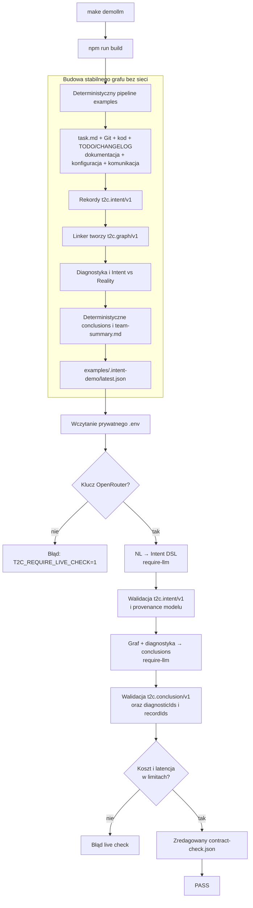
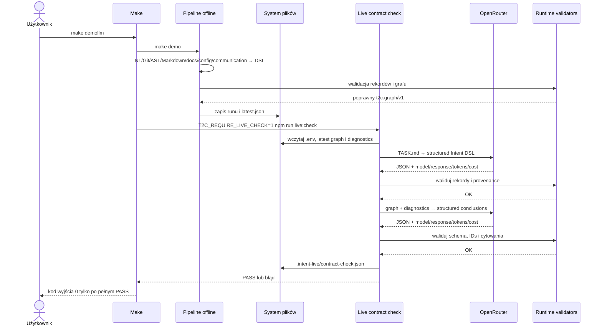

# Proces `make demollm`

`make demollm` demonstruje cały stabilny przepływ todo2code oraz dwa krytyczne
kontrakty prawdziwego modelu. Polecenie kończy się błędem, jeżeli brakuje klucza,
provider odrzuci żądanie, odpowiedź nie spełni schematu, cytowania nie należą do
grafu albo zostanie przekroczony budżet kosztu lub latencji.

## Uruchomienie

W prywatnym `.env` ustaw co najmniej `OPENROUTER_API_KEY`. Modele i budżety mogą
pozostać zgodne z `.env.example`.

```bash
make demollm
```

Target rozwija się do dwóch poleceń:

```bash
make demo
T2C_REQUIRE_LIVE_CHECK=1 npm run live:check
```

## Przepływ procesu



## Kolejność wywołań



## Artefakty i interpretacja

| Artefakt | Znaczenie |
|---|---|
| `examples/.intent-demo/latest.json` | wskaźnik najnowszego kompletnego runu offline |
| `examples/.intent-demo/runs/<run-id>/manifest.json` | tryby etapów, wersja runtime, ostrzeżenia i status |
| `intent.graph.json` | graf dowodów przekazywany do testu summary |
| `diagnostics.json` | deterministyczne rozbieżności cytowane przez LLM |
| `team-summary.md` | raport offline; nie jest odpowiedzią live check |
| `.intent-live/contract-check.json` | zredagowany audyt modeli, tokenów, kosztu i latencji |

Live check nie zapisuje klucza, promptów ani treści odpowiedzi modelu. Pełna
odpowiedź jest walidowana w pamięci, a do audytu trafiają wyłącznie metadane.

## Co dokładnie korzysta z LLM

Bazowy `make demo` pozostaje deterministyczny, aby ten sam kod tworzył stabilny
graf niezależnie od sieci. Część live uruchamia w `require-llm`:

1. `TASK.md` → `t2c.intent/v1`;
2. graf i diagnostyka → `t2c.conclusion/v1`.

Nie jest to pełne wzbogacanie LLM każdego dokumentu ani całego TODO/CHANGELOG.
Do takiego przebiegu służy `pipeline` z trybami `prefer-llm` lub `require-llm`;
`demollm` jest krótkim testem kontraktów, kosztu i dostępności providera.

## Zweryfikowany wynik

Przebieg z 2026-07-30:

```text
extract_nl: ok · 7164 ms · 1284 tokens · $0.008088 · google/gemini-3.6-flash
summarize: ok · 18349 ms · 44136 tokens · $0.005666 · qwen/qwen3.7-flash
live contract check: PASS · total $0.013754
```

Wyniki live mogą zmieniać się wraz z providerem i modelem. Warunkiem sukcesu
nie jest identyczny czas lub koszt, lecz poprawny kontrakt oraz zmieszczenie się
w skonfigurowanych limitach `T2C_LIVE_MAX_LATENCY_MS` i
`T2C_LIVE_MAX_COST_USD`.
