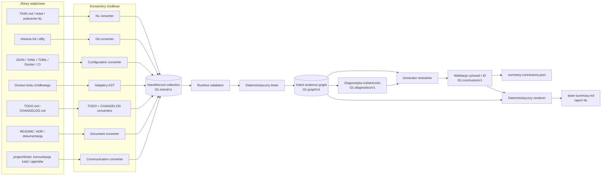
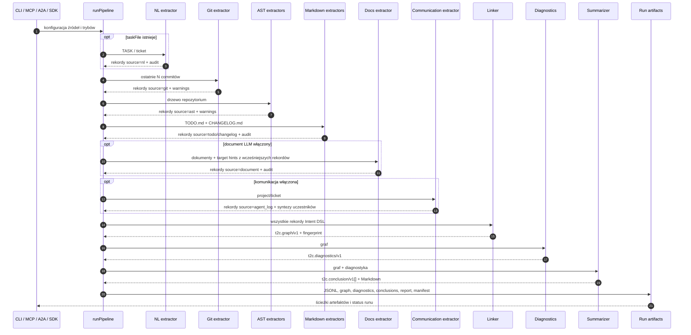
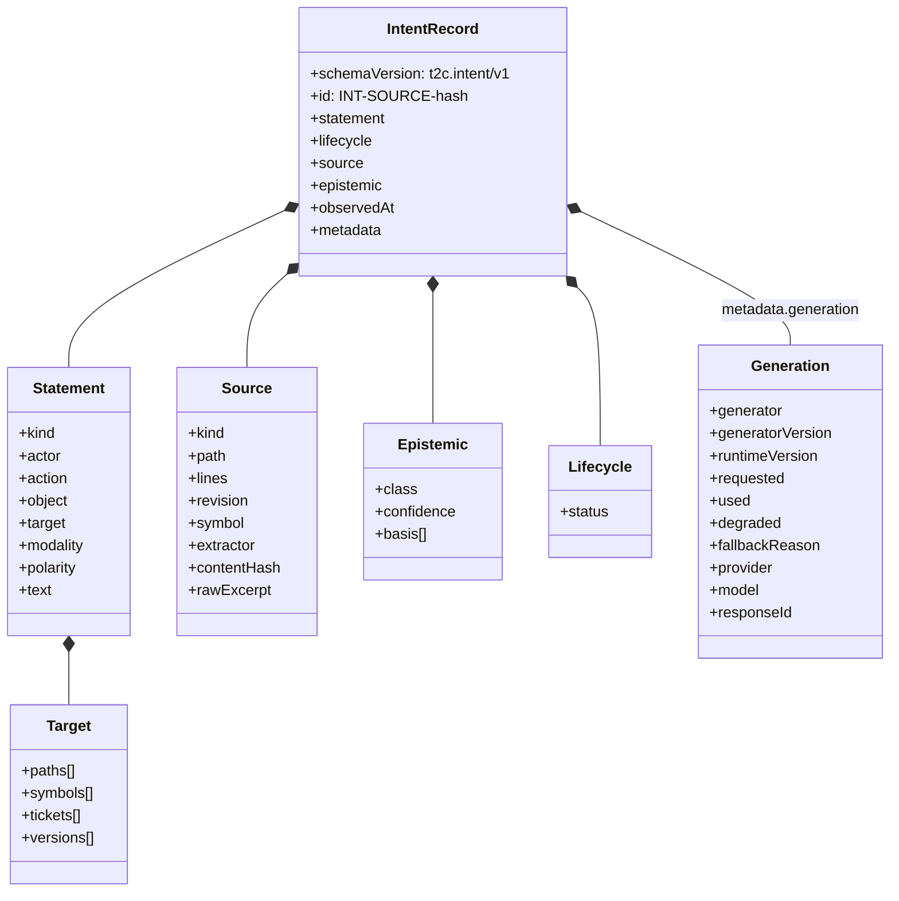
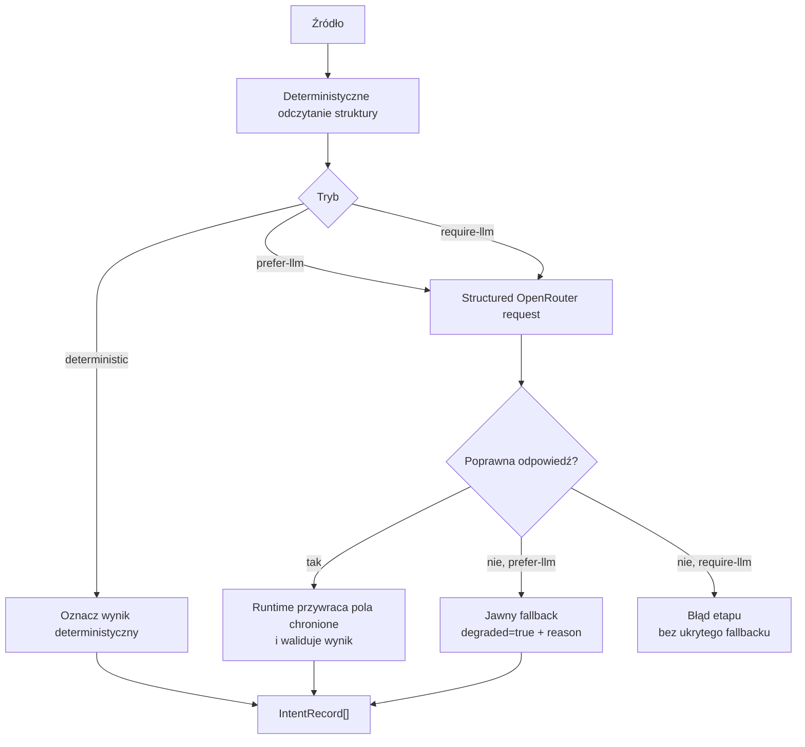
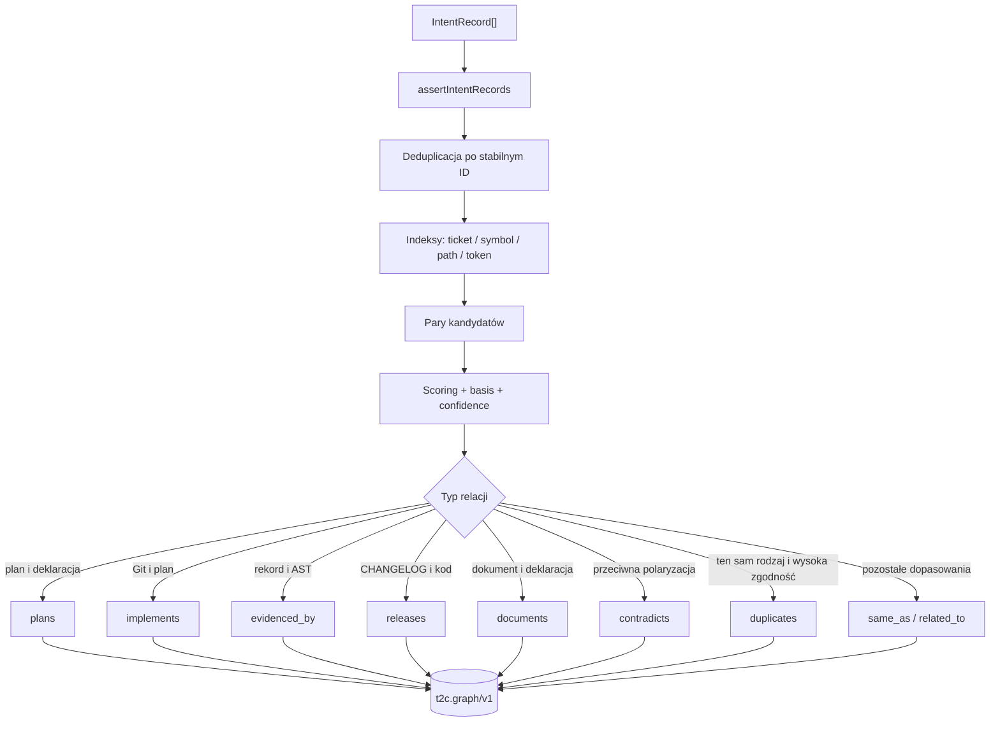
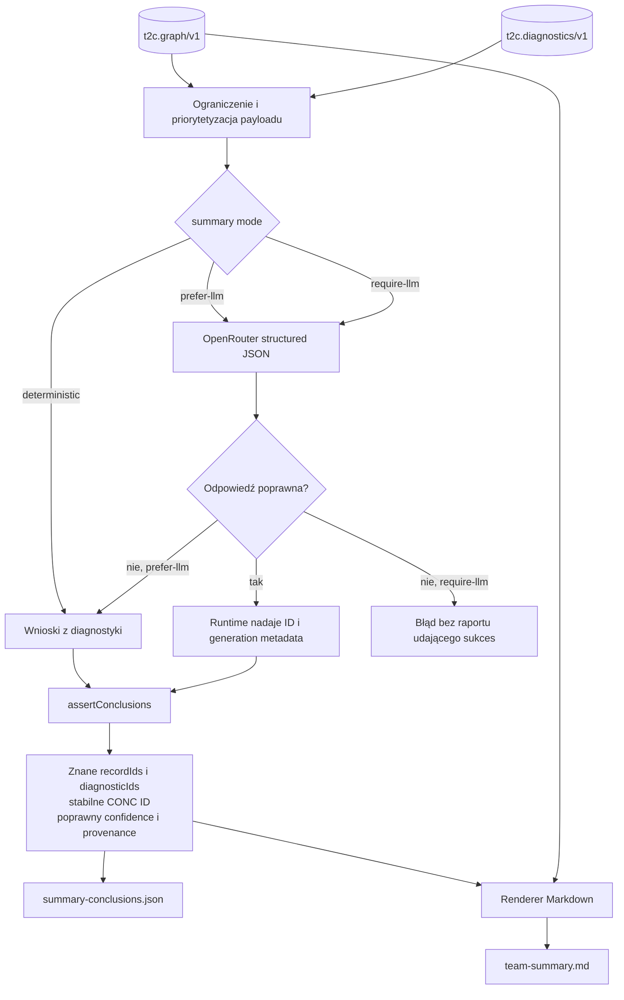
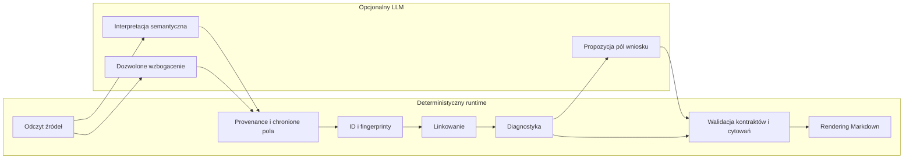

# Od źródeł przez Intent DSL do wniosków NL

Ten dokument pokazuje krok po kroku, jak todo2code (`t2c`) pobiera dane z
różnych zbiorów projektu, zamienia je na jeden kanoniczny Intent Evidence DSL,
łączy dowody, wykrywa rozbieżności i tworzy z nich ugruntowane podsumowanie w
języku naturalnym.

Najważniejsza zasada brzmi:

> System nie streszcza bezpośrednio plików projektu. Najpierw każdy konwerter
> tworzy rekordy `t2c.intent/v1` z dokładnym źródłem i klasą epistemiczną.
> Dopiero graf rekordów i deterministyczna diagnostyka stają się wejściem do
> walidowanych wniosków `t2c.conclusion/v1` oraz raportu NL.

## Przepływ w jednym obrazie



Każda strzałka do kolekcji DSL oznacza dodanie niezależnych rekordów. Linker
nie nadpisuje rekordów jednego źródła danymi innego źródła i nie zamienia
claimu Git w fakt AST.

## Rzeczywista kolejność głównego pipeline'u

`runPipeline()` wykonuje etapy w poniższej kolejności. Git i AST są logicznie
niezależne, ale obecna implementacja uruchamia je sekwencyjnie. Dokumentacja
jest celowo analizowana później, ponieważ otrzymuje target hints z rekordów
znalezionych wcześniej.



Jeżeli źródło nie zostało skonfigurowane, etap jest `skipped`. Brak opcjonalnego
toolchainu językowego daje ostrzeżenie i nie usuwa rekordów innych adapterów.
Nieudany tryb `require-llm` kończy run jawnie i nie publikuje niepełnego grafu
jako `latest`.

Przykładowy przebieg całkowicie offline, który nadal tworzy walidowane wnioski
i raport NL:

```bash
t2c pipeline . \
  --task TASK.md \
  --todo TODO.md \
  --changelog CHANGELOG.md \
  --nl-mode deterministic \
  --markdown-mode deterministic \
  --communication-mode deterministic \
  --no-docs-llm \
  --no-summary-llm \
  --out .intent
```

`--no-summary-llm` wyłącza tylko model podsumowujący. Nie wyłącza diagnostyki,
tworzenia `t2c.conclusion/v1` ani renderowania `team-summary.md`.

## Który konwerter tworzy jakie dane

| Zbiór wejściowy | Konwerter | `source.kind` | Klasa epistemiczna | Znaczenie |
|---|---|---|---|---|
| TASK, ticket, polecenie | `nl-llm.ts` / `nl.ts` | `nl` | `declaration` lub `llm_inference` | oczekiwanie lub deklarowana intencja |
| ostatnie N commitów i diffy | `git.ts` | `git` | `claim` | twierdzenie autora commita o zmianie |
| TypeScript / JavaScript | TypeScript Compiler API w adapterze AST | `ast` | `fact` | zaobserwowany import, symbol, eksport lub call |
| Python | helper standard-library `ast` | `ast` | `fact` | zaobserwowany fakt składniowy Pythona |
| Go | helper `go/ast` | `ast` | `fact` | zaobserwowany fakt składniowy Go |
| Java | JDK Compiler Tree API | `ast` | `fact` | zaobserwowany fakt składniowy Java |
| Rust | helper Cargo oparty na `syn` | `ast` | `fact` | zaobserwowany fakt składniowy Rust |
| checkboxy `TODO.md` | `todo.ts` | `todo` | `plan` | plan i jego lifecycle wynikający z checkboxa |
| wpisy `CHANGELOG.md` | `changelog.ts` | `changelog` | `claim` | deklaracja wydania, a nie dowód kodu |
| README, ADR, dokumenty modułów | `docs-deterministic.ts`, opcjonalnie `docs-llm.ts` | `document` | `declaration` lub `llm_inference` | offline: nagłówki, bloki kodu i jawne referencje; LLM może dodać audytowaną semantykę |
| JSON/YAML/TOML, Dockerfile, Compose, workflow CI | `configuration.ts` | `system` | `fact` | deterministycznie zaobserwowana struktura konfiguracji i infrastruktury |
| pliki `project/<ticket>/` | `communication.ts` / `communication/llm.ts` | `agent_log` | `declaration`, `plan` lub `claim` | wersjonowana wypowiedź człowieka albo agenta |

`source.kind` mówi, skąd pochodzi rekord. `epistemic.class` mówi, jakiego typu
wiedzę reprezentuje. Te dwa pola nie są synonimami: raport agenta może mieć
`source.kind=agent_log`, ale pozostaje `claim`; commit ma `source.kind=git`, ale
nie staje się przez to faktem implementacji.

## Wspólna koperta Intent DSL

Wszystkie konwertery kończą w tym samym typie rekordu. Dzięki temu linker i
diagnostyka nie muszą znać składni źródłowego Markdownu, języka programu ani
formatu komunikacji.



Runtime zachowuje dokładną ścieżkę, zakres linii, rewizję, ekstraktor i hash
treści. Model LLM nie może podmienić provenance, podnieść deklaracji do klasy
`fact` ani samodzielnie nadać finalnego ID.

## Konwertery deterministyczne i opcjonalne wzbogacanie LLM

NL, TODO/CHANGELOG i komunikacja obsługują wspólny kontrakt trybów. Najpierw
powstaje struktura należąca do runtime'u; LLM może dostarczyć tylko dozwoloną
semantykę.



Dokumentacja zawsze przechodzi przez deterministyczny baseline. Bez LLM nadal
powstają rekordy nagłówków, bloków kodu oraz jawnych odwołań do plików, symboli
i ticketów. Tryby `prefer-llm` i `require-llm` mogą dodać audytowaną interpretację
semantyczną, ale nie zastępują ani nie usuwają baseline'u runtime'u.

## Od rekordów do grafu dowodów

Linker najpierw waliduje wszystkie rekordy, deduplikuje identyczne ID, buduje
indeksy kandydatów i dopiero wtedy ocenia pary. Podstawami dopasowania są
znormalizowane tickety, symbole, ścieżki, akcje oraz podobieństwo tokenów.



Graf zachowuje oryginalne rekordy i osobne relacje. Fingerprint obejmuje
kanoniczne rekordy oraz relacje, ale pomija zmienny czas obserwacji.

## Diagnostyka: wnioski deterministyczne przed NL

Diagnostyka porównuje deklaracje, plany i claimy z dowodami Git/AST. Typowe
wyniki to:

- `PLANNED_NOT_IMPLEMENTED` — plan bez dowodu implementacji;
- `IMPLEMENTED_NOT_PLANNED` — fakt kodu bez powiązanego planu;
- `IMPLEMENTED_NOT_DOCUMENTED` — zmiana bez dokumentacji;
- `CHANGELOG_WITHOUT_IMPLEMENTATION` — claim wydania bez dowodu;
- `CONFLICTING_INTENT` — podobny temat z przeciwną polaryzacją;
- `AMBIGUOUS_REQUIREMENT` — wymaganie z brakującymi polami;
- `UNLINKED_RECORD` — ważny rekord bez relacji.

Diagnostyka jest deterministyczna. `ALIGNED` oznacza wyłącznie brak wykrytej
blokującej rozbieżności w dostępnych danych; nie jest automatyczną decyzją
`DONE`.

## Przejście DSL → wnioski → NL

Podsumowanie nie przekazuje modelowi pełnego repozytorium. `compactPayload()`
wybiera ograniczony zestaw rekordów, relacji i najważniejszych diagnostyk.
Dokumentacja i inne źródła deklaratywne są chronione przed wyparciem przez dużą
liczbę drobnych faktów AST.



Model zwraca wyłącznie semantyczne pola wniosków: `kind`, `title`, `detail`,
`severity`, cytowania i `confidence`. Runtime:

1. nadaje `schemaVersion=t2c.conclusion/v1`;
2. dołącza wersję runtime, tryb, model/provider, response ID i fingerprint
   bezpiecznej konfiguracji;
3. wylicza stabilne `CONC-*` z treści semantycznej;
4. odrzuca cytowania nieistniejącego rekordu lub diagnostyki;
5. dopiero po walidacji renderuje Markdown.

W efekcie `summary-conclusions.json` jest strukturalnym źródłem wniosków, a
`team-summary.md` czytelną projekcją NL. Raport zawiera deterministyczne sekcje
celu, planu, Git, AST, dokumentacji, komunikacji, rozbieżności i następnych
działań.

## Trzy tryby generowania podsumowania

| Tryb | Sieć | Zachowanie przy braku lub błędzie LLM |
|---|---:|---|
| `deterministic` | nie | tworzy `t2c.conclusion/v1` bez modelu i renderuje raport |
| `prefer-llm` | tak, jeśli skonfigurowana | używa jawnie oznaczonego deterministycznego fallbacku |
| `require-llm` | tak | kończy operację błędem; nie udaje wyniku LLM |

Przykład standalone:

```bash
t2c summarize intent.graph.json \
  --diagnostics diagnostics.json \
  --mode prefer-llm \
  --out team-summary.md
```

## Artefakty jednego runu

```text
.intent/
├── latest.json
└── runs/<run-id>/
    ├── nl.intent.jsonl
    ├── git.intent.jsonl
    ├── ast.intent.jsonl
    ├── todo.intent.jsonl
    ├── changelog.intent.jsonl
    ├── document.intent.jsonl
    ├── communication.intent.jsonl
    ├── intent.graph.json
    ├── diagnostics.json
    ├── communication-analysis.json
    ├── communication-analysis.md
    ├── summary-conclusions.json
    ├── team-summary.md
    └── manifest.json
```

Przy włączonej syntezie DSL2TODO dochodzą `task-synthesis.json`,
`todo-validation.json`, `TODO.patch` i `TODO.patch.json`. Jest to osobna gałąź
wykorzystująca ten sam graf i diagnostykę; pipeline przygotowuje materiał do
review, ale nie stosuje patcha bez jawnej zgody.

## Granice odpowiedzialności



LLM pomaga interpretować treść, ale nie jest właścicielem źródła, lifecycle,
klasy epistemicznej, finalnych ID, relacji, fingerprintu ani decyzji o
poprawności cytowań. Dzięki temu tryby LLM i deterministyczny tworzą artefakty
o tej samej, sprawdzalnej strukturze.

## Gdzie szukać implementacji

- orkiestracja etapów: [`src/pipeline/run.ts`](../src/pipeline/run.ts);
- typ rekordu i kontrakty wyjściowe: [`src/core/types.ts`](../src/core/types.ts);
- walidacja runtime: [`src/core/schema.ts`](../src/core/schema.ts);
- konwertery: [`src/extractors/`](../src/extractors/);
- komunikacja: [`src/communication/`](../src/communication/);
- linker: [`src/graph/linker.ts`](../src/graph/linker.ts);
- diagnostyka: [`src/graph/diagnostics.ts`](../src/graph/diagnostics.ts);
- DSL do wniosków i Markdown: [`src/summary/summarizer.ts`](../src/summary/summarizer.ts);
- dokładny format DSL: [`DSL.md`](DSL.md);
- ogólna architektura: [`ARCHITECTURE.md`](ARCHITECTURE.md).
