# Diagramy działania systemu Intent Guard

Pakiet zawiera aktualne diagramy zgodne z najnowszymi zasadami:

- intencję podaje użytkownik;
- AI generuje TODO;
- człowiek zatwierdza TODO;
- agent sam uruchamia paczkę zgodnie z instrukcjami projektu;
- paczka nie uruchamia agentów i nie definiuje zakresu zadania;
- minimum trzy niezależne DSL-e są generowane z różnych źródeł;
- DSL-e są konsolidowane do DSL 4;
- wszystkie oficjalne zmiany wymagają zatwierdzenia człowieka;
- TODO, CHANGELOG i VERSION są chronione bramką;
- system działa przyrostowo i przygotowuje patche zamiast samodzielnie zatwierdzać dokumentację.

## 1. 01 Overall Process

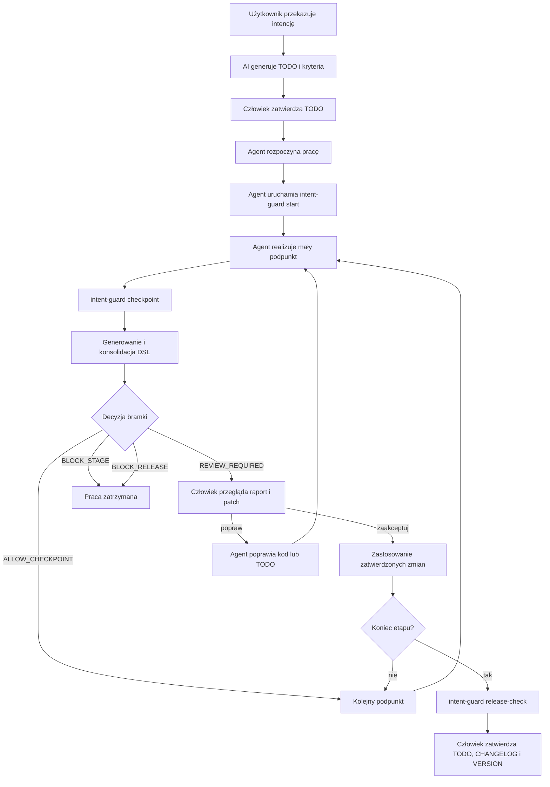

## 2. 02 Three Source Dsls And Consolidation

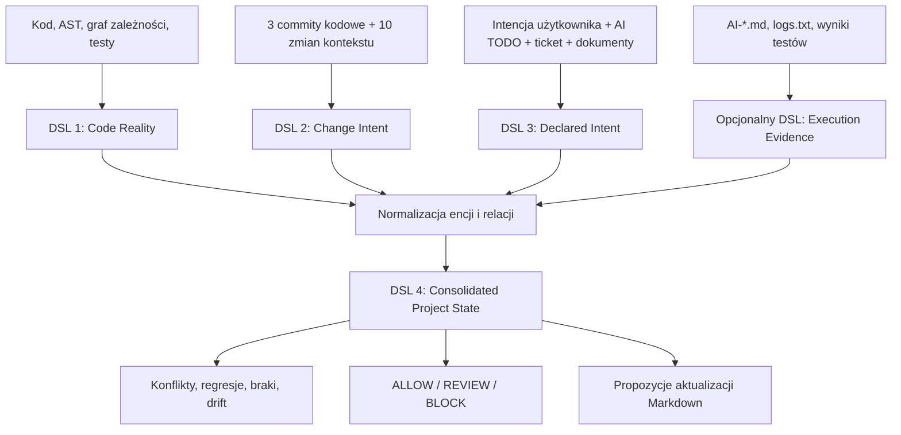

## 3. 03 Code Reality Dsl

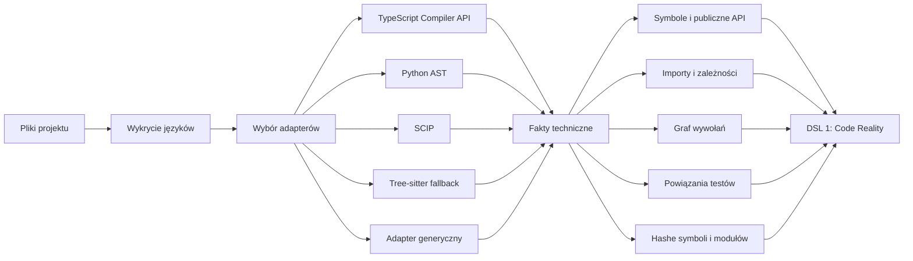

## 4. 04 Change Intent Dsl

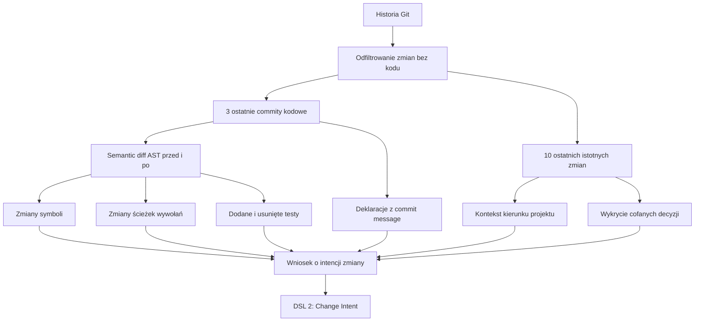

## 5. 05 Declared Intent Dsl

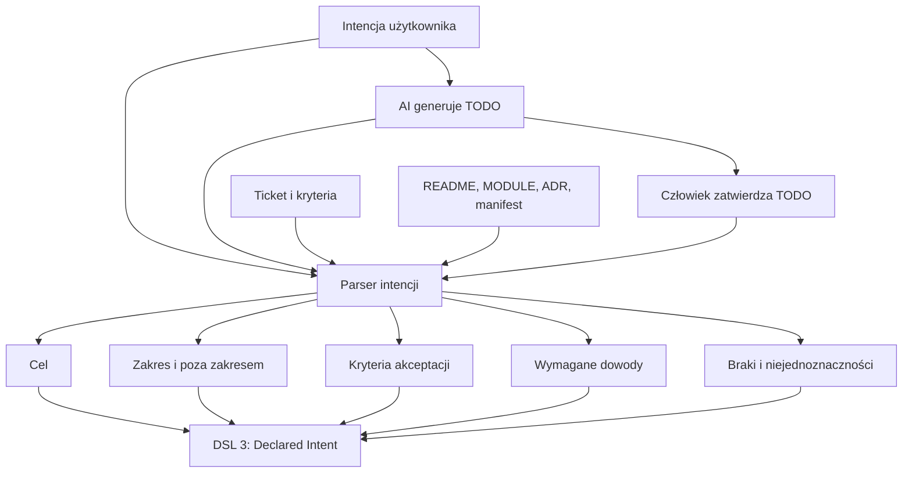

## 6. 06 Reconciliation Engine

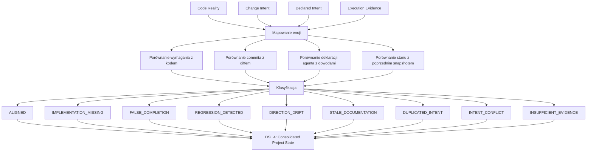

## 7. 07 Agent Checkpoint Flow

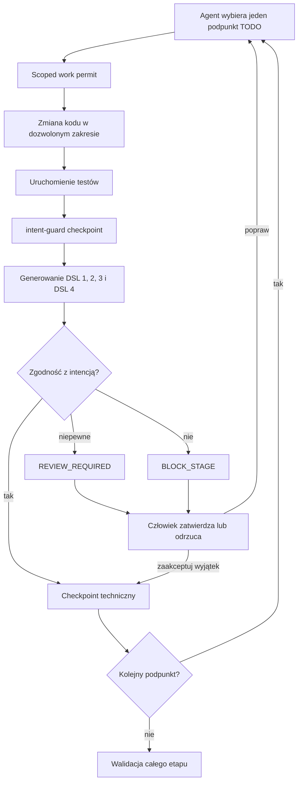

## 8. 08 Protected Files And Release Gate

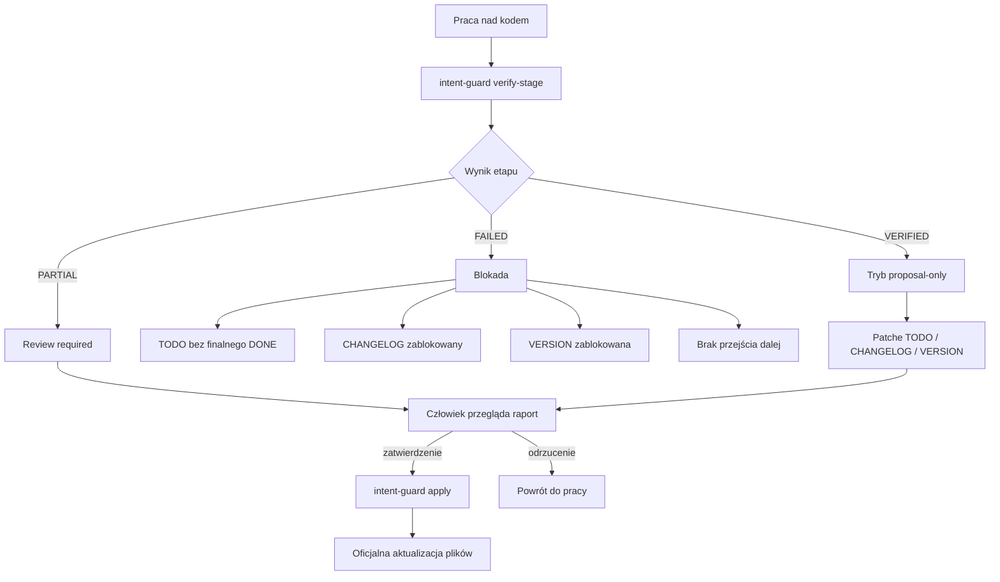

## 9. 09 Markdown Synchronization

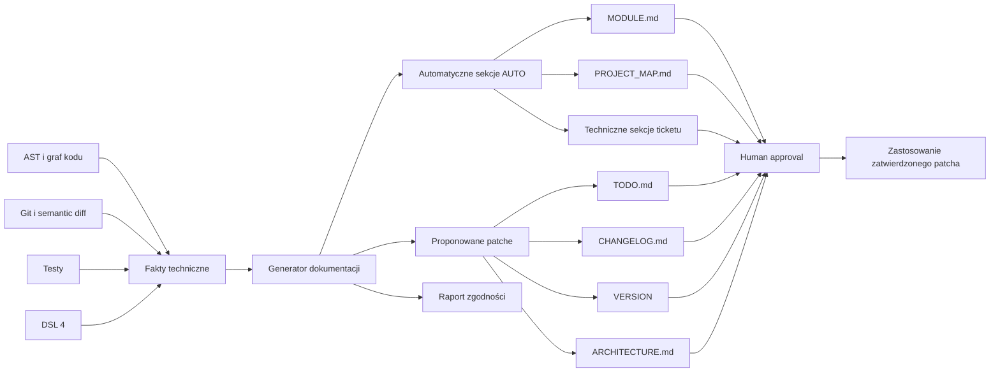

## 10. 10 Hash And Approval Invalidation

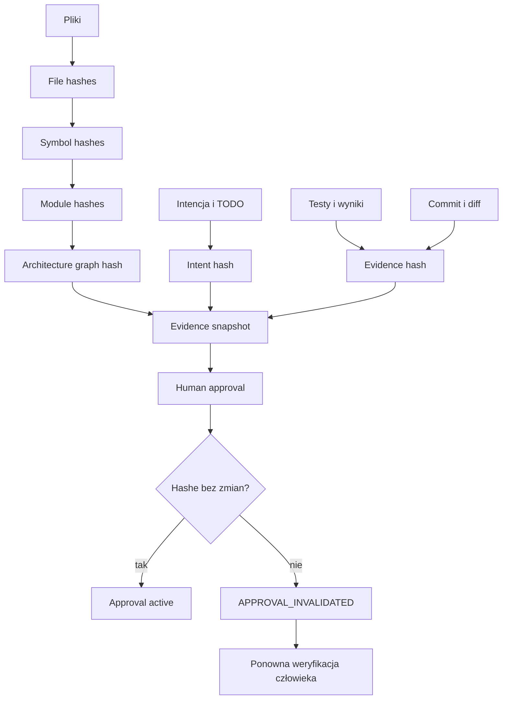

## 11. 11 Background Incremental Monitor

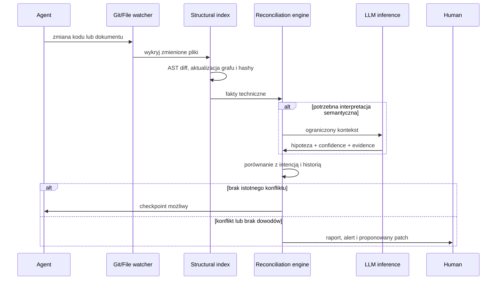

## 12. 12 Universal Package Architecture

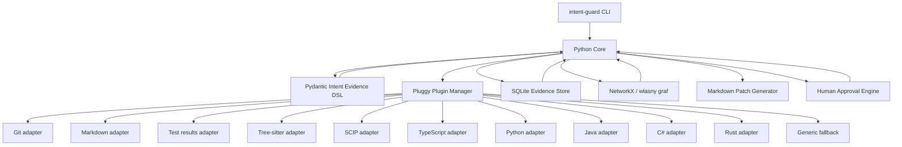

## 13. 13 False Completion Scenario

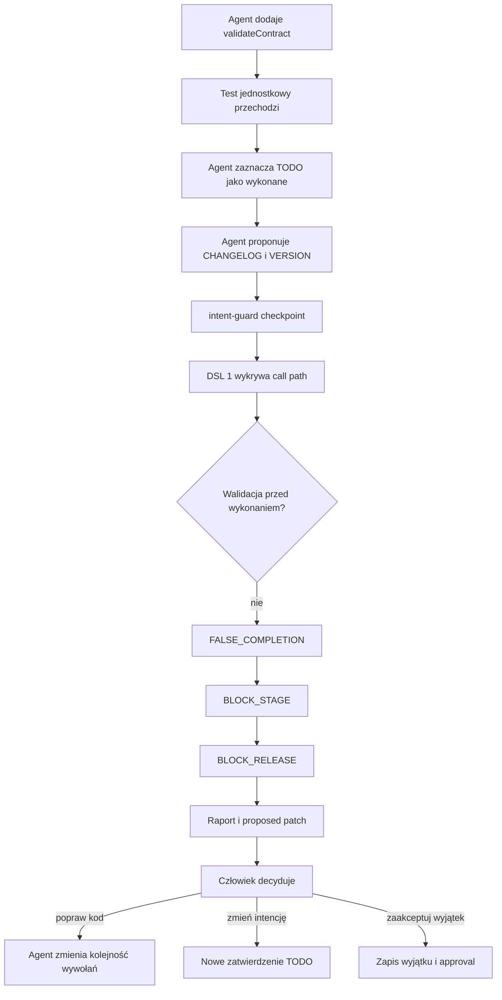

## 14. 14 Project File Layout

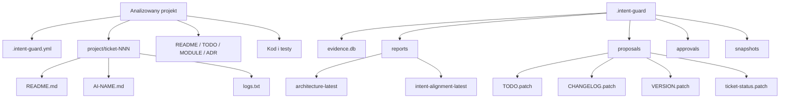
