# System Architecture Analysis
<!-- generated in 0.01s -->

## Overview

- **Project**: <PROJECT_ROOT>
- **Primary Language**: typescript
- **Languages**: typescript: 117, md: 52, json: 32, python: 15, javascript: 15
- **Analysis Mode**: static
- **Total Functions**: 3285
- **Total Classes**: 348
- **Modules**: 262
- **Entry Points**: 2336

## Architecture by Module

### src.cli
- **Functions**: 152
- **Classes**: 1
- **File**: `cli.ts`

### src.core.schema
- **Functions**: 151
- **Classes**: 4
- **File**: `schema.ts`

### src.synthesis.code-change-plan
- **Functions**: 148
- **Classes**: 10
- **File**: `code-change-plan.ts`

### src.services.actions
- **Functions**: 113
- **File**: `actions.ts`

### src.interfaces.a2a-task-store
- **Functions**: 92
- **Classes**: 3
- **File**: `a2a-task-store.ts`

### src.communication.analyzer
- **Functions**: 79
- **Classes**: 3
- **File**: `analyzer.ts`

### src.diff.reality
- **Functions**: 77
- **Classes**: 3
- **File**: `reality.ts`

### src.graph.linker
- **Functions**: 75
- **Classes**: 4
- **File**: `linker.ts`

### src.extractors.communication
- **Functions**: 75
- **Classes**: 4
- **File**: `communication.ts`

### src.pipeline.run
- **Functions**: 64
- **Classes**: 1
- **File**: `run.ts`

### src.evaluation.gold-cases
- **Functions**: 57
- **Classes**: 4
- **File**: `gold-cases.ts`

### src.core.text
- **Functions**: 56
- **File**: `text.ts`

### src.comparison.workspace
- **Functions**: 55
- **Classes**: 3
- **File**: `workspace.ts`

### src.communication.llm
- **Functions**: 55
- **Classes**: 8
- **File**: `llm.ts`

### src.synthesis.todo-patch
- **Functions**: 53
- **Classes**: 5
- **File**: `todo-patch.ts`

### src.diff.text
- **Functions**: 53
- **Classes**: 1
- **File**: `text.ts`

### src.llm.openrouter
- **Functions**: 49
- **Classes**: 7
- **File**: `openrouter.ts`

### sdk.typescript.src
- **Functions**: 48
- **Classes**: 14
- **File**: `index.ts`

### src.operations.validation
- **Functions**: 47
- **File**: `validation.ts`

### src.interfaces.a2a
- **Functions**: 46
- **File**: `a2a.ts`

## Key Entry Points

Main execution flows into the system:

### src.services.actions.executeAction
- **Calls**: src.services.actions.resolveRoot, src.services.actions.scopedPath, src.services.actions.extractNlIntentAudited, src.services.actions.nlModeValue, src.services.actions.extractGitIntent, src.services.actions.numberValue, src.services.actions.extractAstIntent, src.services.actions.extractConfigurationIntent

### src.services.actions.root
- **Calls**: src.services.actions.scopedPath, src.services.actions.extractNlIntentAudited, src.services.actions.nlModeValue, src.services.actions.extractGitIntent, src.services.actions.numberValue, src.services.actions.extractAstIntent, src.services.actions.extractConfigurationIntent, src.services.actions.extractMarkdownIntentAudited

### sdk.python.examples.basic.main
- **Calls**: os.environ.get, os.environ.get, os.environ.get, T2CClient, print, client.agent_card, print, client.extract_nl_result

### src.pipeline.run.runPipeline
- **Calls**: src.pipeline.run.resolve, src.pipeline.run.pathExists, src.pipeline.run.Error, src.pipeline.run.newRunId, src.pipeline.run.join, src.pipeline.run.ensureDir, src.pipeline.run.skippedAudit, src.pipeline.run.extractNlIntentAudited

### src.extractors.ast.typescript.extractTypeScriptFile
- **Calls**: src.extractors.ast.typescript.relativePosix, src.extractors.ast.typescript.createSourceFile, src.extractors.ast.typescript.scriptKind, src.extractors.ast.typescript.getLineAndCharacterOfPosition, src.extractors.ast.typescript.getStart, src.extractors.ast.typescript.getEnd, src.extractors.ast.typescript.getText, src.extractors.ast.typescript.slice

### src.extractors.communication.extractCommunicationIntent
- **Calls**: src.extractors.communication.resolve, src.extractors.communication.assertPathWithinRoot, src.extractors.communication.pathExists, src.extractors.communication.relativePosix, src.extractors.communication.walkFiles, src.extractors.communication.loadParticipantIdentityRegistry, src.extractors.communication.split, src.extractors.communication.toLowerCase

### scripts.research.rank-intent-graph-embeddings.main
- **Calls**: scripts.research.rank-intent-graph-embeddings.parse_args, args.graph.read_bytes, json.loads, sorted, sorted, time.monotonic, SentenceTransformer, model.encode

### src.web.diff-ui.diffUiHtml
- **Calls**: src.web.diff-ui.gradient, src.web.diff-ui.min, src.web.diff-ui.clamp, src.web.diff-ui.not, src.web.diff-ui.media, src.web.diff-ui.token, src.web.diff-ui.getElementById, src.web.diff-ui.byId

### src.comparison.workspace.compareWorkspaceIntent
- **Calls**: src.comparison.workspace.resolve, src.comparison.workspace.git, src.comparison.workspace.trim, src.comparison.workspace.relative, src.comparison.workspace.startsWith, src.comparison.workspace.isAbsolute, src.comparison.workspace.Error, src.comparison.workspace.scopedOutputDirectory

### src.extractors.communication.identityRegistry
- **Calls**: src.extractors.communication.relativePosix, src.extractors.communication.split, src.extractors.communication.toLowerCase, src.extractors.communication.readText, src.extractors.communication.push, src.extractors.communication.String, src.extractors.communication.parseEnvelope, src.extractors.communication.inferIdentity

### src.extractors.communication.communicationFiles
- **Calls**: src.extractors.communication.relativePosix, src.extractors.communication.split, src.extractors.communication.toLowerCase, src.extractors.communication.readText, src.extractors.communication.push, src.extractors.communication.String, src.extractors.communication.parseEnvelope, src.extractors.communication.inferIdentity

### src.synthesis.code-change-plan.applyCodeChangeSourcePatch
- **Calls**: src.synthesis.code-change-plan.assertCodeChangeSourcePatch, src.synthesis.code-change-plan.trim, src.synthesis.code-change-plan.Error, src.synthesis.code-change-plan.resolve, src.synthesis.code-change-plan.assertPathWithinRoot, src.synthesis.code-change-plan.ensureDir, src.synthesis.code-change-plan.dirname, src.synthesis.code-change-plan.open

### src.communication.analyzer.analyzeCommunication
- **Calls**: src.communication.analyzer.assertIntentGraph, src.communication.analyzer.filter, src.communication.analyzer.validateSyntheses, src.communication.analyzer.evidenceNeighbors, src.communication.analyzer.participantOf, src.communication.analyzer.get, src.communication.analyzer.push, src.communication.analyzer.set

### src.synthesis.code-change-plan.proposeCodeChangePlans
- **Calls**: src.synthesis.code-change-plan.assertIntentGraph, src.synthesis.code-change-plan.assertConclusions, src.synthesis.code-change-plan.Date, src.synthesis.code-change-plan.toISOString, src.synthesis.code-change-plan.isNaN, src.synthesis.code-change-plan.parse, src.synthesis.code-change-plan.Error, src.synthesis.code-change-plan.isInteger

### src.graph.diagnostics.diagnoseGraph
- **Calls**: src.graph.diagnostics.Date, src.graph.diagnostics.toISOString, src.graph.diagnostics.assertIntentGraph, src.graph.diagnostics.buildNeighbors, src.graph.diagnostics.Map, src.graph.diagnostics.map, src.graph.diagnostics.indexGroundedImplementationEvidence, src.graph.diagnostics.indexImplementedPaths

### src.interfaces.a2a-message.parseCommand
- **Calls**: src.interfaces.a2a-message.find, src.interfaces.a2a-message.isRecord, src.interfaces.a2a-message.commandFromData, src.interfaces.a2a-message.map, src.interfaces.a2a-message.join, src.interfaces.a2a-message.trim, src.interfaces.a2a-message.startsWith, src.interfaces.a2a-message.parse

### src.core.text.inferObject
- **Calls**: src.core.text.replace, src.core.text.trim, src.core.text.b, src.core.text.utworzy, src.core.text.doda, src.core.text.zaimplementowa, src.core.text.stworzy, src.core.text.zbudowa

### scripts.research.evaluate-embedding-pairs.main
- **Calls**: scripts.research.evaluate-embedding-pairs.parse_args, json.loads, src.synthesis.code-change-plan.list, time.monotonic, SentenceTransformer, model.encode, dict, args.output.write_text

### src.core.text.normalized
- **Calls**: src.core.text.b, src.core.text.utworzy, src.core.text.doda, src.core.text.zaimplementowa, src.core.text.stworzy, src.core.text.zbudowa, src.core.text.napraw, src.core.text.popraw

### src.operations.validation.assertOperationPlan
- **Calls**: src.operations.validation.objectValue, src.operations.validation.exactKeys, src.operations.validation.Error, src.operations.validation.test, src.operations.validation.dateString, src.operations.validation.nonBlank, src.operations.validation.uniqueStrings, src.operations.validation.assertGeneration

### src.comparison.workspace.temporaryParent
- **Calls**: src.comparison.workspace.git, src.comparison.workspace.join, src.comparison.workspace.commonPipelineOptions, src.comparison.workspace.optionsForRoot, src.comparison.workspace.runPipeline, src.comparison.workspace.all, src.comparison.workspace.buildRealityView, src.comparison.workspace.diffIntentGraphs

### src.comparison.workspace.baseWorktree
- **Calls**: src.comparison.workspace.git, src.comparison.workspace.join, src.comparison.workspace.commonPipelineOptions, src.comparison.workspace.optionsForRoot, src.comparison.workspace.runPipeline, src.comparison.workspace.all, src.comparison.workspace.buildRealityView, src.comparison.workspace.diffIntentGraphs

### src.extractors.todo.extractTodo
- **Calls**: src.extractors.todo.resolve, src.extractors.todo.pathExists, src.extractors.todo.readText, src.extractors.todo.relativePosix, src.extractors.todo.split, src.extractors.todo.match, src.extractors.todo.splice, src.extractors.todo.trim

### scripts.verify-env-contract.makefile
- **Calls**: scripts.verify-env-contract.readFile, scripts.verify-env-contract.join, scripts.verify-env-contract.matchAll, scripts.verify-env-contract.add, scripts.verify-env-contract.b, scripts.verify-env-contract.filter, scripts.verify-env-contract.has, scripts.verify-env-contract.sort

### python.ast_extract.main
- **Calls**: argparse.ArgumentParser, parser.add_argument, parser.add_argument, parser.add_argument, parser.parse_args, None.resolve, python.ast_extract.iter_python_files, print

### src.communication.llm.CommunicationLlmRequiredError.extractCommunicationIntentAudited
- **Calls**: src.communication.llm.now, src.communication.llm.extractCommunicationIntent, src.communication.llm.CommunicationAttemptError.audit, src.communication.llm.CommunicationAttemptError.markDeterministic, src.communication.llm.CommunicationAttemptError.deterministicSyntheses, src.communication.llm.CommunicationAttemptError.deterministicGeneration, src.communication.llm.OpenRouterClient, src.communication.llm.isConfigured

### src.graph.linker.linkIntentRecords
- **Calls**: src.graph.linker.Date, src.graph.linker.toISOString, src.graph.linker.assertIntentRecords, src.graph.linker.deduplicateRecords, src.graph.linker.sort, src.graph.linker.localeCompare, src.graph.linker.Map, src.graph.linker.map

### src.extractors.nl-llm.NlLlmRequiredError.extractNlIntentAudited
- **Calls**: src.extractors.nl-llm.NlLlmRequiredError.assertNlExtractionOptions, src.extractors.nl-llm.now, src.extractors.nl-llm.extractNlIntent, src.extractors.nl-llm.NlAttemptError.markDeterministic, src.extractors.nl-llm.NlAttemptError.audit, src.extractors.nl-llm.OpenRouterClient, src.extractors.nl-llm.isConfigured, src.extractors.nl-llm.NlAttemptError.fallbackOrThrow

### scripts.live-model-comparison.main
- **Calls**: scripts.live-model-comparison.loadEnvFile, scripts.live-model-comparison.getConfig, scripts.live-model-comparison.Error, scripts.live-model-comparison.write, scripts.live-model-comparison.SKIPPED, scripts.live-model-comparison.Number, scripts.live-model-comparison.split, scripts.live-model-comparison.map

### src.extractors.markdown-llm.MarkdownLlmRequiredError.extractMarkdownIntentAudited
- **Calls**: src.extractors.markdown-llm.now, src.extractors.markdown-llm.extractMarkdownIntent, src.extractors.markdown-llm.MarkdownAttemptError.stageAudit, src.extractors.markdown-llm.MarkdownAttemptError.markDeterministic, src.extractors.markdown-llm.OpenRouterClient, src.extractors.markdown-llm.isConfigured, src.extractors.markdown-llm.MarkdownAttemptError.fallbackOrThrow, src.extractors.markdown-llm.MarkdownAttemptError.readPrompt

## Process Flows

Key execution flows identified:

### Flow 1: executeAction
```
executeAction [src.services.actions]
  └─> resolveRoot
  └─> scopedPath
      └─> stringValue
```

### Flow 2: root
```
root [src.services.actions]
  └─> scopedPath
      └─> stringValue
```

### Flow 3: main
```
main [sdk.python.examples.basic]
```

### Flow 4: runPipeline
```
runPipeline [src.pipeline.run]
```

### Flow 5: extractTypeScriptFile
```
extractTypeScriptFile [src.extractors.ast.typescript]
```

### Flow 6: extractCommunicationIntent
```
extractCommunicationIntent [src.extractors.communication]
```

### Flow 7: diffUiHtml
```
diffUiHtml [src.web.diff-ui]
```

### Flow 8: compareWorkspaceIntent
```
compareWorkspaceIntent [src.comparison.workspace]
  └─> git
      └─> execFileAsync
```

### Flow 9: identityRegistry
```
identityRegistry [src.extractors.communication]
```

### Flow 10: communicationFiles
```
communicationFiles [src.extractors.communication]
```

## Key Classes

### src.llm.openrouter.OpenRouterClient
- **Methods**: 48
- **Key Methods**: src.llm.openrouter.OpenRouterClient.isConfigured, src.llm.openrouter.OpenRouterClient.listAvailableModels, src.llm.openrouter.OpenRouterClient.controller, src.llm.openrouter.OpenRouterClient.timeout, src.llm.openrouter.OpenRouterClient.response, src.llm.openrouter.OpenRouterClient.text, src.llm.openrouter.OpenRouterClient.clearTimeout, src.llm.openrouter.OpenRouterClient.chatText, src.llm.openrouter.OpenRouterClient.chatTextWithMetadata, src.llm.openrouter.OpenRouterClient.response

### sdk.typescript.src.T2CClient
- **Methods**: 46
- **Key Methods**: sdk.typescript.src.T2CClient.health, sdk.typescript.src.T2CClient.agentCard, sdk.typescript.src.T2CClient.send, sdk.typescript.src.T2CClient.result, sdk.typescript.src.T2CClient.call, sdk.typescript.src.T2CClient.task, sdk.typescript.src.T2CClient.detail, sdk.typescript.src.T2CClient.part, sdk.typescript.src.T2CClient.getTask, sdk.typescript.src.T2CClient.cancelTask

### src.communication.llm.CommunicationAttemptError
- **Methods**: 40
- **Key Methods**: src.communication.llm.CommunicationAttemptError.super, src.communication.llm.CommunicationAttemptError.enrichWithCorrection, src.communication.llm.CommunicationAttemptError.completion, src.communication.llm.CommunicationAttemptError.fallbackOrThrow, src.communication.llm.CommunicationAttemptError.failed, src.communication.llm.CommunicationAttemptError.marked, src.communication.llm.CommunicationAttemptError.participantGroups, src.communication.llm.CommunicationAttemptError.grouped, src.communication.llm.CommunicationAttemptError.participant, src.communication.llm.CommunicationAttemptError.role

### src.llm.structured-schema.StructuredResponseError
- **Methods**: 37
- **Key Methods**: src.llm.structured-schema.StructuredResponseError.super, src.llm.structured-schema.StructuredResponseError.schema, src.llm.structured-schema.StructuredResponseError.parse, src.llm.structured-schema.StructuredResponseError.string, src.llm.structured-schema.StructuredResponseError.pattern, src.llm.structured-schema.StructuredResponseError.fail, src.llm.structured-schema.StructuredResponseError.fail, src.llm.structured-schema.StructuredResponseError.nullableString, src.llm.structured-schema.StructuredResponseError.base, src.llm.structured-schema.StructuredResponseError.number

### sdk.python.todo2code.client.T2CClient
> Client for the todo2code A2A endpoint.

Example:
    >>> client = T2CClient("http://localhost:8787")
- **Methods**: 34
- **Key Methods**: sdk.python.todo2code.client.T2CClient.__init__, sdk.python.todo2code.client.T2CClient._headers, sdk.python.todo2code.client.T2CClient._open, sdk.python.todo2code.client.T2CClient._rpc, sdk.python.todo2code.client.T2CClient._get, sdk.python.todo2code.client.T2CClient.health, sdk.python.todo2code.client.T2CClient.agent_card, sdk.python.todo2code.client.T2CClient.send, sdk.python.todo2code.client.T2CClient.call, sdk.python.todo2code.client.T2CClient.compare_workspace

### src.extractors.nl-llm.NlAttemptError
- **Methods**: 30
- **Key Methods**: src.extractors.nl-llm.NlAttemptError.super, src.extractors.nl-llm.NlAttemptError.extractNlWithCorrection, src.extractors.nl-llm.NlAttemptError.completion, src.extractors.nl-llm.NlAttemptError.fallbackOrThrow, src.extractors.nl-llm.NlAttemptError.failedAudit, src.extractors.nl-llm.NlAttemptError.deterministic, src.extractors.nl-llm.NlAttemptError.markDeterministic, src.extractors.nl-llm.NlAttemptError.toIntentRecord, src.extractors.nl-llm.NlAttemptError.start, src.extractors.nl-llm.NlAttemptError.end

### src.semantic.reranker-llm.SemanticRerankerRequiredError
- **Methods**: 29
- **Key Methods**: src.semantic.reranker-llm.SemanticRerankerRequiredError.super, src.semantic.reranker-llm.SemanticRerankerRequiredError.rerankSemanticCandidates, src.semantic.reranker-llm.SemanticRerankerRequiredError.assertSemanticCandidateSet, src.semantic.reranker-llm.SemanticRerankerRequiredError.model, src.semantic.reranker-llm.SemanticRerankerRequiredError.modelRevision, src.semantic.reranker-llm.SemanticRerankerRequiredError.assertSemanticRerankResult, src.semantic.reranker-llm.SemanticRerankerRequiredError.client, src.semantic.reranker-llm.SemanticRerankerRequiredError.records, src.semantic.reranker-llm.SemanticRerankerRequiredError.payload, src.semantic.reranker-llm.SemanticRerankerRequiredError.response

### src.extractors.docs-llm.DocumentationLlmRequiredError
- **Methods**: 29
- **Key Methods**: src.extractors.docs-llm.DocumentationLlmRequiredError.super, src.extractors.docs-llm.DocumentationLlmRequiredError.extractDocumentationIntent, src.extractors.docs-llm.DocumentationLlmRequiredError.startedAt, src.extractors.docs-llm.DocumentationLlmRequiredError.client, src.extractors.docs-llm.DocumentationLlmRequiredError.requireConfiguredClient, src.extractors.docs-llm.DocumentationLlmRequiredError.cache, src.extractors.docs-llm.DocumentationLlmRequiredError.chunks, src.extractors.docs-llm.DocumentationLlmRequiredError.selectedChunks, src.extractors.docs-llm.DocumentationLlmRequiredError.systemPrompt, src.extractors.docs-llm.DocumentationLlmRequiredError.results

### sdk.php.src.Client.Todo2Code.Client
- **Methods**: 27
- **Key Methods**: sdk.php.src.Client.Client.__construct, sdk.php.src.Client.Client.health, sdk.php.src.Client.Client.agentCard, sdk.php.src.Client.Client.send, sdk.php.src.Client.Client.call, sdk.php.src.Client.Client.rpc, sdk.php.src.Client.Client.extractAst, sdk.php.src.Client.Client.extractConfig, sdk.php.src.Client.Client.extractNl, sdk.php.src.Client.Client.extractDocs

### java.JavaAstExtract.JavaAstExtract
- **Methods**: 25
- **Key Methods**: java.JavaAstExtract.JavaAstExtract.main, java.JavaAstExtract.JavaAstExtract.emit, java.JavaAstExtract.JavaAstExtract.parseFile, java.JavaAstExtract.JavaAstExtract.emit, java.JavaAstExtract.JavaAstExtract.collect, java.JavaAstExtract.JavaAstExtract.try, java.JavaAstExtract.JavaAstExtract.containsIgnored, java.JavaAstExtract.JavaAstExtract.try, java.JavaAstExtract.JavaAstExtract.Collector, java.JavaAstExtract.JavaAstExtract.add

### src.extractors.markdown-llm.MarkdownAttemptError
- **Methods**: 24
- **Key Methods**: src.extractors.markdown-llm.MarkdownAttemptError.super, src.extractors.markdown-llm.MarkdownAttemptError.enrichBatchCovering, src.extractors.markdown-llm.MarkdownAttemptError.metadataByRecord, src.extractors.markdown-llm.MarkdownAttemptError.uncovered, src.extractors.markdown-llm.MarkdownAttemptError.enrichSplitBatch, src.extractors.markdown-llm.MarkdownAttemptError.half, src.extractors.markdown-llm.MarkdownAttemptError.emptyCoverage, src.extractors.markdown-llm.MarkdownAttemptError.enrichMarkdownBatchWithCorrection, src.extractors.markdown-llm.MarkdownAttemptError.completion, src.extractors.markdown-llm.MarkdownAttemptError.fallbackOrThrow

### src.synthesis.tasks-llm.TaskSynthesisAttemptError
- **Methods**: 21
- **Key Methods**: src.synthesis.tasks-llm.TaskSynthesisAttemptError.super, src.synthesis.tasks-llm.TaskSynthesisAttemptError.synthesizeTodoProposals, src.synthesis.tasks-llm.TaskSynthesisAttemptError.startedAt, src.synthesis.tasks-llm.TaskSynthesisAttemptError.assertConclusions, src.synthesis.tasks-llm.TaskSynthesisAttemptError.client, src.synthesis.tasks-llm.TaskSynthesisAttemptError.prompt, src.synthesis.tasks-llm.TaskSynthesisAttemptError.payload, src.synthesis.tasks-llm.TaskSynthesisAttemptError.failure, src.synthesis.tasks-llm.TaskSynthesisAttemptError.responses, src.synthesis.tasks-llm.TaskSynthesisAttemptError.synthesizeWithCorrection

### src.summary.summarizer.SummaryAttemptError
- **Methods**: 21
- **Key Methods**: src.summary.summarizer.SummaryAttemptError.super, src.summary.summarizer.SummaryAttemptError.summarizeWithCorrection, src.summary.summarizer.SummaryAttemptError.conclusions, src.summary.summarizer.SummaryAttemptError.generationMetadata, src.summary.summarizer.SummaryAttemptError.message, src.summary.summarizer.SummaryAttemptError.materializeConclusions, src.summary.summarizer.SummaryAttemptError.parsed, src.summary.summarizer.SummaryAttemptError.conclusions, src.summary.summarizer.SummaryAttemptError.diagnosticIds, src.summary.summarizer.SummaryAttemptError.assertConclusions

### src.sdk.typescript.Todo2CodeClient
- **Methods**: 16
- **Key Methods**: src.sdk.typescript.Todo2CodeClient.a2a, src.sdk.typescript.Todo2CodeClient.health, src.sdk.typescript.Todo2CodeClient.diffGraphs, src.sdk.typescript.Todo2CodeClient.diffGraphFiles, src.sdk.typescript.Todo2CodeClient.compareWorkspace, src.sdk.typescript.Todo2CodeClient.proposeTodo, src.sdk.typescript.Todo2CodeClient.renderTodo, src.sdk.typescript.Todo2CodeClient.applyTodo, src.sdk.typescript.Todo2CodeClient.proposeCodeChange, src.sdk.typescript.Todo2CodeClient.renderCodeChange

### src.extractors.nl-llm.NlLlmRequiredError
- **Methods**: 15
- **Key Methods**: src.extractors.nl-llm.NlLlmRequiredError.super, src.extractors.nl-llm.NlLlmRequiredError.extractNlIntentAudited, src.extractors.nl-llm.NlLlmRequiredError.assertNlExtractionOptions, src.extractors.nl-llm.NlLlmRequiredError.startedAt, src.extractors.nl-llm.NlLlmRequiredError.result, src.extractors.nl-llm.NlLlmRequiredError.client, src.extractors.nl-llm.NlLlmRequiredError.absolute, src.extractors.nl-llm.NlLlmRequiredError.body, src.extractors.nl-llm.NlLlmRequiredError.sourcePath, src.extractors.nl-llm.NlLlmRequiredError.maxLine

### src.communication.llm.CommunicationLlmRequiredError
- **Methods**: 15
- **Key Methods**: src.communication.llm.CommunicationLlmRequiredError.super, src.communication.llm.CommunicationLlmRequiredError.extractCommunicationIntentAudited, src.communication.llm.CommunicationLlmRequiredError.startedAt, src.communication.llm.CommunicationLlmRequiredError.deterministic, src.communication.llm.CommunicationLlmRequiredError.records, src.communication.llm.CommunicationLlmRequiredError.client, src.communication.llm.CommunicationLlmRequiredError.groups, src.communication.llm.CommunicationLlmRequiredError.response, src.communication.llm.CommunicationLlmRequiredError.enrichments, src.communication.llm.CommunicationLlmRequiredError.enrichedByOriginal

### src.extractors.markdown-llm.MarkdownLlmRequiredError
- **Methods**: 13
- **Key Methods**: src.extractors.markdown-llm.MarkdownLlmRequiredError.super, src.extractors.markdown-llm.MarkdownLlmRequiredError.extractMarkdownIntentAudited, src.extractors.markdown-llm.MarkdownLlmRequiredError.startedAt, src.extractors.markdown-llm.MarkdownLlmRequiredError.deterministic, src.extractors.markdown-llm.MarkdownLlmRequiredError.client, src.extractors.markdown-llm.MarkdownLlmRequiredError.prompt, src.extractors.markdown-llm.MarkdownLlmRequiredError.enrichments, src.extractors.markdown-llm.MarkdownLlmRequiredError.responseByRecord, src.extractors.markdown-llm.MarkdownLlmRequiredError.outcomes, src.extractors.markdown-llm.MarkdownLlmRequiredError.corrected

### src.core.content-cache.ContentCache
- **Methods**: 13
- **Key Methods**: src.core.content-cache.ContentCache.getOrCompute, src.core.content-cache.ContentCache.assertNamespace, src.core.content-cache.ContentCache.key, src.core.content-cache.ContentCache.filePath, src.core.content-cache.ContentCache.cached, src.core.content-cache.ContentCache.value, src.core.content-cache.ContentCache.snapshot, src.core.content-cache.ContentCache.envelope, src.core.content-cache.ContentCache.write, src.core.content-cache.ContentCache.directory

### python.ast_extract.FactVisitor
- **Methods**: 13
- **Key Methods**: python.ast_extract.FactVisitor.__init__, python.ast_extract.FactVisitor.excerpt, python.ast_extract.FactVisitor.add, python.ast_extract.FactVisitor.visit_Import, python.ast_extract.FactVisitor.visit_ImportFrom, python.ast_extract.FactVisitor.visit_FunctionDef, python.ast_extract.FactVisitor.visit_AsyncFunctionDef, python.ast_extract.FactVisitor.visit_ClassDef, python.ast_extract.FactVisitor.add_named_constant, python.ast_extract.FactVisitor.visit_Assign
- **Inherits**: ast.NodeVisitor

### src.interfaces.a2a-types.BodyTooLargeError
- **Methods**: 11
- **Key Methods**: src.interfaces.a2a-types.BodyTooLargeError.stringParam, src.interfaces.a2a-types.BodyTooLargeError.optionalString, src.interfaces.a2a-types.BodyTooLargeError.optionalStringArray, src.interfaces.a2a-types.BodyTooLargeError.optionalInteger, src.interfaces.a2a-types.BodyTooLargeError.parsed, src.interfaces.a2a-types.BodyTooLargeError.optionalBoolean, src.interfaces.a2a-types.BodyTooLargeError.optionalTimestamp, src.interfaces.a2a-types.BodyTooLargeError.timestamp, src.interfaces.a2a-types.BodyTooLargeError.optionalTaskState, src.interfaces.a2a-types.BodyTooLargeError.recordParam

## Data Transformation Functions

Key functions that process and transform data:

### src.cli.parsed
- **Output to**: src.cli.printHelp

### src.cli.formatWatchEvent
- **Output to**: src.cli.Date, src.cli.toISOString, src.cli.file, src.cli.join, src.cli.change

### src.cli.parseArgs
- **Output to**: src.cli.push, src.cli.slice, src.cli.startsWith, src.cli.split, src.cli.set

### src.web.diff-ui.formatBytes
- **Output to**: src.web.diff-ui.selectedRun, src.web.diff-ui.byId

### src.synthesis.validation.validateAndClassifyTodoProposals
- **Output to**: src.synthesis.validation.assertTodoProposals, src.synthesis.validation.filter, src.synthesis.validation.map, src.synthesis.validation.duplicateEvidence, src.synthesis.validation.Boolean

### src.synthesis.task-synthesis-materialize.parsed
- **Output to**: src.synthesis.task-synthesis-materialize.map, src.synthesis.task-synthesis-materialize.sortedUnique, src.synthesis.task-synthesis-materialize.groundRecordIdsByDiagnostics, src.synthesis.task-synthesis-materialize.normalizeStringArray, src.synthesis.task-synthesis-materialize.createConclusionId

### src.summary.summarizer.SummaryAttemptError.parsed
- **Output to**: src.summary.summarizer.map, src.summary.summarizer.SummaryAttemptError.sortedUnique, src.summary.summarizer.groundRecordIdsByDiagnostics, src.summary.summarizer.createConclusionId

### src.semantic.reranker.validateRetrieval
- **Output to**: src.semantic.reranker.requiredText, src.semantic.reranker.test, src.semantic.reranker.Error

### src.semantic.reranker.validateGeneration
- **Output to**: src.semantic.reranker.Error, src.semantic.reranker.requiredText, src.semantic.reranker.test

### src.semantic.reranker.validateVerdictReason
- **Output to**: src.semantic.reranker.assertSemanticVerdictReason

### src.operations.subactor.compileSubactorProcessEnvelope
- **Output to**: src.operations.subactor.assertOperationPlan, src.operations.subactor.trim, src.operations.subactor.Error, src.operations.subactor.Map, src.operations.subactor.map

### src.llm.structured-schema.StructuredResponseError.parse
- **Output to**: src.llm.structured-schema.validate

### src.llm.structured-schema.StructuredResponseError.parsed
- **Output to**: src.llm.structured-schema.map, src.llm.structured-schema.StructuredResponseError.parse

### src.llm.openrouter.OpenRouterClient.formatInvalidModelError
- **Output to**: src.llm.openrouter.models, src.llm.openrouter.n, src.llm.openrouter.map, src.llm.openrouter.join

### src.llm.openrouter.OpenRouterClient.parseJsonContent
- **Output to**: src.llm.openrouter.trim, src.llm.openrouter.replace, src.llm.openrouter.parse, src.llm.openrouter.indexOf, src.llm.openrouter.lastIndexOf

### src.llm.openrouter.OpenRouterClient.parseJsonResponse
- **Output to**: src.llm.openrouter.OpenRouterClient.responseMetadata, src.llm.openrouter.OpenRouterClient.extractContent, src.llm.openrouter.String, src.llm.openrouter.StructuredResponseError

### src.interfaces.mcp.parsed
- **Output to**: src.interfaces.mcp.send

### src.interfaces.mcp.validateModernRequest
- **Output to**: src.interfaces.mcp.McpRequestError, src.interfaces.mcp.isArray, src.interfaces.mcp.validateModernMetadata

### src.interfaces.mcp.validateModernMetadata
- **Output to**: src.interfaces.mcp.McpRequestError, src.interfaces.mcp.isArray

### src.interfaces.mcp.parseRequestLine

### src.interfaces.a2a.parseRpcRequest
- **Output to**: src.interfaces.a2a.parse, src.interfaces.a2a.readBody, src.interfaces.a2a.sendJson, src.interfaces.a2a.rpcError, src.interfaces.a2a.errorMessage

### src.interfaces.a2a-types.BodyTooLargeError.parsed
- **Output to**: src.interfaces.a2a-types.isInteger, src.interfaces.a2a-types.A2ARequestError

### src.interfaces.a2a-task-store.encodeCursor
- **Output to**: src.interfaces.a2a-task-store.from, src.interfaces.a2a-task-store.stringify, src.interfaces.a2a-task-store.toString

### src.interfaces.a2a-task-store.decodeCursor
- **Output to**: src.interfaces.a2a-task-store.parse, src.interfaces.a2a-task-store.from, src.interfaces.a2a-task-store.toString, src.interfaces.a2a-task-store.isFinite, src.interfaces.a2a-task-store.Error

### src.interfaces.a2a-task-store.decoded
- **Output to**: src.interfaces.a2a-task-store.isFinite, src.interfaces.a2a-task-store.parse, src.interfaces.a2a-task-store.Error

## Behavioral Patterns

### recursion_dotted_name
- **Type**: recursion
- **Confidence**: 0.90
- **Functions**: python.ast_extract.dotted_name

## Public API Surface

Functions exposed as public API (no underscore prefix):

- `src.services.actions.executeAction` - 65 calls
- `src.services.actions.root` - 64 calls
- `sdk.python.examples.basic.main` - 62 calls
- `src.pipeline.run.runPipeline` - 54 calls
- `src.cli.main` - 44 calls
- `src.extractors.ast.typescript.extractTypeScriptFile` - 44 calls
- `src.extractors.communication.extractCommunicationIntent` - 43 calls
- `scripts.research.rank-intent-graph-embeddings.main` - 43 calls
- `src.web.diff-ui.diffUiHtml` - 42 calls
- `src.comparison.workspace.compareWorkspaceIntent` - 40 calls
- `src.extractors.communication.identityRegistry` - 37 calls
- `src.extractors.communication.communicationFiles` - 37 calls
- `sdk.rust.src.client.parse_http_response` - 37 calls
- `src.synthesis.code-change-plan.applyCodeChangeSourcePatch` - 35 calls
- `src.communication.analyzer.analyzeCommunication` - 35 calls
- `src.synthesis.code-change-plan.proposeCodeChangePlans` - 34 calls
- `sdk.rust.examples.basic.run` - 33 calls
- `src.graph.diagnostics.diagnoseGraph` - 32 calls
- `src.interfaces.a2a-message.parseCommand` - 31 calls
- `src.core.text.inferObject` - 31 calls
- `scripts.research.evaluate-embedding-pairs.main` - 30 calls
- `src.core.text.normalized` - 29 calls
- `src.operations.validation.assertOperationPlan` - 28 calls
- `src.synthesis.code-change-plan.assertCodeChangeSourcePatch` - 26 calls
- `src.extractors.ast.typescript.visit` - 26 calls
- `src.comparison.workspace.temporaryParent` - 25 calls
- `src.comparison.workspace.baseWorktree` - 25 calls
- `sdk.go.examples.basic.main.run` - 25 calls
- `src.extractors.todo.extractTodo` - 24 calls
- `scripts.verify-env-contract.makefile` - 24 calls
- `python.ast_extract.main` - 24 calls
- `src.communication.llm.CommunicationLlmRequiredError.extractCommunicationIntentAudited` - 23 calls
- `src.graph.linker.linkIntentRecords` - 22 calls
- `src.extractors.nl-llm.NlLlmRequiredError.extractNlIntentAudited` - 22 calls
- `scripts.live-model-comparison.main` - 22 calls
- `src.semantic.reranker.assertSemanticRerankResult` - 21 calls
- `src.extractors.markdown-llm.MarkdownLlmRequiredError.extractMarkdownIntentAudited` - 21 calls
- `src.extractors.git.extractGitIntent` - 21 calls
- `sdk.typescript.examples.basic.baseUrl` - 21 calls
- `sdk.typescript.examples.basic.token` - 21 calls

## System Interactions

How components interact:

```mermaid
graph TD
    executeAction --> resolveRoot
    executeAction --> scopedPath
    executeAction --> extractNlIntentAudit
    executeAction --> nlModeValue
    executeAction --> extractGitIntent
    root --> scopedPath
    root --> extractNlIntentAudit
    root --> nlModeValue
    root --> extractGitIntent
    root --> numberValue
    main --> get
    main --> T2CClient
    main --> print
    runPipeline --> resolve
    runPipeline --> pathExists
    runPipeline --> Error
    runPipeline --> newRunId
    runPipeline --> join
    extractTypeScriptFil --> relativePosix
    extractTypeScriptFil --> createSourceFile
    extractTypeScriptFil --> scriptKind
    extractTypeScriptFil --> getLineAndCharacterO
    extractTypeScriptFil --> getStart
    extractCommunication --> resolve
    extractCommunication --> assertPathWithinRoot
    extractCommunication --> pathExists
    extractCommunication --> relativePosix
    extractCommunication --> walkFiles
    main --> parse_args
    main --> read_bytes
```



## Reverse Engineering Guidelines

1. **Entry Points**: Start analysis from the entry points listed above
2. **Core Logic**: Focus on classes with many methods
3. **Data Flow**: Follow data transformation functions
4. **Process Flows**: Use the flow diagrams for execution paths
5. **API Surface**: Public API functions reveal the interface

## Context for LLM

Maintain the identified architectural patterns and public API surface when suggesting changes.