# System Architecture Analysis
<!-- generated in 0.01s -->

## Overview

- **Project**: /home/tom/github/autogrammar/todo2code
- **Primary Language**: typescript
- **Languages**: typescript: 133, md: 61, json: 41, javascript: 17, python: 16
- **Analysis Mode**: static
- **Total Functions**: 4221
- **Total Classes**: 429
- **Modules**: 306
- **Entry Points**: 2875

## Architecture by Module

### src.cli
- **Functions**: 160
- **Classes**: 1
- **File**: `cli.ts`

### src.core.schema
- **Functions**: 151
- **Classes**: 4
- **File**: `schema.ts`

### src.synthesis.code-change-plan
- **Functions**: 148
- **Classes**: 10
- **File**: `code-change-plan.ts`

### src.services.actions
- **Functions**: 113
- **File**: `actions.ts`

### src.interfaces.a2a-task-store
- **Functions**: 101
- **Classes**: 3
- **File**: `a2a-task-store.ts`

### src.extractors.communication
- **Functions**: 97
- **Classes**: 6
- **File**: `communication.ts`

### src.services.workspace-preflight
- **Functions**: 96
- **Classes**: 12
- **File**: `workspace-preflight.ts`

### src.services.branch-snapshot
- **Functions**: 92
- **Classes**: 9
- **File**: `branch-snapshot.ts`

### src.core.branch-portfolio
- **Functions**: 92
- **Classes**: 9
- **File**: `branch-portfolio.ts`

### scripts.github-event-log
- **Functions**: 90
- **File**: `github-event-log.mjs`

### src.comparison.workspace
- **Functions**: 84
- **Classes**: 5
- **File**: `workspace.ts`

### src.evaluation.analysis-policy
- **Functions**: 83
- **Classes**: 7
- **File**: `analysis-policy.ts`

### src.communication.intake-service
- **Functions**: 82
- **Classes**: 2
- **File**: `intake-service.ts`

### src.pipeline.run
- **Functions**: 82
- **Classes**: 8
- **File**: `run.ts`

### src.core.truth-map
- **Functions**: 81
- **Classes**: 5
- **File**: `truth-map.ts`

### src.llm.openrouter
- **Functions**: 79
- **Classes**: 8
- **File**: `openrouter.ts`

### src.communication.analyzer
- **Functions**: 79
- **Classes**: 3
- **File**: `analyzer.ts`

### src.diff.reality
- **Functions**: 78
- **Classes**: 3
- **File**: `reality.ts`

### src.graph.linker
- **Functions**: 75
- **Classes**: 4
- **File**: `linker.ts`

### src.pipeline.event-log
- **Functions**: 62
- **Classes**: 4
- **File**: `event-log.ts`

## Key Entry Points

Main execution flows into the system:

### src.services.actions.executeAction
- **Calls**: src.services.actions.resolveRoot, src.services.actions.scopedPath, src.services.actions.extractNlIntentAudited, src.services.actions.nlModeValue, src.services.actions.extractGitIntent, src.services.actions.numberValue, src.services.actions.extractAstIntent, src.services.actions.extractConfigurationIntent

### src.services.actions.root
- **Calls**: src.services.actions.scopedPath, src.services.actions.extractNlIntentAudited, src.services.actions.nlModeValue, src.services.actions.extractGitIntent, src.services.actions.numberValue, src.services.actions.extractAstIntent, src.services.actions.extractConfigurationIntent, src.services.actions.extractMarkdownIntentAudited

### sdk.python.examples.basic.main
- **Calls**: os.environ.get, os.environ.get, os.environ.get, T2CClient, print, client.agent_card, print, client.extract_nl_result

### src.comparison.workspace.compareWorkspaceIntent
- **Calls**: src.comparison.workspace.resolve, src.comparison.workspace.git, src.comparison.workspace.trim, src.comparison.workspace.relative, src.comparison.workspace.startsWith, src.comparison.workspace.isAbsolute, src.comparison.workspace.Error, src.comparison.workspace.scopedOutputDirectory

### src.extractors.ast.typescript.extractTypeScriptFile
- **Calls**: src.extractors.ast.typescript.relativePosix, src.extractors.ast.typescript.createSourceFile, src.extractors.ast.typescript.scriptKind, src.extractors.ast.typescript.getLineAndCharacterOfPosition, src.extractors.ast.typescript.getStart, src.extractors.ast.typescript.getEnd, src.extractors.ast.typescript.getText, src.extractors.ast.typescript.slice

### scripts.research.rank-intent-graph-embeddings.main
- **Calls**: scripts.research.rank-intent-graph-embeddings.parse_args, args.graph.read_bytes, json.loads, sorted, sorted, time.monotonic, SentenceTransformer, model.encode

### src.web.diff-ui.diffUiHtml
- **Calls**: src.web.diff-ui.gradient, src.web.diff-ui.min, src.web.diff-ui.clamp, src.web.diff-ui.not, src.web.diff-ui.media, src.web.diff-ui.token, src.web.diff-ui.getElementById, src.web.diff-ui.byId

### src.synthesis.code-change-plan.applyCodeChangeSourcePatch
- **Calls**: src.synthesis.code-change-plan.assertCodeChangeSourcePatch, src.synthesis.code-change-plan.trim, src.synthesis.code-change-plan.Error, src.synthesis.code-change-plan.resolve, src.synthesis.code-change-plan.assertPathWithinRoot, src.synthesis.code-change-plan.ensureDir, src.synthesis.code-change-plan.dirname, src.synthesis.code-change-plan.open

### src.communication.analyzer.analyzeCommunication
- **Calls**: src.communication.analyzer.assertIntentGraph, src.communication.analyzer.filter, src.communication.analyzer.validateSyntheses, src.communication.analyzer.evidenceNeighbors, src.communication.analyzer.participantOf, src.communication.analyzer.get, src.communication.analyzer.push, src.communication.analyzer.set

### src.synthesis.code-change-plan.proposeCodeChangePlans
- **Calls**: src.synthesis.code-change-plan.assertIntentGraph, src.synthesis.code-change-plan.assertConclusions, src.synthesis.code-change-plan.Date, src.synthesis.code-change-plan.toISOString, src.synthesis.code-change-plan.isNaN, src.synthesis.code-change-plan.parse, src.synthesis.code-change-plan.Error, src.synthesis.code-change-plan.isInteger

### src.interfaces.a2a-message.parseCommand
- **Calls**: src.interfaces.a2a-message.find, src.interfaces.a2a-message.from, src.interfaces.a2a-message.decodeIntakeEnvelope, src.interfaces.a2a-message.isRecord, src.interfaces.a2a-message.commandFromData, src.interfaces.a2a-message.map, src.interfaces.a2a-message.join, src.interfaces.a2a-message.trim

### src.graph.diagnostics.diagnoseGraph
- **Calls**: src.graph.diagnostics.Date, src.graph.diagnostics.toISOString, src.graph.diagnostics.assertIntentGraph, src.graph.diagnostics.buildNeighbors, src.graph.diagnostics.Map, src.graph.diagnostics.map, src.graph.diagnostics.indexGroundedImplementationEvidence, src.graph.diagnostics.indexImplementedPaths

### src.core.text.inferObject
- **Calls**: src.core.text.replace, src.core.text.trim, src.core.text.b, src.core.text.utworzy, src.core.text.doda, src.core.text.zaimplementowa, src.core.text.stworzy, src.core.text.zbudowa

### scripts.research.evaluate-embedding-pairs.main
- **Calls**: scripts.research.evaluate-embedding-pairs.parse_args, json.loads, src.synthesis.code-change-plan.list, time.monotonic, SentenceTransformer, model.encode, dict, args.output.write_text

### src.core.text.normalized
- **Calls**: src.core.text.b, src.core.text.utworzy, src.core.text.doda, src.core.text.zaimplementowa, src.core.text.stworzy, src.core.text.zbudowa, src.core.text.napraw, src.core.text.popraw

### src.interfaces.intake_cli.main
- **Calls**: argparse.ArgumentParser, parser.add_subparsers, sub.add_parser, encode.add_argument, encode.add_argument, sub.add_parser, decode.add_argument, decode.add_argument

### src.comparison.workspace.temporaryParent
- **Calls**: src.comparison.workspace.git, src.comparison.workspace.join, src.comparison.workspace.commonPipelineOptions, src.comparison.workspace.optionsForRoot, src.comparison.workspace.runPipeline, src.comparison.workspace.Error, src.comparison.workspace.all, src.comparison.workspace.buildRealityView

### src.comparison.workspace.baseWorktree
- **Calls**: src.comparison.workspace.git, src.comparison.workspace.join, src.comparison.workspace.commonPipelineOptions, src.comparison.workspace.optionsForRoot, src.comparison.workspace.runPipeline, src.comparison.workspace.Error, src.comparison.workspace.all, src.comparison.workspace.buildRealityView

### src.operations.validation.assertOperationPlan
- **Calls**: src.operations.validation.objectValue, src.operations.validation.exactKeys, src.operations.validation.Error, src.operations.validation.test, src.operations.validation.dateString, src.operations.validation.nonBlank, src.operations.validation.uniqueStrings, src.operations.validation.assertGeneration

### src.extractors.todo.extractTodo
- **Calls**: src.extractors.todo.resolve, src.extractors.todo.pathExists, src.extractors.todo.readText, src.extractors.todo.relativePosix, src.extractors.todo.split, src.extractors.todo.match, src.extractors.todo.splice, src.extractors.todo.trim

### scripts.verify-env-contract.makefile
- **Calls**: scripts.verify-env-contract.readFile, scripts.verify-env-contract.join, scripts.verify-env-contract.matchAll, scripts.verify-env-contract.add, scripts.verify-env-contract.b, scripts.verify-env-contract.filter, scripts.verify-env-contract.has, scripts.verify-env-contract.sort

### scripts.github-event-log.main
- **Calls**: scripts.github-event-log.parser, scripts.github-event-log.slice, scripts.github-event-log.fail, scripts.github-event-log.write, scripts.github-event-log.has, scripts.github-event-log.resolve, scripts.github-event-log.readFile, scripts.github-event-log.parse

### python.ast_extract.main
- **Calls**: argparse.ArgumentParser, parser.add_argument, parser.add_argument, parser.add_argument, parser.parse_args, None.resolve, python.ast_extract.iter_python_files, print

### src.communication.llm.CommunicationLlmRequiredError.extractCommunicationIntentAudited
- **Calls**: src.communication.llm.now, src.communication.llm.extractCommunicationIntent, src.communication.llm.CommunicationAttemptError.audit, src.communication.llm.CommunicationAttemptError.markDeterministic, src.communication.llm.CommunicationAttemptError.deterministicSyntheses, src.communication.llm.CommunicationAttemptError.deterministicGeneration, src.communication.llm.OpenRouterClient, src.communication.llm.isConfigured

### src.extractors.nl-llm.NlLlmRequiredError.extractNlIntentAudited
- **Calls**: src.extractors.nl-llm.NlLlmRequiredError.assertNlExtractionOptions, src.extractors.nl-llm.now, src.extractors.nl-llm.extractNlIntent, src.extractors.nl-llm.NlAttemptError.markDeterministic, src.extractors.nl-llm.NlAttemptError.audit, src.extractors.nl-llm.OpenRouterClient, src.extractors.nl-llm.isConfigured, src.extractors.nl-llm.NlAttemptError.fallbackOrThrow

### src.graph.linker.linkIntentRecords
- **Calls**: src.graph.linker.Date, src.graph.linker.toISOString, src.graph.linker.assertIntentRecords, src.graph.linker.deduplicateRecords, src.graph.linker.sort, src.graph.linker.localeCompare, src.graph.linker.Map, src.graph.linker.map

### scripts.live-model-comparison.main
- **Calls**: scripts.live-model-comparison.loadEnvFile, scripts.live-model-comparison.getConfig, scripts.live-model-comparison.Error, scripts.live-model-comparison.write, scripts.live-model-comparison.SKIPPED, scripts.live-model-comparison.Number, scripts.live-model-comparison.split, scripts.live-model-comparison.map

### rust-ast.src.main.main
- **Calls**: rust-ast.src.main.let, rust-ast.src.main.arguments, rust-ast.src.main.collect_files, rust-ast.src.main.sort, rust-ast.src.main.slash, rust-ast.src.main.strip_prefix, rust-ast.src.main.unwrap_or, rust-ast.src.main.metadata

### src.extractors.git.extractGitIntent
- **Calls**: src.extractors.git.resolve, src.extractors.git.runGit, src.extractors.git.trim, src.extractors.git.readCommits, src.extractors.git.String, src.extractors.git.test, src.extractors.git.readChangedFiles, src.extractors.git.readStats

### src.extractors.markdown-llm.MarkdownLlmRequiredError.extractMarkdownIntentAudited
- **Calls**: src.extractors.markdown-llm.now, src.extractors.markdown-llm.extractMarkdownIntent, src.extractors.markdown-llm.MarkdownAttemptError.stageAudit, src.extractors.markdown-llm.MarkdownAttemptError.markDeterministic, src.extractors.markdown-llm.OpenRouterClient, src.extractors.markdown-llm.isConfigured, src.extractors.markdown-llm.MarkdownAttemptError.fallbackOrThrow, src.extractors.markdown-llm.MarkdownAttemptError.readPrompt

## Process Flows

Key execution flows identified:

### Flow 1: executeAction
```
executeAction [src.services.actions]
  └─> resolveRoot
  └─> scopedPath
      └─> stringValue
```

### Flow 2: root
```
root [src.services.actions]
  └─> scopedPath
      └─> stringValue
```

### Flow 3: main
```
main [sdk.python.examples.basic]
```

### Flow 4: compareWorkspaceIntent
```
compareWorkspaceIntent [src.comparison.workspace]
  └─> git
      └─> execFileAsync
```

### Flow 5: extractTypeScriptFile
```
extractTypeScriptFile [src.extractors.ast.typescript]
```

### Flow 6: diffUiHtml
```
diffUiHtml [src.web.diff-ui]
```

### Flow 7: applyCodeChangeSourcePatch
```
applyCodeChangeSourcePatch [src.synthesis.code-change-plan]
  └─> assertCodeChangeSourcePatch
```

### Flow 8: analyzeCommunication
```
analyzeCommunication [src.communication.analyzer]
```

### Flow 9: proposeCodeChangePlans
```
proposeCodeChangePlans [src.synthesis.code-change-plan]
```

### Flow 10: parseCommand
```
parseCommand [src.interfaces.a2a-message]
```

## Key Classes

### src.services.workspace-preflight.WorkspacePreflightError
- **Methods**: 93
- **Key Methods**: src.services.workspace-preflight.WorkspacePreflightError.super, src.services.workspace-preflight.WorkspacePreflightError.inspectWorkspace, src.services.workspace-preflight.WorkspacePreflightError.validateOptions, src.services.workspace-preflight.WorkspacePreflightError.root, src.services.workspace-preflight.WorkspacePreflightError.baselineSha, src.services.workspace-preflight.WorkspacePreflightError.headSha, src.services.workspace-preflight.WorkspacePreflightError.branch, src.services.workspace-preflight.WorkspacePreflightError.dirtyEntries, src.services.workspace-preflight.WorkspacePreflightError.changedPaths, src.services.workspace-preflight.WorkspacePreflightError.governance

### src.communication.intake-service.GovernedIntakeService
- **Methods**: 82
- **Key Methods**: src.communication.intake-service.GovernedIntakeService.command, src.communication.intake-service.GovernedIntakeService.duplicate, src.communication.intake-service.GovernedIntakeService.state, src.communication.intake-service.GovernedIntakeService.actor, src.communication.intake-service.GovernedIntakeService.event, src.communication.intake-service.GovernedIntakeService.appended, src.communication.intake-service.GovernedIntakeService.actual, src.communication.intake-service.GovernedIntakeService.updated, src.communication.intake-service.GovernedIntakeService.participantId, src.communication.intake-service.GovernedIntakeService.ticketId

### src.pipeline.run.PipelineRun
- **Methods**: 81
- **Key Methods**: src.pipeline.run.PipelineRun.run, src.pipeline.run.PipelineRun.execute, src.pipeline.run.PipelineRun.extraction, src.pipeline.run.PipelineRun.analysis, src.pipeline.run.PipelineRun.synthesis, src.pipeline.run.PipelineRun.planning, src.pipeline.run.PipelineRun.summary, src.pipeline.run.PipelineRun.extractSources, src.pipeline.run.PipelineRun.naturalLanguageAudit, src.pipeline.run.PipelineRun.git

### src.core.truth-map.RecordComponents
- **Methods**: 80
- **Key Methods**: src.core.truth-map.RecordComponents.find, src.core.truth-map.RecordComponents.parent, src.core.truth-map.RecordComponents.root, src.core.truth-map.RecordComponents.connect, src.core.truth-map.RecordComponents.leftRoot, src.core.truth-map.RecordComponents.rightRoot, src.core.truth-map.RecordComponents.root, src.core.truth-map.RecordComponents.child, src.core.truth-map.RecordComponents.projectTruthMap, src.core.truth-map.RecordComponents.assertIntentGraph

### src.llm.openrouter.OpenRouterClient
- **Methods**: 75
- **Key Methods**: src.llm.openrouter.OpenRouterClient.isConfigured, src.llm.openrouter.OpenRouterClient.listAvailableModels, src.llm.openrouter.OpenRouterClient.transport, src.llm.openrouter.OpenRouterClient.controller, src.llm.openrouter.OpenRouterClient.timeout, src.llm.openrouter.OpenRouterClient.response, src.llm.openrouter.OpenRouterClient.text, src.llm.openrouter.OpenRouterClient.clearTimeout, src.llm.openrouter.OpenRouterClient.chatText, src.llm.openrouter.OpenRouterClient.chatTextWithMetadata

### src.evaluation.analysis-policy.PolicyReader
- **Methods**: 59
- **Key Methods**: src.evaluation.analysis-policy.PolicyReader.fail, src.evaluation.analysis-policy.PolicyReader.exact, src.evaluation.analysis-policy.PolicyReader.string, src.evaluation.analysis-policy.PolicyReader.stringArray, src.evaluation.analysis-policy.PolicyReader.integer, src.evaluation.analysis-policy.PolicyReader.budget, src.evaluation.analysis-policy.PolicyReader.done, src.evaluation.analysis-policy.PolicyReader.field, src.evaluation.analysis-policy.PolicyReader.line, src.evaluation.analysis-policy.PolicyReader.parseStage

### sdk.typescript.src.T2CClient
- **Methods**: 46
- **Key Methods**: sdk.typescript.src.T2CClient.health, sdk.typescript.src.T2CClient.agentCard, sdk.typescript.src.T2CClient.send, sdk.typescript.src.T2CClient.result, sdk.typescript.src.T2CClient.call, sdk.typescript.src.T2CClient.task, sdk.typescript.src.T2CClient.detail, sdk.typescript.src.T2CClient.part, sdk.typescript.src.T2CClient.getTask, sdk.typescript.src.T2CClient.cancelTask

### src.communication.intake-contract.IntakeError
- **Methods**: 44
- **Key Methods**: src.communication.intake-contract.IntakeError.super, src.communication.intake-contract.IntakeError.payloadHash, src.communication.intake-contract.IntakeError.canonicalJson, src.communication.intake-contract.IntakeError.record, src.communication.intake-contract.IntakeError.assertIntakeEnvelope, src.communication.intake-contract.IntakeError.envelope, src.communication.intake-contract.IntakeError.invalid, src.communication.intake-contract.IntakeError.invalid, src.communication.intake-contract.IntakeError.assertCommand, src.communication.intake-contract.IntakeError.base

### src.communication.llm.CommunicationAttemptError
- **Methods**: 40
- **Key Methods**: src.communication.llm.CommunicationAttemptError.super, src.communication.llm.CommunicationAttemptError.enrichWithCorrection, src.communication.llm.CommunicationAttemptError.completion, src.communication.llm.CommunicationAttemptError.fallbackOrThrow, src.communication.llm.CommunicationAttemptError.failed, src.communication.llm.CommunicationAttemptError.marked, src.communication.llm.CommunicationAttemptError.participantGroups, src.communication.llm.CommunicationAttemptError.grouped, src.communication.llm.CommunicationAttemptError.participant, src.communication.llm.CommunicationAttemptError.role

### src.llm.structured-schema.StructuredResponseError
- **Methods**: 37
- **Key Methods**: src.llm.structured-schema.StructuredResponseError.super, src.llm.structured-schema.StructuredResponseError.schema, src.llm.structured-schema.StructuredResponseError.parse, src.llm.structured-schema.StructuredResponseError.string, src.llm.structured-schema.StructuredResponseError.pattern, src.llm.structured-schema.StructuredResponseError.fail, src.llm.structured-schema.StructuredResponseError.fail, src.llm.structured-schema.StructuredResponseError.nullableString, src.llm.structured-schema.StructuredResponseError.base, src.llm.structured-schema.StructuredResponseError.number

### src.pipeline.event-log.EventLogError
- **Methods**: 37
- **Key Methods**: src.pipeline.event-log.EventLogError.super, src.pipeline.event-log.EventLogError.validateEvent, src.pipeline.event-log.EventLogError.validateOptionalText, src.pipeline.event-log.EventLogError.validateTimestamp, src.pipeline.event-log.EventLogError.validateTimestamp, src.pipeline.event-log.EventLogError.fail, src.pipeline.event-log.EventLogError.fail, src.pipeline.event-log.EventLogError.validateSha, src.pipeline.event-log.EventLogError.validateSha, src.pipeline.event-log.EventLogError.validateEvidenceRef

### sdk.python.todo2code.client.T2CClient
> Client for the todo2code A2A endpoint.

Example:
    >>> client = T2CClient("http://localhost:8787")
- **Methods**: 34
- **Key Methods**: sdk.python.todo2code.client.T2CClient.__init__, sdk.python.todo2code.client.T2CClient._headers, sdk.python.todo2code.client.T2CClient._open, sdk.python.todo2code.client.T2CClient._rpc, sdk.python.todo2code.client.T2CClient._get, sdk.python.todo2code.client.T2CClient.health, sdk.python.todo2code.client.T2CClient.agent_card, sdk.python.todo2code.client.T2CClient.send, sdk.python.todo2code.client.T2CClient.call, sdk.python.todo2code.client.T2CClient.compare_workspace

### src.extractors.nl-llm.NlAttemptError
- **Methods**: 30
- **Key Methods**: src.extractors.nl-llm.NlAttemptError.super, src.extractors.nl-llm.NlAttemptError.extractNlWithCorrection, src.extractors.nl-llm.NlAttemptError.completion, src.extractors.nl-llm.NlAttemptError.fallbackOrThrow, src.extractors.nl-llm.NlAttemptError.failedAudit, src.extractors.nl-llm.NlAttemptError.deterministic, src.extractors.nl-llm.NlAttemptError.markDeterministic, src.extractors.nl-llm.NlAttemptError.toIntentRecord, src.extractors.nl-llm.NlAttemptError.start, src.extractors.nl-llm.NlAttemptError.end

### src.extractors.docs-llm.DocumentationLlmRequiredError
- **Methods**: 29
- **Key Methods**: src.extractors.docs-llm.DocumentationLlmRequiredError.super, src.extractors.docs-llm.DocumentationLlmRequiredError.extractDocumentationIntent, src.extractors.docs-llm.DocumentationLlmRequiredError.startedAt, src.extractors.docs-llm.DocumentationLlmRequiredError.client, src.extractors.docs-llm.DocumentationLlmRequiredError.requireConfiguredClient, src.extractors.docs-llm.DocumentationLlmRequiredError.cache, src.extractors.docs-llm.DocumentationLlmRequiredError.chunks, src.extractors.docs-llm.DocumentationLlmRequiredError.selectedChunks, src.extractors.docs-llm.DocumentationLlmRequiredError.systemPrompt, src.extractors.docs-llm.DocumentationLlmRequiredError.results

### src.semantic.reranker-llm.SemanticRerankerRequiredError
- **Methods**: 29
- **Key Methods**: src.semantic.reranker-llm.SemanticRerankerRequiredError.super, src.semantic.reranker-llm.SemanticRerankerRequiredError.rerankSemanticCandidates, src.semantic.reranker-llm.SemanticRerankerRequiredError.assertSemanticCandidateSet, src.semantic.reranker-llm.SemanticRerankerRequiredError.model, src.semantic.reranker-llm.SemanticRerankerRequiredError.modelRevision, src.semantic.reranker-llm.SemanticRerankerRequiredError.assertSemanticRerankResult, src.semantic.reranker-llm.SemanticRerankerRequiredError.client, src.semantic.reranker-llm.SemanticRerankerRequiredError.records, src.semantic.reranker-llm.SemanticRerankerRequiredError.payload, src.semantic.reranker-llm.SemanticRerankerRequiredError.response

### sdk.php.src.Client.Todo2Code.Client
- **Methods**: 27
- **Key Methods**: sdk.php.src.Client.Client.__construct, sdk.php.src.Client.Client.health, sdk.php.src.Client.Client.agentCard, sdk.php.src.Client.Client.send, sdk.php.src.Client.Client.call, sdk.php.src.Client.Client.rpc, sdk.php.src.Client.Client.extractAst, sdk.php.src.Client.Client.extractConfig, sdk.php.src.Client.Client.extractNl, sdk.php.src.Client.Client.extractDocs

### java.JavaAstExtract.JavaAstExtract
- **Methods**: 25
- **Key Methods**: java.JavaAstExtract.JavaAstExtract.main, java.JavaAstExtract.JavaAstExtract.emit, java.JavaAstExtract.JavaAstExtract.parseFile, java.JavaAstExtract.JavaAstExtract.emit, java.JavaAstExtract.JavaAstExtract.collect, java.JavaAstExtract.JavaAstExtract.try, java.JavaAstExtract.JavaAstExtract.containsIgnored, java.JavaAstExtract.JavaAstExtract.try, java.JavaAstExtract.JavaAstExtract.Collector, java.JavaAstExtract.JavaAstExtract.add

### src.extractors.markdown-llm.MarkdownAttemptError
- **Methods**: 24
- **Key Methods**: src.extractors.markdown-llm.MarkdownAttemptError.super, src.extractors.markdown-llm.MarkdownAttemptError.enrichBatchCovering, src.extractors.markdown-llm.MarkdownAttemptError.metadataByRecord, src.extractors.markdown-llm.MarkdownAttemptError.uncovered, src.extractors.markdown-llm.MarkdownAttemptError.enrichSplitBatch, src.extractors.markdown-llm.MarkdownAttemptError.half, src.extractors.markdown-llm.MarkdownAttemptError.emptyCoverage, src.extractors.markdown-llm.MarkdownAttemptError.enrichMarkdownBatchWithCorrection, src.extractors.markdown-llm.MarkdownAttemptError.completion, src.extractors.markdown-llm.MarkdownAttemptError.fallbackOrThrow

### src.synthesis.tasks-llm.TaskSynthesisAttemptError
- **Methods**: 21
- **Key Methods**: src.synthesis.tasks-llm.TaskSynthesisAttemptError.super, src.synthesis.tasks-llm.TaskSynthesisAttemptError.synthesizeTodoProposals, src.synthesis.tasks-llm.TaskSynthesisAttemptError.startedAt, src.synthesis.tasks-llm.TaskSynthesisAttemptError.assertConclusions, src.synthesis.tasks-llm.TaskSynthesisAttemptError.client, src.synthesis.tasks-llm.TaskSynthesisAttemptError.prompt, src.synthesis.tasks-llm.TaskSynthesisAttemptError.payload, src.synthesis.tasks-llm.TaskSynthesisAttemptError.failure, src.synthesis.tasks-llm.TaskSynthesisAttemptError.responses, src.synthesis.tasks-llm.TaskSynthesisAttemptError.synthesizeWithCorrection

### src.summary.summarizer.SummaryAttemptError
- **Methods**: 21
- **Key Methods**: src.summary.summarizer.SummaryAttemptError.super, src.summary.summarizer.SummaryAttemptError.summarizeWithCorrection, src.summary.summarizer.SummaryAttemptError.conclusions, src.summary.summarizer.SummaryAttemptError.generationMetadata, src.summary.summarizer.SummaryAttemptError.message, src.summary.summarizer.SummaryAttemptError.materializeConclusions, src.summary.summarizer.SummaryAttemptError.parsed, src.summary.summarizer.SummaryAttemptError.conclusions, src.summary.summarizer.SummaryAttemptError.diagnosticIds, src.summary.summarizer.SummaryAttemptError.assertConclusions

## Data Transformation Functions

Key functions that process and transform data:

### examples.src.runtime.validateContract
- **Output to**: examples.src.runtime.Error

### examples.backend.src.validation.validateEventPayload
- **Output to**: examples.backend.src.validation.isArray, examples.backend.src.validation.invalid, examples.backend.src.validation.trim, examples.backend.src.validation.has, examples.backend.src.validation.join

### src.extractors.runtime-cycle.parseCycle
- **Output to**: src.extractors.runtime-cycle.parse, src.extractors.runtime-cycle.Error, src.extractors.runtime-cycle.JSON, src.extractors.runtime-cycle.String, src.extractors.runtime-cycle.isArray

### java.JavaAstExtract.JavaAstExtract.parseFile

### src.extractors.ast.external.parsed
- **Output to**: src.extractors.ast.external.adapterRecords

### src.extractors.docs-deterministic.convertDocument
- **Output to**: src.extractors.docs-deterministic.relativePosix, src.extractors.docs-deterministic.split, src.extractors.docs-deterministic.match, src.extractors.docs-deterministic.trim, src.extractors.docs-deterministic.codeBlockRecord

### src.extractors.configuration.format
- **Output to**: src.extractors.configuration.buildRecord, src.extractors.configuration.join, src.extractors.configuration.trim

### src.extractors.configuration.configurationFormat
- **Output to**: src.extractors.configuration.basename, src.extractors.configuration.toLowerCase, src.extractors.configuration.startsWith, src.extractors.configuration.endsWith

### src.extractors.configuration.parsed
- **Output to**: src.extractors.configuration.keys, src.extractors.configuration.sort, src.extractors.configuration.map, src.extractors.configuration.findKeyLine

### src.core.ignore.parseIgnoreFile
- **Output to**: src.core.ignore.split, src.core.ignore.map, src.core.ignore.compileIgnorePattern, src.core.ignore.filter

### src.services.branch-portfolio-assembler.validateSemanticBundle
- **Output to**: src.services.branch-portfolio-assembler.requireObject, src.services.branch-portfolio-assembler.requireExactKeys, src.services.branch-portfolio-assembler.test, src.services.branch-portfolio-assembler.Error, src.services.branch-portfolio-assembler.assertIntentGraph

### src.core.truth-map.RecordComponents.validateRecordCoverage
- **Output to**: src.core.truth-map.keys, src.core.truth-map.filter, src.core.truth-map.has, src.core.truth-map.sort, src.core.truth-map.Error

### src.core.truth-map.RecordComponents.validateMappingEndpoints
- **Output to**: src.core.truth-map.RecordComponents.values, src.core.truth-map.has, src.core.truth-map.get, src.core.truth-map.Error

### src.core.truth-map.RecordComponents.validateProjectionSummary
- **Output to**: src.core.truth-map.RecordComponents.countStatuses, src.core.truth-map.stableStringify, src.core.truth-map.Error, src.core.truth-map.RecordComponents.truthMapFingerprint

### src.core.truth-map.RecordComponents.validateAssertions
- **Output to**: src.core.truth-map.RecordComponents.assertSortedUnique, src.core.truth-map.map, src.core.truth-map.test, src.core.truth-map.Error, src.core.truth-map.has

### src.core.truth-map.RecordComponents.validateAssertion
- **Output to**: src.core.truth-map.RecordComponents.assertSortedUnique, src.core.truth-map.Error, src.core.truth-map.Set, src.core.truth-map.has, src.core.truth-map.set

### src.core.truth-map.RecordComponents.validateEvidencePartition
- **Output to**: src.core.truth-map.entries, src.core.truth-map.RecordComponents.assertSortedUnique, src.core.truth-map.has, src.core.truth-map.Error, src.core.truth-map.add

### src.core.truth-map.RecordComponents.validateSources
- **Output to**: src.core.truth-map.map, src.core.truth-map.RecordComponents.assertSortedUnique, src.core.truth-map.stableStringify, src.core.truth-map.Error, src.core.truth-map.get

### src.core.truth-map.RecordComponents.validateRelations
- **Output to**: src.core.truth-map.get, src.core.truth-map.Error, src.core.truth-map.has, src.core.truth-map.RecordComponents.values, src.core.truth-map.filter

### src.extractors.markdown-llm.MarkdownAttemptError.validateEnrichments
- **Output to**: src.extractors.markdown-llm.isArray, src.extractors.markdown-llm.Error, src.extractors.markdown-llm.Set, src.extractors.markdown-llm.map, src.extractors.markdown-llm.has

### src.extractors.communication.convertCommunicationCandidate
- **Output to**: src.extractors.communication.resolveAttribution, src.extractors.communication.attributionWarnings, src.extractors.communication.communicationSegments, src.extractors.communication.trim, src.extractors.communication.push

### src.extractors.communication.parseEnvelope
- **Output to**: src.extractors.communication.split, src.extractors.communication.trim, src.extractors.communication.slice, src.extractors.communication.findIndex, src.extractors.communication.match

### src.extractors.communication.parsed

### src.semantic.reranker.validateRetrieval
- **Output to**: src.semantic.reranker.requiredText, src.semantic.reranker.test, src.semantic.reranker.Error

### src.semantic.reranker.validateGeneration
- **Output to**: src.semantic.reranker.Error, src.semantic.reranker.requiredText, src.semantic.reranker.test

## Behavioral Patterns

### recursion_dotted_name
- **Type**: recursion
- **Confidence**: 0.90
- **Functions**: python.ast_extract.dotted_name

### state_machine_RecordComponents
- **Type**: state_machine
- **Confidence**: 0.70
- **Functions**: src.core.truth-map.RecordComponents.find, src.core.truth-map.RecordComponents.parent, src.core.truth-map.RecordComponents.root, src.core.truth-map.RecordComponents.connect, src.core.truth-map.RecordComponents.leftRoot

### state_machine_GovernedIntakeService
- **Type**: state_machine
- **Confidence**: 0.70
- **Functions**: src.communication.intake-service.GovernedIntakeService.command, src.communication.intake-service.GovernedIntakeService.duplicate, src.communication.intake-service.GovernedIntakeService.state, src.communication.intake-service.GovernedIntakeService.actor, src.communication.intake-service.GovernedIntakeService.event

## Public API Surface

Functions exposed as public API (no underscore prefix):

- `src.services.workspace-preflight.WorkspacePreflightError.validateBaselineOption` - 70 calls
- `src.services.actions.executeAction` - 65 calls
- `src.services.actions.root` - 64 calls
- `sdk.python.examples.basic.main` - 62 calls
- `src.services.branch-snapshot.validateRef` - 61 calls
- `src.comparison.workspace.compareWorkspaceIntent` - 48 calls
- `src.cli.main` - 45 calls
- `src.extractors.ast.typescript.extractTypeScriptFile` - 44 calls
- `scripts.research.rank-intent-graph-embeddings.main` - 43 calls
- `src.web.diff-ui.diffUiHtml` - 42 calls
- `sdk.rust.src.client.parse_http_response` - 37 calls
- `src.synthesis.code-change-plan.applyCodeChangeSourcePatch` - 35 calls
- `src.communication.analyzer.analyzeCommunication` - 35 calls
- `src.synthesis.code-change-plan.proposeCodeChangePlans` - 34 calls
- `src.interfaces.a2a-message.parseCommand` - 33 calls
- `sdk.rust.examples.basic.run` - 33 calls
- `src.graph.diagnostics.diagnoseGraph` - 32 calls
- `src.core.text.inferObject` - 31 calls
- `scripts.research.evaluate-embedding-pairs.main` - 30 calls
- `src.core.text.normalized` - 29 calls
- `src.interfaces.intake_cli.main` - 29 calls
- `src.comparison.workspace.temporaryParent` - 28 calls
- `src.comparison.workspace.baseWorktree` - 28 calls
- `src.operations.validation.assertOperationPlan` - 28 calls
- `src.extractors.ast.typescript.visit` - 26 calls
- `src.synthesis.code-change-plan.assertCodeChangeSourcePatch` - 26 calls
- `sdk.go.examples.basic.main.run` - 25 calls
- `src.extractors.todo.extractTodo` - 24 calls
- `scripts.verify-env-contract.makefile` - 24 calls
- `scripts.github-event-log.main` - 24 calls
- `python.ast_extract.main` - 24 calls
- `src.communication.llm.CommunicationLlmRequiredError.extractCommunicationIntentAudited` - 23 calls
- `src.extractors.nl-llm.NlLlmRequiredError.extractNlIntentAudited` - 22 calls
- `src.graph.linker.linkIntentRecords` - 22 calls
- `scripts.live-model-comparison.main` - 22 calls
- `rust-ast.src.main.main` - 21 calls
- `src.extractors.git.extractGitIntent` - 21 calls
- `src.extractors.markdown-llm.MarkdownLlmRequiredError.extractMarkdownIntentAudited` - 21 calls
- `src.semantic.reranker.assertSemanticRerankResult` - 21 calls
- `sdk.typescript.examples.basic.baseUrl` - 21 calls

## System Interactions

How components interact:

```mermaid
graph TD
    executeAction --> resolveRoot
    executeAction --> scopedPath
    executeAction --> extractNlIntentAudit
    executeAction --> nlModeValue
    executeAction --> extractGitIntent
    root --> scopedPath
    root --> extractNlIntentAudit
    root --> nlModeValue
    root --> extractGitIntent
    root --> numberValue
    main --> get
    main --> T2CClient
    main --> print
    compareWorkspaceInte --> resolve
    compareWorkspaceInte --> git
    compareWorkspaceInte --> trim
    compareWorkspaceInte --> relative
    compareWorkspaceInte --> startsWith
    extractTypeScriptFil --> relativePosix
    extractTypeScriptFil --> createSourceFile
    extractTypeScriptFil --> scriptKind
    extractTypeScriptFil --> getLineAndCharacterO
    extractTypeScriptFil --> getStart
    main --> parse_args
    main --> read_bytes
    main --> loads
    main --> sorted
    diffUiHtml --> gradient
    diffUiHtml --> min
    diffUiHtml --> clamp
```



## Reverse Engineering Guidelines

1. **Entry Points**: Start analysis from the entry points listed above
2. **Core Logic**: Focus on classes with many methods
3. **Data Flow**: Follow data transformation functions
4. **Process Flows**: Use the flow diagrams for execution paths
5. **API Surface**: Public API functions reveal the interface

## Context for LLM

Maintain the identified architectural patterns and public API surface when suggesting changes.