# System Architecture Analysis
<!-- generated in 0.01s -->

## Overview

- **Project**: /home/tom/github/semcod/todo2code
- **Primary Language**: typescript
- **Languages**: typescript: 187, json: 40, python: 15, javascript: 15, shell: 8
- **Analysis Mode**: static
- **Total Functions**: 4218
- **Total Classes**: 403
- **Modules**: 294
- **Entry Points**: 2791

## Architecture by Module

### src.cli
- **Functions**: 212
- **Classes**: 1
- **File**: `cli.ts`

### src.services.actions
- **Functions**: 145
- **Classes**: 1
- **File**: `actions.ts`

### src.interfaces.a2a-task-store
- **Functions**: 101
- **Classes**: 3
- **File**: `a2a-task-store.ts`

### src.communication.analyzer
- **Functions**: 92
- **Classes**: 3
- **File**: `analyzer.ts`

### src.communication.intake-service
- **Functions**: 82
- **Classes**: 2
- **File**: `intake-service.ts`

### src.communication.intake-contract
- **Functions**: 76
- **Classes**: 7
- **File**: `intake-contract.ts`

### src.evaluation.gold-cases
- **Functions**: 75
- **Classes**: 4
- **File**: `gold-cases.ts`

### src.operations.validation
- **Functions**: 67
- **File**: `validation.ts`

### src.core.text
- **Functions**: 66
- **File**: `text.ts`

### src.extractors.git
- **Functions**: 64
- **Classes**: 6
- **File**: `git.ts`

### src.graph.diagnostics
- **Functions**: 61
- **Classes**: 1
- **File**: `diagnostics.ts`

### src.comparison.workspace
- **Functions**: 56
- **Classes**: 3
- **File**: `workspace.ts`

### src.graph.linker
- **Functions**: 55
- **Classes**: 1
- **File**: `linker.ts`

### src.synthesis.code-change-plan.implementation-source-patch-assert
- **Functions**: 55
- **Classes**: 2
- **File**: `implementation-source-patch-assert.ts`

### src.synthesis.code-change-plan.implementation-source-patch-apply-core
- **Functions**: 54
- **Classes**: 6
- **File**: `implementation-source-patch-apply-core.ts`

### src.synthesis.todo-patch
- **Functions**: 53
- **Classes**: 5
- **File**: `todo-patch.ts`

### src.extractors.communication-helpers
- **Functions**: 49
- **Classes**: 3
- **File**: `communication-helpers.ts`

### src.diff.reality-build
- **Functions**: 49
- **Classes**: 2
- **File**: `reality-build.ts`

### src.interfaces.a2a
- **Functions**: 48
- **File**: `a2a.ts`

### sdk.typescript.src
- **Functions**: 48
- **Classes**: 14
- **File**: `index.ts`

## Key Entry Points

Main execution flows into the system:

### sdk.python.examples.basic.main
- **Calls**: os.environ.get, os.environ.get, os.environ.get, T2CClient, print, client.agent_card, print, client.extract_nl_result

### scripts.research.rank-intent-graph-embeddings.main
- **Calls**: scripts.research.rank-intent-graph-embeddings.parse_args, args.graph.read_bytes, json.loads, sorted, sorted, time.monotonic, SentenceTransformer, model.encode

### src.comparison.workspace.compareWorkspaceIntent
- **Calls**: src.comparison.workspace.resolve, src.comparison.workspace.git, src.comparison.workspace.trim, src.comparison.workspace.relative, src.comparison.workspace.startsWith, src.comparison.workspace.isAbsolute, src.comparison.workspace.Error, src.comparison.workspace.scopedOutputDirectory

### scripts.research.evaluate-embedding-pairs.main
- **Calls**: scripts.research.evaluate-embedding-pairs.parse_args, json.loads, src.synthesis.code-change-plan.implementation-indexing.list, time.monotonic, SentenceTransformer, model.encode, dict, args.output.write_text

### src.interfaces.intake_cli.main
- **Calls**: argparse.ArgumentParser, parser.add_subparsers, sub.add_parser, encode.add_argument, encode.add_argument, sub.add_parser, decode.add_argument, decode.add_argument

### src.pipeline.run-execution.executePipeline
- **Calls**: src.pipeline.run-execution.resolveGlobs, src.pipeline.run-execution.skippedAudit, src.pipeline.run-execution.extractNlIntentAudited, src.pipeline.run-execution.push, src.pipeline.run-execution.extractGitIntent, src.pipeline.run-execution.extractAstIntent, src.pipeline.run-execution.extractMarkdownIntentAudited, src.pipeline.run-execution.filter

### src.comparison.workspace.temporaryParent
- **Calls**: src.comparison.workspace.git, src.comparison.workspace.join, src.comparison.workspace.commonPipelineOptions, src.comparison.workspace.optionsForRoot, src.comparison.workspace.runPipeline, src.comparison.workspace.all, src.comparison.workspace.buildRealityView, src.comparison.workspace.diffIntentGraphs

### src.comparison.workspace.baseWorktree
- **Calls**: src.comparison.workspace.git, src.comparison.workspace.join, src.comparison.workspace.commonPipelineOptions, src.comparison.workspace.optionsForRoot, src.comparison.workspace.runPipeline, src.comparison.workspace.all, src.comparison.workspace.buildRealityView, src.comparison.workspace.diffIntentGraphs

### src.extractors.todo.extractTodo
- **Calls**: src.extractors.todo.resolve, src.extractors.todo.pathExists, src.extractors.todo.readText, src.extractors.todo.relativePosix, src.extractors.todo.split, src.extractors.todo.match, src.extractors.todo.splice, src.extractors.todo.trim

### src.communication.llm.implementation.CommunicationLlmRequiredError.extractCommunicationIntentAudited
- **Calls**: src.communication.llm.implementation.now, src.communication.llm.implementation.extractCommunicationIntent, src.communication.llm.implementation.audit, src.communication.llm.implementation.markDeterministic, src.communication.llm.implementation.deterministicSyntheses, src.communication.llm.implementation.deterministicGeneration, src.communication.llm.implementation.OpenRouterClient, src.communication.llm.implementation.isConfigured

### src.extractors.nl-llm.NlLlmRequiredError.extractNlIntentAudited
- **Calls**: src.extractors.nl-llm.NlLlmRequiredError.assertNlExtractionOptions, src.extractors.nl-llm.now, src.extractors.nl-llm.extractNlIntent, src.extractors.nl-llm.markDeterministicNlRecords, src.extractors.nl-llm.nlStageAudit, src.extractors.nl-llm.OpenRouterClient, src.extractors.nl-llm.isConfigured, src.extractors.nl-llm.NlLlmRequiredError.fallbackOrThrow

### src.graph.linker.linkIntentRecords
- **Calls**: src.graph.linker.Date, src.graph.linker.toISOString, src.graph.linker.assertIntentRecords, src.graph.linker.deduplicateRecords, src.graph.linker.sort, src.graph.linker.localeCompare, src.graph.linker.Map, src.graph.linker.map

### scripts.live-model-comparison.main
- **Calls**: scripts.live-model-comparison.loadEnvFile, scripts.live-model-comparison.getConfig, scripts.live-model-comparison.Error, scripts.live-model-comparison.write, scripts.live-model-comparison.SKIPPED, scripts.live-model-comparison.Number, scripts.live-model-comparison.split, scripts.live-model-comparison.map

### rust-ast.src.main.main
- **Calls**: rust-ast.src.main.let, rust-ast.src.main.arguments, rust-ast.src.main.collect_files, rust-ast.src.main.sort, rust-ast.src.main.slash, rust-ast.src.main.strip_prefix, rust-ast.src.main.unwrap_or, rust-ast.src.main.metadata

### sdk.typescript.examples.basic.baseUrl
- **Calls**: sdk.typescript.examples.basic.T2CClient, sdk.typescript.examples.basic.health, sdk.typescript.examples.basic.log, sdk.typescript.examples.basic.agentCard, sdk.typescript.examples.basic.map, sdk.typescript.examples.basic.join, sdk.typescript.examples.basic.extractNl, sdk.typescript.examples.basic.Error

### sdk.typescript.examples.basic.token
- **Calls**: sdk.typescript.examples.basic.T2CClient, sdk.typescript.examples.basic.health, sdk.typescript.examples.basic.log, sdk.typescript.examples.basic.agentCard, sdk.typescript.examples.basic.map, sdk.typescript.examples.basic.join, sdk.typescript.examples.basic.extractNl, sdk.typescript.examples.basic.Error

### sdk.typescript.examples.basic.root
- **Calls**: sdk.typescript.examples.basic.T2CClient, sdk.typescript.examples.basic.health, sdk.typescript.examples.basic.log, sdk.typescript.examples.basic.agentCard, sdk.typescript.examples.basic.map, sdk.typescript.examples.basic.join, sdk.typescript.examples.basic.extractNl, sdk.typescript.examples.basic.Error

### sdk.typescript.examples.basic.main
- **Calls**: sdk.typescript.examples.basic.T2CClient, sdk.typescript.examples.basic.health, sdk.typescript.examples.basic.log, sdk.typescript.examples.basic.agentCard, sdk.typescript.examples.basic.map, sdk.typescript.examples.basic.join, sdk.typescript.examples.basic.extractNl, sdk.typescript.examples.basic.Error

### sdk.python.todo2code.runtime.TypeScriptRuntime.reality
- **Calls**: tempfile.TemporaryDirectory, self.invoke, Path, Path, Path, str, str, str

### src.extractors.nl.extractNlIntent
- **Calls**: src.extractors.nl.assertNlExtractionOptions, src.extractors.nl.resolve, src.extractors.nl.readText, src.extractors.nl.isAbsolute, src.extractors.nl.relativePosix, src.extractors.nl.replace, src.extractors.nl.splitIntentLines, src.extractors.nl.classifyAction

### src.extractors.ast.extractAstIntent
- **Calls**: src.extractors.ast.resolve, src.extractors.ast.ContentCache, src.extractors.ast.loadIgnoreMatcher, src.extractors.ast.walkFiles, src.extractors.ast.readText, src.extractors.ast.relativePosix, src.extractors.ast.getOrCompute, src.extractors.ast.sha256

### src.extractors.todo.body
- **Calls**: src.extractors.todo.match, src.extractors.todo.splice, src.extractors.todo.trim, src.extractors.todo.toLowerCase, src.extractors.todo.readListBlock, src.extractors.todo.classifyAction, src.extractors.todo.resolve, src.extractors.todo.extractPaths

### src.extractors.todo.relative
- **Calls**: src.extractors.todo.match, src.extractors.todo.splice, src.extractors.todo.trim, src.extractors.todo.toLowerCase, src.extractors.todo.readListBlock, src.extractors.todo.classifyAction, src.extractors.todo.resolve, src.extractors.todo.extractPaths

### src.extractors.todo.lines
- **Calls**: src.extractors.todo.match, src.extractors.todo.splice, src.extractors.todo.trim, src.extractors.todo.toLowerCase, src.extractors.todo.readListBlock, src.extractors.todo.classifyAction, src.extractors.todo.resolve, src.extractors.todo.extractPaths

### src.synthesis.todo-patch.applyTodoPatch
- **Calls**: src.synthesis.todo-patch.all, src.synthesis.todo-patch.readText, src.synthesis.todo-patch.assertTodoPatchArtifact, src.synthesis.todo-patch.sha256, src.synthesis.todo-patch.Error, src.synthesis.todo-patch.assertApproval, src.synthesis.todo-patch.ensureDir, src.synthesis.todo-patch.dirname

### src.extractors.changelog.extractChangelog
- **Calls**: src.extractors.changelog.resolve, src.extractors.changelog.pathExists, src.extractors.changelog.readText, src.extractors.changelog.relativePosix, src.extractors.changelog.split, src.extractors.changelog.match, src.extractors.changelog.trim, src.extractors.changelog.readListBlock

### src.graph.diff.diffIntentGraphs
- **Calls**: src.graph.diff.assertGraph, src.graph.diff.Map, src.graph.diff.map, src.graph.diff.has, src.graph.diff.push, src.graph.diff.groupRecords, src.graph.diff.Set, src.graph.diff.keys

### php.ast_extract.parseFile
- **Calls**: php.ast_extract.file_get_contents, php.ast_extract.RuntimeException, php.ast_extract.preg_split, php.ast_extract.token_get_all, php.ast_extract.foreach, php.ast_extract.normalizedToken, php.ast_extract.substr_count, php.ast_extract.defined

### src.services.actions.executeAnalyzeCommunicationAction
- **Calls**: src.services.actions.all, src.services.actions.extractCommunicationIntentAudited, src.services.actions.scopedPath, src.services.actions.nullableString, src.services.actions.llmModeValue, src.services.actions.extractGitIntent, src.services.actions.numberValue, src.services.actions.booleanValue

### src.synthesis.task-synthesis-materialize.materializeTaskSynthesisResponse
- **Calls**: src.synthesis.task-synthesis-materialize.parse, src.synthesis.task-synthesis-materialize.normalizeLocalKeys, src.synthesis.task-synthesis-materialize.flatMap, src.synthesis.task-synthesis-materialize.map, src.synthesis.task-synthesis-materialize.sortedUnique, src.synthesis.task-synthesis-materialize.groundRecordIdsByDiagnostics, src.synthesis.task-synthesis-materialize.normalizeStringArray, src.synthesis.task-synthesis-materialize.createConclusionId

## Process Flows

Key execution flows identified:

### Flow 1: main
```
main [sdk.python.examples.basic]
```

### Flow 2: compareWorkspaceIntent
```
compareWorkspaceIntent [src.comparison.workspace]
  └─> git
      └─> execFileAsync
```

### Flow 3: executePipeline
```
executePipeline [src.pipeline.run-execution]
```

### Flow 4: temporaryParent
```
temporaryParent [src.comparison.workspace]
  └─> git
      └─> execFileAsync
```

### Flow 5: baseWorktree
```
baseWorktree [src.comparison.workspace]
  └─> git
      └─> execFileAsync
```

### Flow 6: extractTodo
```
extractTodo [src.extractors.todo]
```

### Flow 7: extractCommunicationIntentAudited
```
extractCommunicationIntentAudited [src.communication.llm.implementation.CommunicationLlmRequiredError]
```

### Flow 8: extractNlIntentAudited
```
extractNlIntentAudited [src.extractors.nl-llm.NlLlmRequiredError]
  └─> assertNlExtractionOptions
```

### Flow 9: linkIntentRecords
```
linkIntentRecords [src.graph.linker]
```

### Flow 10: baseUrl
```
baseUrl [sdk.typescript.examples.basic]
  └─> health
```

## Key Classes

### src.communication.intake-service.GovernedIntakeService
- **Methods**: 82
- **Key Methods**: src.communication.intake-service.GovernedIntakeService.command, src.communication.intake-service.GovernedIntakeService.duplicate, src.communication.intake-service.GovernedIntakeService.state, src.communication.intake-service.GovernedIntakeService.actor, src.communication.intake-service.GovernedIntakeService.event, src.communication.intake-service.GovernedIntakeService.appended, src.communication.intake-service.GovernedIntakeService.actual, src.communication.intake-service.GovernedIntakeService.updated, src.communication.intake-service.GovernedIntakeService.participantId, src.communication.intake-service.GovernedIntakeService.ticketId

### src.communication.intake-contract.IntakeError
- **Methods**: 76
- **Key Methods**: src.communication.intake-contract.IntakeError.super, src.communication.intake-contract.IntakeError.payloadHash, src.communication.intake-contract.IntakeError.canonicalJson, src.communication.intake-contract.IntakeError.record, src.communication.intake-contract.IntakeError.assertIntakeEnvelope, src.communication.intake-contract.IntakeError.envelope, src.communication.intake-contract.IntakeError.validateIntakeEnvelopeHeader, src.communication.intake-contract.IntakeError.validateIntakeEnvelopeTimestamp, src.communication.intake-contract.IntakeError.assertCommand, src.communication.intake-contract.IntakeError.assertQuery

### sdk.typescript.src.T2CClient
- **Methods**: 46
- **Key Methods**: sdk.typescript.src.T2CClient.health, sdk.typescript.src.T2CClient.agentCard, sdk.typescript.src.T2CClient.send, sdk.typescript.src.T2CClient.result, sdk.typescript.src.T2CClient.call, sdk.typescript.src.T2CClient.task, sdk.typescript.src.T2CClient.detail, sdk.typescript.src.T2CClient.part, sdk.typescript.src.T2CClient.getTask, sdk.typescript.src.T2CClient.cancelTask

### src.semantic.reranker-llm.SemanticRerankerRequiredError
- **Methods**: 43
- **Key Methods**: src.semantic.reranker-llm.SemanticRerankerRequiredError.super, src.semantic.reranker-llm.SemanticRerankerRequiredError.rerankSemanticCandidates, src.semantic.reranker-llm.SemanticRerankerRequiredError.assertSemanticCandidateSet, src.semantic.reranker-llm.SemanticRerankerRequiredError.validateCandidateSetSize, src.semantic.reranker-llm.SemanticRerankerRequiredError.model, src.semantic.reranker-llm.SemanticRerankerRequiredError.modelRevision, src.semantic.reranker-llm.SemanticRerankerRequiredError.cached, src.semantic.reranker-llm.SemanticRerankerRequiredError.client, src.semantic.reranker-llm.SemanticRerankerRequiredError.payload, src.semantic.reranker-llm.SemanticRerankerRequiredError.response

### src.llm.structured-schema.StructuredResponseError
- **Methods**: 37
- **Key Methods**: src.llm.structured-schema.StructuredResponseError.super, src.llm.structured-schema.StructuredResponseError.schema, src.llm.structured-schema.StructuredResponseError.parse, src.llm.structured-schema.StructuredResponseError.string, src.llm.structured-schema.StructuredResponseError.pattern, src.llm.structured-schema.StructuredResponseError.fail, src.llm.structured-schema.StructuredResponseError.fail, src.llm.structured-schema.StructuredResponseError.nullableString, src.llm.structured-schema.StructuredResponseError.base, src.llm.structured-schema.StructuredResponseError.number

### sdk.python.todo2code.client.T2CClient
> Client for the todo2code A2A endpoint.

Example:
    >>> client = T2CClient("http://localhost:8787")
- **Methods**: 34
- **Key Methods**: sdk.python.todo2code.client.T2CClient.__init__, sdk.python.todo2code.client.T2CClient._headers, sdk.python.todo2code.client.T2CClient._open, sdk.python.todo2code.client.T2CClient._rpc, sdk.python.todo2code.client.T2CClient._get, sdk.python.todo2code.client.T2CClient.health, sdk.python.todo2code.client.T2CClient.agent_card, sdk.python.todo2code.client.T2CClient.send, sdk.python.todo2code.client.T2CClient.call, sdk.python.todo2code.client.T2CClient.compare_workspace

### src.llm.openrouter.OpenRouterClient
- **Methods**: 33
- **Key Methods**: src.llm.openrouter.OpenRouterClient.isConfigured, src.llm.openrouter.OpenRouterClient.listAvailableModels, src.llm.openrouter.OpenRouterClient.controller, src.llm.openrouter.OpenRouterClient.timeout, src.llm.openrouter.OpenRouterClient.response, src.llm.openrouter.OpenRouterClient.text, src.llm.openrouter.OpenRouterClient.clearTimeout, src.llm.openrouter.OpenRouterClient.chatText, src.llm.openrouter.OpenRouterClient.chatTextWithMetadata, src.llm.openrouter.OpenRouterClient.response

### src.extractors.nl-llm-helpers.NlAttemptError
- **Methods**: 31
- **Key Methods**: src.extractors.nl-llm-helpers.NlAttemptError.super, src.extractors.nl-llm-helpers.NlAttemptError.extractNlWithCorrection, src.extractors.nl-llm-helpers.NlAttemptError.completion, src.extractors.nl-llm-helpers.NlAttemptError.markDeterministicNlRecords, src.extractors.nl-llm-helpers.NlAttemptError.toIntentRecord, src.extractors.nl-llm-helpers.NlAttemptError.lines, src.extractors.nl-llm-helpers.NlAttemptError.action, src.extractors.nl-llm-helpers.NlAttemptError.normalizedText, src.extractors.nl-llm-helpers.NlAttemptError.statementText, src.extractors.nl-llm-helpers.NlAttemptError.nlStageAudit

### src.extractors.markdown-llm-helpers.MarkdownAttemptError
- **Methods**: 30
- **Key Methods**: src.extractors.markdown-llm-helpers.MarkdownAttemptError.super, src.extractors.markdown-llm-helpers.MarkdownAttemptError.enrichMarkdownRecords, src.extractors.markdown-llm-helpers.MarkdownAttemptError.enrichments, src.extractors.markdown-llm-helpers.MarkdownAttemptError.responseByRecord, src.extractors.markdown-llm-helpers.MarkdownAttemptError.outcomes, src.extractors.markdown-llm-helpers.MarkdownAttemptError.corrected, src.extractors.markdown-llm-helpers.MarkdownAttemptError.failed, src.extractors.markdown-llm-helpers.MarkdownAttemptError.enrichment, src.extractors.markdown-llm-helpers.MarkdownAttemptError.metadata, src.extractors.markdown-llm-helpers.MarkdownAttemptError.enrichBatchCovering

### src.extractors.docs-llm.DocumentationLlmRequiredError
- **Methods**: 29
- **Key Methods**: src.extractors.docs-llm.DocumentationLlmRequiredError.super, src.extractors.docs-llm.DocumentationLlmRequiredError.extractDocumentationIntent, src.extractors.docs-llm.DocumentationLlmRequiredError.startedAt, src.extractors.docs-llm.DocumentationLlmRequiredError.client, src.extractors.docs-llm.DocumentationLlmRequiredError.requireConfiguredClient, src.extractors.docs-llm.DocumentationLlmRequiredError.cache, src.extractors.docs-llm.DocumentationLlmRequiredError.chunks, src.extractors.docs-llm.DocumentationLlmRequiredError.selectedChunks, src.extractors.docs-llm.DocumentationLlmRequiredError.systemPrompt, src.extractors.docs-llm.DocumentationLlmRequiredError.results

### java.JavaAstExtract.JavaAstExtract
- **Methods**: 28
- **Key Methods**: java.JavaAstExtract.JavaAstExtract.main, java.JavaAstExtract.JavaAstExtract.emit, java.JavaAstExtract.JavaAstExtract.parseFile, java.JavaAstExtract.JavaAstExtract.emit, java.JavaAstExtract.JavaAstExtract.collect, java.JavaAstExtract.JavaAstExtract.try, java.JavaAstExtract.JavaAstExtract.containsIgnored, java.JavaAstExtract.JavaAstExtract.try, java.JavaAstExtract.JavaAstExtract.scanCompilationUnits, java.JavaAstExtract.JavaAstExtract.collectFileDiagnostics

### sdk.php.src.Client.Todo2Code.Client
- **Methods**: 27
- **Key Methods**: sdk.php.src.Client.Client.__construct, sdk.php.src.Client.Client.health, sdk.php.src.Client.Client.agentCard, sdk.php.src.Client.Client.send, sdk.php.src.Client.Client.call, sdk.php.src.Client.Client.rpc, sdk.php.src.Client.Client.extractAst, sdk.php.src.Client.Client.extractConfig, sdk.php.src.Client.Client.extractNl, sdk.php.src.Client.Client.extractDocs

### src.extractors.nl-llm.NlLlmRequiredError
- **Methods**: 19
- **Key Methods**: src.extractors.nl-llm.NlLlmRequiredError.super, src.extractors.nl-llm.NlLlmRequiredError.extractNlIntentAudited, src.extractors.nl-llm.NlLlmRequiredError.assertNlExtractionOptions, src.extractors.nl-llm.NlLlmRequiredError.startedAt, src.extractors.nl-llm.NlLlmRequiredError.result, src.extractors.nl-llm.NlLlmRequiredError.client, src.extractors.nl-llm.NlLlmRequiredError.absolute, src.extractors.nl-llm.NlLlmRequiredError.body, src.extractors.nl-llm.NlLlmRequiredError.sourcePath, src.extractors.nl-llm.NlLlmRequiredError.maxLine

### src.synthesis.tasks-llm.TaskSynthesisAttemptError
- **Methods**: 19
- **Key Methods**: src.synthesis.tasks-llm.TaskSynthesisAttemptError.super, src.synthesis.tasks-llm.TaskSynthesisAttemptError.synthesizeTodoProposals, src.synthesis.tasks-llm.TaskSynthesisAttemptError.startedAt, src.synthesis.tasks-llm.TaskSynthesisAttemptError.assertConclusions, src.synthesis.tasks-llm.TaskSynthesisAttemptError.client, src.synthesis.tasks-llm.TaskSynthesisAttemptError.prompt, src.synthesis.tasks-llm.TaskSynthesisAttemptError.payload, src.synthesis.tasks-llm.TaskSynthesisAttemptError.failure, src.synthesis.tasks-llm.TaskSynthesisAttemptError.responses, src.synthesis.tasks-llm.TaskSynthesisAttemptError.synthesizeWithCorrection

### src.communication.intake-store.IntakeEventStore
- **Methods**: 19
- **Key Methods**: src.communication.intake-store.IntakeEventStore.read, src.communication.intake-store.IntakeEventStore.names, src.communication.intake-store.IntakeEventStore.name, src.communication.intake-store.IntakeEventStore.eventPath, src.communication.intake-store.IntakeEventStore.stat, src.communication.intake-store.IntakeEventStore.event, src.communication.intake-store.IntakeEventStore.lockPath, src.communication.intake-store.IntakeEventStore.stream, src.communication.intake-store.IntakeEventStore.existing, src.communication.intake-store.IntakeEventStore.writeRegistry

### src.summary.summarizer.SummaryAttemptError
- **Methods**: 17
- **Key Methods**: src.summary.summarizer.SummaryAttemptError.super, src.summary.summarizer.SummaryAttemptError.summarizeWithCorrection, src.summary.summarizer.SummaryAttemptError.conclusions, src.summary.summarizer.SummaryAttemptError.generationMetadata, src.summary.summarizer.SummaryAttemptError.message, src.summary.summarizer.SummaryAttemptError.materializeConclusions, src.summary.summarizer.SummaryAttemptError.parsed, src.summary.summarizer.SummaryAttemptError.conclusions, src.summary.summarizer.SummaryAttemptError.diagnosticIds, src.summary.summarizer.SummaryAttemptError.assertConclusions

### src.sdk.typescript.Todo2CodeClient
- **Methods**: 16
- **Key Methods**: src.sdk.typescript.Todo2CodeClient.a2a, src.sdk.typescript.Todo2CodeClient.health, src.sdk.typescript.Todo2CodeClient.diffGraphs, src.sdk.typescript.Todo2CodeClient.diffGraphFiles, src.sdk.typescript.Todo2CodeClient.compareWorkspace, src.sdk.typescript.Todo2CodeClient.proposeTodo, src.sdk.typescript.Todo2CodeClient.renderTodo, src.sdk.typescript.Todo2CodeClient.applyTodo, src.sdk.typescript.Todo2CodeClient.proposeCodeChange, src.sdk.typescript.Todo2CodeClient.renderCodeChange

### src.communication.llm.implementation.CommunicationLlmRequiredError
- **Methods**: 15
- **Key Methods**: src.communication.llm.implementation.CommunicationLlmRequiredError.super, src.communication.llm.implementation.CommunicationLlmRequiredError.extractCommunicationIntentAudited, src.communication.llm.implementation.CommunicationLlmRequiredError.startedAt, src.communication.llm.implementation.CommunicationLlmRequiredError.deterministic, src.communication.llm.implementation.CommunicationLlmRequiredError.records, src.communication.llm.implementation.CommunicationLlmRequiredError.client, src.communication.llm.implementation.CommunicationLlmRequiredError.groups, src.communication.llm.implementation.CommunicationLlmRequiredError.response, src.communication.llm.implementation.CommunicationLlmRequiredError.enrichments, src.communication.llm.implementation.CommunicationLlmRequiredError.enrichedByOriginal

### src.core.content-cache.ContentCache
- **Methods**: 13
- **Key Methods**: src.core.content-cache.ContentCache.getOrCompute, src.core.content-cache.ContentCache.assertNamespace, src.core.content-cache.ContentCache.key, src.core.content-cache.ContentCache.filePath, src.core.content-cache.ContentCache.cached, src.core.content-cache.ContentCache.value, src.core.content-cache.ContentCache.snapshot, src.core.content-cache.ContentCache.envelope, src.core.content-cache.ContentCache.write, src.core.content-cache.ContentCache.directory

### src.extractors.markdown-llm.MarkdownLlmRequiredError
- **Methods**: 11
- **Key Methods**: src.extractors.markdown-llm.MarkdownLlmRequiredError.super, src.extractors.markdown-llm.MarkdownLlmRequiredError.extractMarkdownIntentAudited, src.extractors.markdown-llm.MarkdownLlmRequiredError.startedAt, src.extractors.markdown-llm.MarkdownLlmRequiredError.deterministic, src.extractors.markdown-llm.MarkdownLlmRequiredError.client, src.extractors.markdown-llm.MarkdownLlmRequiredError.prompt, src.extractors.markdown-llm.MarkdownLlmRequiredError.failure, src.extractors.markdown-llm.MarkdownLlmRequiredError.failedResponses, src.extractors.markdown-llm.MarkdownLlmRequiredError.classifyLlmFailure, src.extractors.markdown-llm.MarkdownLlmRequiredError.fallbackOrThrow

## Data Transformation Functions

Key functions that process and transform data:

### examples.backend.src.request-handlers.parseOffset
- **Output to**: examples.backend.src.request-handlers.Number, examples.backend.src.request-handlers.isFinite

### examples.backend.src.request-handlers.parsed

### examples.backend.src.request-handlers.parseLimit
- **Output to**: examples.backend.src.request-handlers.Number, examples.backend.src.request-handlers.isFinite

### examples.backend.src.validation.validateEventPayload
- **Output to**: examples.backend.src.validation.isArray, examples.backend.src.validation.invalid, examples.backend.src.validation.trim, examples.backend.src.validation.has, examples.backend.src.validation.join

### examples.src.runtime.validateContract
- **Output to**: examples.src.runtime.Error

### java.JavaAstExtract.JavaAstExtract.parseFile

### src.extractors.runtime-cycle.parseCycle
- **Output to**: src.extractors.runtime-cycle.parse, src.extractors.runtime-cycle.Error, src.extractors.runtime-cycle.JSON, src.extractors.runtime-cycle.String, src.extractors.runtime-cycle.isArray

### src.extractors.configuration.format
- **Output to**: src.extractors.configuration.buildRecord, src.extractors.configuration.join, src.extractors.configuration.trim

### src.extractors.configuration.configurationFormat
- **Output to**: src.extractors.configuration.basename, src.extractors.configuration.toLowerCase, src.extractors.configuration.startsWith, src.extractors.configuration.endsWith

### src.extractors.configuration.parsed
- **Output to**: src.extractors.configuration.keys, src.extractors.configuration.sort, src.extractors.configuration.map, src.extractors.configuration.findKeyLine

### src.extractors.docs-deterministic.convertDocument
- **Output to**: src.extractors.docs-deterministic.relativePosix, src.extractors.docs-deterministic.split, src.extractors.docs-deterministic.handleDocumentationLine, src.extractors.docs-deterministic.push

### src.extractors.docs-deterministic.parseFenceBlock
- **Output to**: src.extractors.docs-deterministic.match, src.extractors.docs-deterministic.trim, src.extractors.docs-deterministic.codeBlockRecord, src.extractors.docs-deterministic.startsWith, src.extractors.docs-deterministic.slice

### src.extractors.docs-deterministic.parseSectionHeading
- **Output to**: src.extractors.docs-deterministic.match, src.extractors.docs-deterministic.trim, src.extractors.docs-deterministic.splice, src.extractors.docs-deterministic.statementRecord

### src.extractors.docs-deterministic.parseBulletStatement
- **Output to**: src.extractors.docs-deterministic.match, src.extractors.docs-deterministic.readListBlock, src.extractors.docs-deterministic.qualifyingStatement

### src.extractors.docs-deterministic.parseParagraphStatement
- **Output to**: src.extractors.docs-deterministic.trim, src.extractors.docs-deterministic.readParagraph, src.extractors.docs-deterministic.qualifyingStatement

### src.extractors.markdown-llm-helpers.MarkdownAttemptError.validateEnrichments
- **Output to**: src.extractors.markdown-llm-helpers.isArray, src.extractors.markdown-llm-helpers.Error, src.extractors.markdown-llm-helpers.Set, src.extractors.markdown-llm-helpers.map, src.extractors.markdown-llm-helpers.has

### src.extractors.communication-helpers.parseEnvelope
- **Output to**: src.extractors.communication-helpers.split, src.extractors.communication-helpers.trim, src.extractors.communication-helpers.slice, src.extractors.communication-helpers.findIndex, src.extractors.communication-helpers.match

### src.extractors.communication-helpers.parsed

### src.extractors.git.processDiscoveryDirectory
- **Output to**: src.extractors.git.join, src.extractors.git.resolveDiscoveryPrefix, src.extractors.git.gitMarkerState, src.extractors.git.push, src.extractors.git.registerDiscoveredRepository

### src.extractors.ast.external.parsed
- **Output to**: src.extractors.ast.external.adapterRecords

### src.services.actions.parseCommunicationGraphFilter
- **Output to**: src.services.actions.stringValue, src.services.actions.toLowerCase, src.services.actions.booleanValue

### src.core.ignore.parseIgnoreFile
- **Output to**: src.core.ignore.split, src.core.ignore.map, src.core.ignore.compileIgnorePattern, src.core.ignore.filter

### src.core.schema.code-change.validateCodeChangePlanContext
- **Output to**: src.core.schema.code-change.validateGroundedContext, src.core.schema.code-change.assertConclusions, src.core.schema.code-change.assertTodoProposals, src.core.schema.code-change.entries, src.core.schema.code-change.objectValue

### src.core.schema.conclusions.validateGroundedContext
- **Output to**: src.core.schema.conclusions.assertIntentGraph, src.core.schema.conclusions.objectValue, src.core.schema.conclusions.Error, src.core.schema.conclusions.isArray, src.core.schema.conclusions.test

### src.core.schema.conclusions.validateTodoProposalContext
- **Output to**: src.core.schema.conclusions.validateGroundedContext, src.core.schema.conclusions.assertConclusions, src.core.schema.conclusions.Set, src.core.schema.conclusions.map

## Behavioral Patterns

### state_machine_GovernedIntakeService
- **Type**: state_machine
- **Confidence**: 0.70
- **Functions**: src.communication.intake-service.GovernedIntakeService.command, src.communication.intake-service.GovernedIntakeService.duplicate, src.communication.intake-service.GovernedIntakeService.state, src.communication.intake-service.GovernedIntakeService.actor, src.communication.intake-service.GovernedIntakeService.event

## Public API Surface

Functions exposed as public API (no underscore prefix):

- `sdk.python.examples.basic.main` - 62 calls
- `scripts.research.rank-intent-graph-embeddings.main` - 43 calls
- `src.comparison.workspace.compareWorkspaceIntent` - 40 calls
- `sdk.rust.examples.basic.run` - 33 calls
- `scripts.research.evaluate-embedding-pairs.main` - 30 calls
- `src.interfaces.intake_cli.main` - 29 calls
- `sdk.rust.src.client.validate_http_status_body` - 28 calls
- `src.pipeline.run-execution.executePipeline` - 26 calls
- `src.comparison.workspace.temporaryParent` - 25 calls
- `src.comparison.workspace.baseWorktree` - 25 calls
- `sdk.go.examples.basic.main.run` - 25 calls
- `src.extractors.todo.extractTodo` - 24 calls
- `src.communication.llm.implementation.CommunicationLlmRequiredError.extractCommunicationIntentAudited` - 23 calls
- `src.extractors.nl-llm.NlLlmRequiredError.extractNlIntentAudited` - 22 calls
- `src.graph.linker.linkIntentRecords` - 22 calls
- `scripts.live-model-comparison.main` - 22 calls
- `rust-ast.src.main.main` - 21 calls
- `src.extractors.git.extractRepositoryGitIntent` - 21 calls
- `sdk.typescript.examples.basic.baseUrl` - 21 calls
- `sdk.typescript.examples.basic.token` - 21 calls
- `sdk.typescript.examples.basic.root` - 21 calls
- `sdk.typescript.examples.basic.main` - 21 calls
- `sdk.python.todo2code.runtime.TypeScriptRuntime.reality` - 21 calls
- `rust-ast.src.main.collect_files` - 20 calls
- `src.extractors.nl.extractNlIntent` - 20 calls
- `src.extractors.ast.extractAstIntent` - 20 calls
- `src.extractors.todo.body` - 20 calls
- `src.extractors.todo.relative` - 20 calls
- `src.extractors.todo.lines` - 20 calls
- `src.synthesis.todo-patch.createTodoPatch` - 20 calls
- `src.synthesis.todo-patch.applyTodoPatch` - 20 calls
- `src.communication.intake-service.GovernedIntakeService.validateProjection` - 20 calls
- `src.extractors.changelog.extractChangelog` - 19 calls
- `src.graph.diff.diffIntentGraphs` - 19 calls
- `php.ast_extract.parseFile` - 19 calls
- `scripts.verify-env-contract.collectDockerReferences` - 19 calls
- `src.services.actions.executeAnalyzeCommunicationAction` - 18 calls
- `src.core.schema.conclusions.assertTodoProposalValue` - 18 calls
- `src.synthesis.task-synthesis-materialize.materializeTaskSynthesisResponse` - 18 calls
- `src.operations.subactor.compileSubactorProcessEnvelope` - 18 calls

## System Interactions

How components interact:

```mermaid
graph TD
    main --> get
    main --> T2CClient
    main --> print
    main --> parse_args
    main --> read_bytes
    main --> loads
    main --> sorted
    compareWorkspaceInte --> resolve
    compareWorkspaceInte --> git
    compareWorkspaceInte --> trim
    compareWorkspaceInte --> relative
    compareWorkspaceInte --> startsWith
    main --> list
    main --> monotonic
    main --> SentenceTransformer
    main --> ArgumentParser
    main --> add_subparsers
    main --> add_parser
    main --> add_argument
    executePipeline --> resolveGlobs
    executePipeline --> skippedAudit
    executePipeline --> extractNlIntentAudit
    executePipeline --> push
    executePipeline --> extractGitIntent
    temporaryParent --> git
    temporaryParent --> join
    temporaryParent --> commonPipelineOption
    temporaryParent --> optionsForRoot
    temporaryParent --> runPipeline
    baseWorktree --> git
```



## Reverse Engineering Guidelines

1. **Entry Points**: Start analysis from the entry points listed above
2. **Core Logic**: Focus on classes with many methods
3. **Data Flow**: Follow data transformation functions
4. **Process Flows**: Use the flow diagrams for execution paths
5. **API Surface**: Public API functions reveal the interface

## Context for LLM

Maintain the identified architectural patterns and public API surface when suggesting changes.