# System Architecture Analysis
<!-- generated in 0.01s -->

## Overview

- **Project**: /home/tom/github/semcod/todo2code
- **Primary Language**: typescript
- **Languages**: typescript: 99, md: 53, json: 22, python: 12, rust: 7
- **Analysis Mode**: static
- **Total Functions**: 2491
- **Total Classes**: 271
- **Modules**: 222
- **Entry Points**: 1725

## Architecture by Module

### src.cli
- **Functions**: 125
- **Classes**: 1
- **File**: `cli.ts`

### src.core.schema
- **Functions**: 103
- **Classes**: 2
- **File**: `schema.ts`

### src.interfaces.a2a-task-store
- **Functions**: 92
- **Classes**: 3
- **File**: `a2a-task-store.ts`

### src.services.actions
- **Functions**: 76
- **File**: `actions.ts`

### src.diff.reality
- **Functions**: 66
- **Classes**: 3
- **File**: `reality.ts`

### src.graph.linker
- **Functions**: 57
- **Classes**: 4
- **File**: `linker.ts`

### src.pipeline.run
- **Functions**: 57
- **Classes**: 1
- **File**: `run.ts`

### src.comparison.workspace
- **Functions**: 55
- **Classes**: 3
- **File**: `workspace.ts`

### src.extractors.communication
- **Functions**: 54
- **Classes**: 2
- **File**: `communication.ts`

### src.synthesis.todo-patch
- **Functions**: 53
- **Classes**: 5
- **File**: `todo-patch.ts`

### src.diff.text
- **Functions**: 53
- **Classes**: 1
- **File**: `text.ts`

### src.communication.llm
- **Functions**: 53
- **Classes**: 7
- **File**: `llm.ts`

### src.communication.analyzer
- **Functions**: 52
- **Classes**: 3
- **File**: `analyzer.ts`

### src.synthesis.tasks-llm
- **Functions**: 47
- **Classes**: 6
- **File**: `tasks-llm.ts`

### src.operations.validation
- **Functions**: 47
- **File**: `validation.ts`

### src.interfaces.a2a
- **Functions**: 46
- **File**: `a2a.ts`

### sdk.python.todo2code.client
- **Functions**: 45
- **Classes**: 7
- **File**: `client.py`

### src.llm.openrouter
- **Functions**: 43
- **Classes**: 7
- **File**: `openrouter.ts`

### src.interfaces.mcp
- **Functions**: 43
- **Classes**: 2
- **File**: `mcp.ts`

### src.core.text
- **Functions**: 42
- **File**: `text.ts`

## Key Entry Points

Main execution flows into the system:

### sdk.python.examples.basic.main
- **Calls**: os.environ.get, os.environ.get, os.environ.get, T2CClient, print, client.agent_card, print, client.extract_nl_result

### src.services.actions.executeAction
- **Calls**: src.services.actions.resolveRoot, src.services.actions.scopedPath, src.services.actions.extractNlIntentAudited, src.services.actions.nlModeValue, src.services.actions.extractGitIntent, src.services.actions.numberValue, src.services.actions.extractAstIntent, src.services.actions.extractConfigurationIntent

### src.services.actions.root
- **Calls**: src.services.actions.scopedPath, src.services.actions.extractNlIntentAudited, src.services.actions.nlModeValue, src.services.actions.extractGitIntent, src.services.actions.numberValue, src.services.actions.extractAstIntent, src.services.actions.extractConfigurationIntent, src.services.actions.extractMarkdownIntentAudited

### src.pipeline.run.runPipeline
- **Calls**: src.pipeline.run.resolve, src.pipeline.run.pathExists, src.pipeline.run.Error, src.pipeline.run.newRunId, src.pipeline.run.join, src.pipeline.run.ensureDir, src.pipeline.run.skippedAudit, src.pipeline.run.extractNlIntentAudited

### src.extractors.ast.typescript.extractTypeScriptFile
- **Calls**: src.extractors.ast.typescript.relativePosix, src.extractors.ast.typescript.createSourceFile, src.extractors.ast.typescript.scriptKind, src.extractors.ast.typescript.getLineAndCharacterOfPosition, src.extractors.ast.typescript.getStart, src.extractors.ast.typescript.getEnd, src.extractors.ast.typescript.getText, src.extractors.ast.typescript.slice

### src.web.diff-ui.diffUiHtml
- **Calls**: src.web.diff-ui.gradient, src.web.diff-ui.min, src.web.diff-ui.clamp, src.web.diff-ui.not, src.web.diff-ui.media, src.web.diff-ui.token, src.web.diff-ui.getElementById, src.web.diff-ui.byId

### src.extractors.communication.extractCommunicationIntent
- **Calls**: src.extractors.communication.resolve, src.extractors.communication.assertPathWithinRoot, src.extractors.communication.pathExists, src.extractors.communication.relativePosix, src.extractors.communication.walkFiles, src.extractors.communication.loadParticipantIdentityRegistry, src.extractors.communication.split, src.extractors.communication.test

### src.comparison.workspace.compareWorkspaceIntent
- **Calls**: src.comparison.workspace.resolve, src.comparison.workspace.git, src.comparison.workspace.trim, src.comparison.workspace.relative, src.comparison.workspace.startsWith, src.comparison.workspace.isAbsolute, src.comparison.workspace.Error, src.comparison.workspace.scopedOutputDirectory

### src.extractors.communication.identityRegistry
- **Calls**: src.extractors.communication.relativePosix, src.extractors.communication.split, src.extractors.communication.test, src.extractors.communication.basename, src.extractors.communication.push, src.extractors.communication.toLowerCase, src.extractors.communication.readText, src.extractors.communication.String

### src.core.text.inferObject
- **Calls**: src.core.text.replace, src.core.text.trim, src.core.text.b, src.core.text.utworzy, src.core.text.doda, src.core.text.zaimplementowa, src.core.text.stworzy, src.core.text.zbudowa

### src.interfaces.a2a-message.parseCommand
- **Calls**: src.interfaces.a2a-message.find, src.interfaces.a2a-message.isRecord, src.interfaces.a2a-message.commandFromData, src.interfaces.a2a-message.map, src.interfaces.a2a-message.join, src.interfaces.a2a-message.trim, src.interfaces.a2a-message.startsWith, src.interfaces.a2a-message.parse

### src.communication.analyzer.analyzeCommunication
- **Calls**: src.communication.analyzer.assertIntentGraph, src.communication.analyzer.filter, src.communication.analyzer.validateSyntheses, src.communication.analyzer.evidenceNeighbors, src.communication.analyzer.participantOf, src.communication.analyzer.get, src.communication.analyzer.push, src.communication.analyzer.set

### src.core.text.normalized
- **Calls**: src.core.text.b, src.core.text.utworzy, src.core.text.doda, src.core.text.zaimplementowa, src.core.text.stworzy, src.core.text.zbudowa, src.core.text.napraw, src.core.text.popraw

### src.operations.validation.assertOperationPlan
- **Calls**: src.operations.validation.objectValue, src.operations.validation.exactKeys, src.operations.validation.Error, src.operations.validation.test, src.operations.validation.dateString, src.operations.validation.nonBlank, src.operations.validation.uniqueStrings, src.operations.validation.assertGeneration

### src.comparison.workspace.temporaryParent
- **Calls**: src.comparison.workspace.git, src.comparison.workspace.join, src.comparison.workspace.commonPipelineOptions, src.comparison.workspace.optionsForRoot, src.comparison.workspace.runPipeline, src.comparison.workspace.all, src.comparison.workspace.buildRealityView, src.comparison.workspace.diffIntentGraphs

### src.comparison.workspace.baseWorktree
- **Calls**: src.comparison.workspace.git, src.comparison.workspace.join, src.comparison.workspace.commonPipelineOptions, src.comparison.workspace.optionsForRoot, src.comparison.workspace.runPipeline, src.comparison.workspace.all, src.comparison.workspace.buildRealityView, src.comparison.workspace.diffIntentGraphs

### src.extractors.todo.extractTodo
- **Calls**: src.extractors.todo.resolve, src.extractors.todo.pathExists, src.extractors.todo.readText, src.extractors.todo.relativePosix, src.extractors.todo.split, src.extractors.todo.match, src.extractors.todo.splice, src.extractors.todo.trim

### src.graph.diagnostics.diagnoseGraph
- **Calls**: src.graph.diagnostics.Date, src.graph.diagnostics.toISOString, src.graph.diagnostics.assertIntentGraph, src.graph.diagnostics.buildNeighbors, src.graph.diagnostics.Map, src.graph.diagnostics.map, src.graph.diagnostics.indexImplementedPaths, src.graph.diagnostics.get

### scripts.verify-env-contract.makefile
- **Calls**: scripts.verify-env-contract.readFile, scripts.verify-env-contract.join, scripts.verify-env-contract.matchAll, scripts.verify-env-contract.add, scripts.verify-env-contract.b, scripts.verify-env-contract.filter, scripts.verify-env-contract.has, scripts.verify-env-contract.sort

### python.ast_extract.main
- **Calls**: argparse.ArgumentParser, parser.add_argument, parser.add_argument, parser.parse_args, None.resolve, python.ast_extract.iter_python_files, print, json.dumps

### src.communication.llm.CommunicationLlmRequiredError.extractCommunicationIntentAudited
- **Calls**: src.communication.llm.now, src.communication.llm.extractCommunicationIntent, src.communication.llm.CommunicationLlmRequiredError.audit, src.communication.llm.CommunicationLlmRequiredError.markDeterministic, src.communication.llm.CommunicationLlmRequiredError.deterministicSyntheses, src.communication.llm.CommunicationLlmRequiredError.deterministicGeneration, src.communication.llm.OpenRouterClient, src.communication.llm.isConfigured

### rust-ast.src.main.main
- **Calls**: rust-ast.src.main.let, rust-ast.src.main.arguments, rust-ast.src.main.collect_files, rust-ast.src.main.sort, rust-ast.src.main.slash, rust-ast.src.main.strip_prefix, rust-ast.src.main.unwrap_or, rust-ast.src.main.metadata

### src.extractors.nl-llm.NlLlmRequiredError.extractNlIntentAudited
- **Calls**: src.extractors.nl-llm.NlLlmRequiredError.assertNlExtractionOptions, src.extractors.nl-llm.now, src.extractors.nl-llm.extractNlIntent, src.extractors.nl-llm.NlLlmRequiredError.markDeterministic, src.extractors.nl-llm.NlLlmRequiredError.audit, src.extractors.nl-llm.OpenRouterClient, src.extractors.nl-llm.isConfigured, src.extractors.nl-llm.NlLlmRequiredError.fallbackOrThrow

### src.extractors.git.extractGitIntent
- **Calls**: src.extractors.git.resolve, src.extractors.git.runGit, src.extractors.git.trim, src.extractors.git.readCommits, src.extractors.git.String, src.extractors.git.test, src.extractors.git.readChangedFiles, src.extractors.git.readStats

### sdk.typescript.examples.basic.baseUrl
- **Calls**: sdk.typescript.examples.basic.T2CClient, sdk.typescript.examples.basic.health, sdk.typescript.examples.basic.log, sdk.typescript.examples.basic.agentCard, sdk.typescript.examples.basic.map, sdk.typescript.examples.basic.join, sdk.typescript.examples.basic.extractNl, sdk.typescript.examples.basic.Error

### sdk.typescript.examples.basic.token
- **Calls**: sdk.typescript.examples.basic.T2CClient, sdk.typescript.examples.basic.health, sdk.typescript.examples.basic.log, sdk.typescript.examples.basic.agentCard, sdk.typescript.examples.basic.map, sdk.typescript.examples.basic.join, sdk.typescript.examples.basic.extractNl, sdk.typescript.examples.basic.Error

### sdk.typescript.examples.basic.root
- **Calls**: sdk.typescript.examples.basic.T2CClient, sdk.typescript.examples.basic.health, sdk.typescript.examples.basic.log, sdk.typescript.examples.basic.agentCard, sdk.typescript.examples.basic.map, sdk.typescript.examples.basic.join, sdk.typescript.examples.basic.extractNl, sdk.typescript.examples.basic.Error

### sdk.typescript.examples.basic.main
- **Calls**: sdk.typescript.examples.basic.T2CClient, sdk.typescript.examples.basic.health, sdk.typescript.examples.basic.log, sdk.typescript.examples.basic.agentCard, sdk.typescript.examples.basic.map, sdk.typescript.examples.basic.join, sdk.typescript.examples.basic.extractNl, sdk.typescript.examples.basic.Error

### sdk.python.todo2code.runtime.TypeScriptRuntime.reality
- **Calls**: tempfile.TemporaryDirectory, self.invoke, Path, Path, Path, str, str, str

### src.extractors.nl.extractNlIntent
- **Calls**: src.extractors.nl.assertNlExtractionOptions, src.extractors.nl.resolve, src.extractors.nl.readText, src.extractors.nl.isAbsolute, src.extractors.nl.relativePosix, src.extractors.nl.replace, src.extractors.nl.splitIntentLines, src.extractors.nl.classifyAction

## Process Flows

Key execution flows identified:

### Flow 1: main
```
main [sdk.python.examples.basic]
```

### Flow 2: executeAction
```
executeAction [src.services.actions]
  └─> resolveRoot
  └─> scopedPath
      └─> stringValue
```

### Flow 3: root
```
root [src.services.actions]
  └─> scopedPath
      └─> stringValue
```

### Flow 4: runPipeline
```
runPipeline [src.pipeline.run]
```

### Flow 5: extractTypeScriptFile
```
extractTypeScriptFile [src.extractors.ast.typescript]
```

### Flow 6: diffUiHtml
```
diffUiHtml [src.web.diff-ui]
```

### Flow 7: extractCommunicationIntent
```
extractCommunicationIntent [src.extractors.communication]
```

### Flow 8: compareWorkspaceIntent
```
compareWorkspaceIntent [src.comparison.workspace]
  └─> git
      └─> execFileAsync
```

### Flow 9: identityRegistry
```
identityRegistry [src.extractors.communication]
```

### Flow 10: inferObject
```
inferObject [src.core.text]
```

## Key Classes

### src.communication.llm.CommunicationLlmRequiredError
- **Methods**: 52
- **Key Methods**: src.communication.llm.CommunicationLlmRequiredError.super, src.communication.llm.CommunicationLlmRequiredError.extractCommunicationIntentAudited, src.communication.llm.CommunicationLlmRequiredError.startedAt, src.communication.llm.CommunicationLlmRequiredError.deterministic, src.communication.llm.CommunicationLlmRequiredError.records, src.communication.llm.CommunicationLlmRequiredError.client, src.communication.llm.CommunicationLlmRequiredError.groups, src.communication.llm.CommunicationLlmRequiredError.completion, src.communication.llm.CommunicationLlmRequiredError.enrichments, src.communication.llm.CommunicationLlmRequiredError.enrichedByOriginal

### src.synthesis.tasks-llm.TaskSynthesisRequiredError
- **Methods**: 47
- **Key Methods**: src.synthesis.tasks-llm.TaskSynthesisRequiredError.super, src.synthesis.tasks-llm.TaskSynthesisRequiredError.synthesizeTodoProposals, src.synthesis.tasks-llm.TaskSynthesisRequiredError.startedAt, src.synthesis.tasks-llm.TaskSynthesisRequiredError.assertConclusions, src.synthesis.tasks-llm.TaskSynthesisRequiredError.client, src.synthesis.tasks-llm.TaskSynthesisRequiredError.prompt, src.synthesis.tasks-llm.TaskSynthesisRequiredError.completion, src.synthesis.tasks-llm.TaskSynthesisRequiredError.generation, src.synthesis.tasks-llm.TaskSynthesisRequiredError.materializeResponse, src.synthesis.tasks-llm.TaskSynthesisRequiredError.conclusionKeys

### src.llm.openrouter.OpenRouterClient
- **Methods**: 42
- **Key Methods**: src.llm.openrouter.OpenRouterClient.isConfigured, src.llm.openrouter.OpenRouterClient.listAvailableModels, src.llm.openrouter.OpenRouterClient.controller, src.llm.openrouter.OpenRouterClient.timeout, src.llm.openrouter.OpenRouterClient.response, src.llm.openrouter.OpenRouterClient.text, src.llm.openrouter.OpenRouterClient.clearTimeout, src.llm.openrouter.OpenRouterClient.chatText, src.llm.openrouter.OpenRouterClient.chatTextWithMetadata, src.llm.openrouter.OpenRouterClient.response

### sdk.typescript.src.T2CClient
- **Methods**: 40
- **Key Methods**: sdk.typescript.src.T2CClient.health, sdk.typescript.src.T2CClient.agentCard, sdk.typescript.src.T2CClient.send, sdk.typescript.src.T2CClient.result, sdk.typescript.src.T2CClient.call, sdk.typescript.src.T2CClient.task, sdk.typescript.src.T2CClient.detail, sdk.typescript.src.T2CClient.part, sdk.typescript.src.T2CClient.getTask, sdk.typescript.src.T2CClient.cancelTask

### src.extractors.nl-llm.NlLlmRequiredError
- **Methods**: 34
- **Key Methods**: src.extractors.nl-llm.NlLlmRequiredError.super, src.extractors.nl-llm.NlLlmRequiredError.extractNlIntentAudited, src.extractors.nl-llm.NlLlmRequiredError.assertNlExtractionOptions, src.extractors.nl-llm.NlLlmRequiredError.startedAt, src.extractors.nl-llm.NlLlmRequiredError.result, src.extractors.nl-llm.NlLlmRequiredError.client, src.extractors.nl-llm.NlLlmRequiredError.absolute, src.extractors.nl-llm.NlLlmRequiredError.body, src.extractors.nl-llm.NlLlmRequiredError.sourcePath, src.extractors.nl-llm.NlLlmRequiredError.maxLine

### sdk.python.todo2code.client.T2CClient
> Client for the todo2code A2A endpoint.

Example:
    >>> client = T2CClient("http://localhost:8787")
- **Methods**: 34
- **Key Methods**: sdk.python.todo2code.client.T2CClient.__init__, sdk.python.todo2code.client.T2CClient._headers, sdk.python.todo2code.client.T2CClient._open, sdk.python.todo2code.client.T2CClient._rpc, sdk.python.todo2code.client.T2CClient._get, sdk.python.todo2code.client.T2CClient.health, sdk.python.todo2code.client.T2CClient.agent_card, sdk.python.todo2code.client.T2CClient.send, sdk.python.todo2code.client.T2CClient.call, sdk.python.todo2code.client.T2CClient.compare_workspace

### src.extractors.markdown-llm.MarkdownLlmRequiredError
- **Methods**: 29
- **Key Methods**: src.extractors.markdown-llm.MarkdownLlmRequiredError.super, src.extractors.markdown-llm.MarkdownLlmRequiredError.extractMarkdownIntentAudited, src.extractors.markdown-llm.MarkdownLlmRequiredError.startedAt, src.extractors.markdown-llm.MarkdownLlmRequiredError.deterministic, src.extractors.markdown-llm.MarkdownLlmRequiredError.client, src.extractors.markdown-llm.MarkdownLlmRequiredError.prompt, src.extractors.markdown-llm.MarkdownLlmRequiredError.enrichments, src.extractors.markdown-llm.MarkdownLlmRequiredError.responseByRecord, src.extractors.markdown-llm.MarkdownLlmRequiredError.batch, src.extractors.markdown-llm.MarkdownLlmRequiredError.completion

### sdk.php.src.Client.Todo2Code.Client
- **Methods**: 27
- **Key Methods**: sdk.php.src.Client.Client.__construct, sdk.php.src.Client.Client.health, sdk.php.src.Client.Client.agentCard, sdk.php.src.Client.Client.send, sdk.php.src.Client.Client.call, sdk.php.src.Client.Client.rpc, sdk.php.src.Client.Client.extractAst, sdk.php.src.Client.Client.extractConfig, sdk.php.src.Client.Client.extractNl, sdk.php.src.Client.Client.extractDocs

### java.JavaAstExtract.JavaAstExtract
- **Methods**: 25
- **Key Methods**: java.JavaAstExtract.JavaAstExtract.main, java.JavaAstExtract.JavaAstExtract.emit, java.JavaAstExtract.JavaAstExtract.parseFile, java.JavaAstExtract.JavaAstExtract.emit, java.JavaAstExtract.JavaAstExtract.collect, java.JavaAstExtract.JavaAstExtract.try, java.JavaAstExtract.JavaAstExtract.containsIgnored, java.JavaAstExtract.JavaAstExtract.try, java.JavaAstExtract.JavaAstExtract.Collector, java.JavaAstExtract.JavaAstExtract.add

### src.extractors.docs-llm.DocumentationLlmRequiredError
- **Methods**: 24
- **Key Methods**: src.extractors.docs-llm.DocumentationLlmRequiredError.super, src.extractors.docs-llm.DocumentationLlmRequiredError.extractDocumentationIntent, src.extractors.docs-llm.DocumentationLlmRequiredError.startedAt, src.extractors.docs-llm.DocumentationLlmRequiredError.client, src.extractors.docs-llm.DocumentationLlmRequiredError.requireConfiguredClient, src.extractors.docs-llm.DocumentationLlmRequiredError.chunks, src.extractors.docs-llm.DocumentationLlmRequiredError.selectedChunks, src.extractors.docs-llm.DocumentationLlmRequiredError.systemPrompt, src.extractors.docs-llm.DocumentationLlmRequiredError.results, src.extractors.docs-llm.DocumentationLlmRequiredError.requireConfiguredClient

### src.interfaces.a2a-types.BodyTooLargeError
- **Methods**: 11
- **Key Methods**: src.interfaces.a2a-types.BodyTooLargeError.stringParam, src.interfaces.a2a-types.BodyTooLargeError.optionalString, src.interfaces.a2a-types.BodyTooLargeError.optionalStringArray, src.interfaces.a2a-types.BodyTooLargeError.optionalInteger, src.interfaces.a2a-types.BodyTooLargeError.parsed, src.interfaces.a2a-types.BodyTooLargeError.optionalBoolean, src.interfaces.a2a-types.BodyTooLargeError.optionalTimestamp, src.interfaces.a2a-types.BodyTooLargeError.timestamp, src.interfaces.a2a-types.BodyTooLargeError.optionalTaskState, src.interfaces.a2a-types.BodyTooLargeError.recordParam

### sdk.python.todo2code_sdk.Todo2CodeClient
> Diff-focused client for the todo2code runtime.

Graph comparisons use the REST fast path (``POST /ap
- **Methods**: 11
- **Key Methods**: sdk.python.todo2code_sdk.Todo2CodeClient.__init__, sdk.python.todo2code_sdk.Todo2CodeClient.base_url, sdk.python.todo2code_sdk.Todo2CodeClient.health, sdk.python.todo2code_sdk.Todo2CodeClient.extract_nl, sdk.python.todo2code_sdk.Todo2CodeClient.extract_docs, sdk.python.todo2code_sdk.Todo2CodeClient.diff_graphs, sdk.python.todo2code_sdk.Todo2CodeClient.diff_graph_files, sdk.python.todo2code_sdk.Todo2CodeClient.diff_text_files, sdk.python.todo2code_sdk.Todo2CodeClient.diff_git, sdk.python.todo2code_sdk.Todo2CodeClient.reality

### src.sdk.typescript.Todo2CodeClient
- **Methods**: 10
- **Key Methods**: src.sdk.typescript.Todo2CodeClient.a2a, src.sdk.typescript.Todo2CodeClient.health, src.sdk.typescript.Todo2CodeClient.diffGraphs, src.sdk.typescript.Todo2CodeClient.diffGraphFiles, src.sdk.typescript.Todo2CodeClient.compareWorkspace, src.sdk.typescript.Todo2CodeClient.proposeTodo, src.sdk.typescript.Todo2CodeClient.renderTodo, src.sdk.typescript.Todo2CodeClient.applyTodo, src.sdk.typescript.Todo2CodeClient.extractNl, src.sdk.typescript.Todo2CodeClient.run

### python.ast_extract.FactVisitor
- **Methods**: 9
- **Key Methods**: python.ast_extract.FactVisitor.__init__, python.ast_extract.FactVisitor.excerpt, python.ast_extract.FactVisitor.add, python.ast_extract.FactVisitor.visit_Import, python.ast_extract.FactVisitor.visit_ImportFrom, python.ast_extract.FactVisitor.visit_FunctionDef, python.ast_extract.FactVisitor.visit_AsyncFunctionDef, python.ast_extract.FactVisitor.visit_ClassDef, python.ast_extract.FactVisitor.visit_Call
- **Inherits**: ast.NodeVisitor

### examples.frontend.src.api.ApiError
- **Methods**: 8
- **Key Methods**: examples.frontend.src.api.ApiError.super, examples.frontend.src.api.ApiError.fetchEvents, examples.frontend.src.api.ApiError.url, examples.frontend.src.api.ApiError.response, examples.frontend.src.api.ApiError.payload, examples.frontend.src.api.ApiError.publishEvent, examples.frontend.src.api.ApiError.response, examples.frontend.src.api.ApiError.payload

### sdk.python.todo2code.runtime.TypeScriptRuntime
> Execute the canonical TypeScript runtime from a Python process.

``cli_path`` may point at ``dist/sr
- **Methods**: 7
- **Key Methods**: sdk.python.todo2code.runtime.TypeScriptRuntime.__init__, sdk.python.todo2code.runtime.TypeScriptRuntime.invoke, sdk.python.todo2code.runtime.TypeScriptRuntime.version, sdk.python.todo2code.runtime.TypeScriptRuntime.pipeline, sdk.python.todo2code.runtime.TypeScriptRuntime.diagnose, sdk.python.todo2code.runtime.TypeScriptRuntime.diff_graphs, sdk.python.todo2code.runtime.TypeScriptRuntime.reality

### sdk.python.todo2code.client.IntentRecord
> A single t2c.intent/v1 record.
- **Methods**: 5
- **Key Methods**: sdk.python.todo2code.client.IntentRecord.from_dict, sdk.python.todo2code.client.IntentRecord.action, sdk.python.todo2code.client.IntentRecord.source_kind, sdk.python.todo2code.client.IntentRecord.confidence, sdk.python.todo2code.client.IntentRecord.generation

### examples.backend.src.store.EventStore
- **Methods**: 4
- **Key Methods**: examples.backend.src.store.EventStore.enqueueEvent, examples.backend.src.store.EventStore.listEvents, examples.backend.src.store.EventStore.start, examples.backend.src.store.EventStore.size

### src.interfaces.mcp-errors.McpRequestError
- **Methods**: 2
- **Key Methods**: src.interfaces.mcp-errors.McpRequestError.super, src.interfaces.mcp-errors.McpRequestError.normalizeMcpError

### sdk.php.src.Error.Todo2Code.Error
- **Methods**: 2
- **Key Methods**: sdk.php.src.Error.Error.__construct, sdk.php.src.Error.Error.data

## Data Transformation Functions

Key functions that process and transform data:

### examples.backend.src.validation.validateEventPayload
- **Output to**: examples.backend.src.validation.isArray, examples.backend.src.validation.invalid, examples.backend.src.validation.trim, examples.backend.src.validation.has, examples.backend.src.validation.join

### examples.src.runtime.validateContract
- **Output to**: examples.src.runtime.Error

### java.JavaAstExtract.JavaAstExtract.parseFile

### src.cli.parsed
- **Output to**: src.cli.printHelp

### src.cli.formatWatchEvent
- **Output to**: src.cli.Date, src.cli.toISOString, src.cli.file, src.cli.join, src.cli.change

### src.cli.parseArgs
- **Output to**: src.cli.push, src.cli.slice, src.cli.startsWith, src.cli.split, src.cli.set

### src.extractors.configuration.parsed
- **Output to**: src.extractors.configuration.keys, src.extractors.configuration.sort, src.extractors.configuration.map, src.extractors.configuration.findKeyLine

### src.extractors.docs-deterministic.convertDocument
- **Output to**: src.extractors.docs-deterministic.relativePosix, src.extractors.docs-deterministic.split, src.extractors.docs-deterministic.match, src.extractors.docs-deterministic.trim, src.extractors.docs-deterministic.codeBlockRecord

### src.extractors.communication.parseEnvelope
- **Output to**: src.extractors.communication.split, src.extractors.communication.trim, src.extractors.communication.slice, src.extractors.communication.findIndex, src.extractors.communication.match

### src.extractors.communication.parsed

### src.extractors.markdown-llm.MarkdownLlmRequiredError.validateEnrichments
- **Output to**: src.extractors.markdown-llm.isArray, src.extractors.markdown-llm.Error, src.extractors.markdown-llm.Set, src.extractors.markdown-llm.map, src.extractors.markdown-llm.MarkdownLlmRequiredError.isMarkdownEnrichment

### src.core.ignore.parseIgnoreFile
- **Output to**: src.core.ignore.split, src.core.ignore.map, src.core.ignore.compileIgnorePattern, src.core.ignore.filter

### src.core.schema.validateGroundedContext
- **Output to**: src.core.schema.assertIntentGraph, src.core.schema.objectValue, src.core.schema.Error, src.core.schema.isArray, src.core.schema.test

### src.core.schema.validateTodoProposalContext
- **Output to**: src.core.schema.validateGroundedContext, src.core.schema.assertConclusions, src.core.schema.Set, src.core.schema.map

### src.web.diff-ui.formatBytes
- **Output to**: src.web.diff-ui.selectedRun, src.web.diff-ui.byId

### src.synthesis.validation.validateAndClassifyTodoProposals
- **Output to**: src.synthesis.validation.assertTodoProposals, src.synthesis.validation.filter, src.synthesis.validation.map, src.synthesis.validation.duplicateEvidence, src.synthesis.validation.Boolean

### src.comparison.workspace.parseAheadBehind
- **Output to**: src.comparison.workspace.trim, src.comparison.workspace.split, src.comparison.workspace.Number

### src.llm.openrouter.OpenRouterClient.formatInvalidModelError
- **Output to**: src.llm.openrouter.models, src.llm.openrouter.n, src.llm.openrouter.map, src.llm.openrouter.join

### src.llm.openrouter.OpenRouterClient.parseJsonContent
- **Output to**: src.llm.openrouter.trim, src.llm.openrouter.replace, src.llm.openrouter.parse, src.llm.openrouter.indexOf, src.llm.openrouter.lastIndexOf

### src.interfaces.a2a-card.serialized
- **Output to**: src.interfaces.a2a-card.createHash, src.interfaces.a2a-card.update, src.interfaces.a2a-card.digest

### src.interfaces.a2a-message.parseSendConfiguration
- **Output to**: src.interfaces.a2a-message.isRecord, src.interfaces.a2a-message.A2ARequestError, src.interfaces.a2a-message.validateOutputModes, src.interfaces.a2a-message.optionalBoolean, src.interfaces.a2a-message.optionalInteger

### src.interfaces.a2a-message.validateOutputModes
- **Output to**: src.interfaces.a2a-message.isArray, src.interfaces.a2a-message.every, src.interfaces.a2a-message.A2ARequestError, src.interfaces.a2a-message.Set, src.interfaces.a2a-message.some

### src.interfaces.a2a-message.parseCommand
- **Output to**: src.interfaces.a2a-message.find, src.interfaces.a2a-message.isRecord, src.interfaces.a2a-message.commandFromData, src.interfaces.a2a-message.map, src.interfaces.a2a-message.join

### src.interfaces.a2a-message.parseKeyValues
- **Output to**: src.interfaces.a2a-message.matchAll, src.interfaces.a2a-message.replace, src.interfaces.a2a-message.parseScalar

### src.interfaces.a2a-message.parseScalar
- **Output to**: src.interfaces.a2a-message.test, src.interfaces.a2a-message.Number

## Behavioral Patterns

### recursion_dotted_name
- **Type**: recursion
- **Confidence**: 0.90
- **Functions**: python.ast_extract.dotted_name

## Public API Surface

Functions exposed as public API (no underscore prefix):

- `sdk.python.examples.basic.main` - 62 calls
- `src.services.actions.executeAction` - 54 calls
- `src.services.actions.root` - 53 calls
- `src.pipeline.run.runPipeline` - 50 calls
- `src.extractors.ast.typescript.extractTypeScriptFile` - 44 calls
- `src.cli.main` - 42 calls
- `src.web.diff-ui.diffUiHtml` - 42 calls
- `src.extractors.communication.extractCommunicationIntent` - 41 calls
- `src.comparison.workspace.compareWorkspaceIntent` - 40 calls
- `sdk.rust.src.client.parse_http_response` - 37 calls
- `src.extractors.communication.identityRegistry` - 35 calls
- `sdk.rust.examples.basic.run` - 33 calls
- `src.core.text.inferObject` - 31 calls
- `src.interfaces.a2a-message.parseCommand` - 31 calls
- `src.communication.analyzer.analyzeCommunication` - 30 calls
- `src.core.text.normalized` - 29 calls
- `src.operations.validation.assertOperationPlan` - 28 calls
- `src.extractors.ast.typescript.visit` - 26 calls
- `src.comparison.workspace.temporaryParent` - 25 calls
- `src.comparison.workspace.baseWorktree` - 25 calls
- `sdk.go.examples.basic.main.run` - 25 calls
- `src.extractors.todo.extractTodo` - 24 calls
- `src.graph.diagnostics.diagnoseGraph` - 24 calls
- `scripts.verify-env-contract.makefile` - 24 calls
- `python.ast_extract.main` - 23 calls
- `src.communication.llm.CommunicationLlmRequiredError.extractCommunicationIntentAudited` - 22 calls
- `rust-ast.src.main.main` - 21 calls
- `src.extractors.nl-llm.NlLlmRequiredError.extractNlIntentAudited` - 21 calls
- `src.extractors.git.extractGitIntent` - 21 calls
- `sdk.typescript.examples.basic.baseUrl` - 21 calls
- `sdk.typescript.examples.basic.token` - 21 calls
- `sdk.typescript.examples.basic.root` - 21 calls
- `sdk.typescript.examples.basic.main` - 21 calls
- `sdk.python.todo2code.runtime.TypeScriptRuntime.reality` - 21 calls
- `rust-ast.src.main.collect_files` - 20 calls
- `src.extractors.nl.extractNlIntent` - 20 calls
- `src.graph.linker.linkIntentRecords` - 20 calls
- `src.core.io.walkFiles` - 20 calls
- `src.synthesis.todo-patch.createTodoPatch` - 20 calls
- `src.synthesis.todo-patch.applyTodoPatch` - 20 calls

## System Interactions

How components interact:

```mermaid
graph TD
    main --> get
    main --> T2CClient
    main --> print
    executeAction --> resolveRoot
    executeAction --> scopedPath
    executeAction --> extractNlIntentAudit
    executeAction --> nlModeValue
    executeAction --> extractGitIntent
    root --> scopedPath
    root --> extractNlIntentAudit
    root --> nlModeValue
    root --> extractGitIntent
    root --> numberValue
    runPipeline --> resolve
    runPipeline --> pathExists
    runPipeline --> Error
    runPipeline --> newRunId
    runPipeline --> join
    extractTypeScriptFil --> relativePosix
    extractTypeScriptFil --> createSourceFile
    extractTypeScriptFil --> scriptKind
    extractTypeScriptFil --> getLineAndCharacterO
    extractTypeScriptFil --> getStart
    diffUiHtml --> gradient
    diffUiHtml --> min
    diffUiHtml --> clamp
    diffUiHtml --> not
    diffUiHtml --> media
    extractCommunication --> resolve
    extractCommunication --> assertPathWithinRoot
```



## Reverse Engineering Guidelines

1. **Entry Points**: Start analysis from the entry points listed above
2. **Core Logic**: Focus on classes with many methods
3. **Data Flow**: Follow data transformation functions
4. **Process Flows**: Use the flow diagrams for execution paths
5. **API Surface**: Public API functions reveal the interface

## Context for LLM

Maintain the identified architectural patterns and public API surface when suggesting changes.