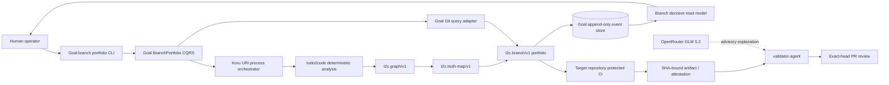
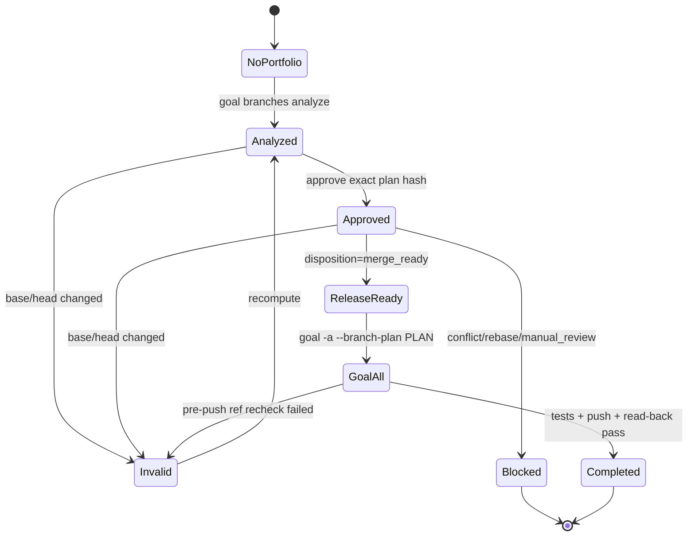
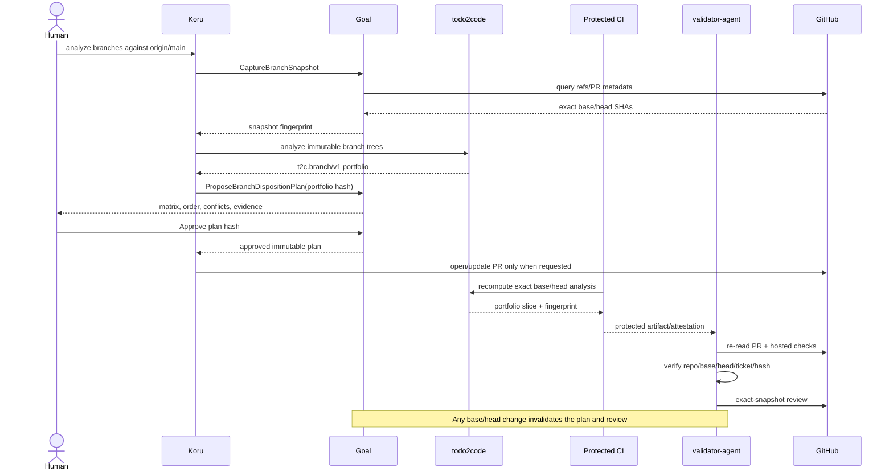

# Branch Intelligence with todo2code, Koru, Goal and Validator Agent

## Objective

Provide one deterministic view over many Git branches so a human can decide:

- which branch is ready to merge;
- which branch must be rebased or retargeted;
- which branches overlap textually or semantically;
- which branch duplicates or supersedes another;
- which merge order minimizes conflicts;
- which stale branch can be closed or deleted only after explicit approval.

The system recommends a disposition but does not silently merge, close, delete,
force-push or rebase a branch. A source-code conflict, an intent conflict and a
failed hosted check remain distinct facts.

The incident-derived diagnostic contract, operator command and division of
responsibility between todo2code, Goal, Giton, Validator Agent, Koru and
wellmanifest are specified in
[`GOVERNANCE_DIAGNOSTICS.md`](GOVERNANCE_DIAGNOSTICS.md). That document is a
follow-up architecture boundary, not an expansion of ticket 036's two-file
core implementation scope.

## One canonical DSL profile

The exchange format is one discriminated contract, `t2c.branch/v1`. It uses a
`kind` field for `snapshot`, `comparison`, `portfolio` and `validation`
projections instead of creating unrelated formats in each repository.

```json
{
  "schemaVersion": "t2c.branch/v1",
  "kind": "portfolio",
  "repository": "semcod/example",
  "base": {
    "ref": "refs/remotes/origin/main",
    "sha": "<40-hex>"
  },
  "snapshotFingerprint": "<sha256>",
  "branches": [
    {
      "ref": "refs/remotes/origin/ticket-123-example",
      "headSha": "<40-hex>",
      "mergeBaseSha": "<40-hex>",
      "ahead": 3,
      "behind": 1,
      "graphFingerprint": "<sha256>",
      "truthMapFingerprint": "<sha256>",
      "ticket": "ticket-123",
      "pullRequests": [
        {
          "number": 42,
          "state": "OPEN",
          "headSha": "<40-hex>",
          "baseRef": "main",
          "mergeCommitSha": null
        }
      ]
    }
  ],
  "interactions": [
    {
      "leftHeadSha": "<40-hex>",
      "rightHeadSha": "<40-hex>",
      "classification": "semantic_conflict",
      "pathEvidence": ["src/example.ts"],
      "recordIds": ["INT-NL-...", "INT-AST-..."],
      "relationIds": ["REL-..."],
      "mergeTreeFingerprint": "<sha256>"
    }
  ],
  "recommendations": [
    {
      "headSha": "<40-hex>",
      "disposition": "rebase_required",
      "advisory": true,
      "reasonCodes": ["BASE_BEHIND", "SEMANTIC_OVERLAP"],
      "evidenceIds": ["INT-NL-...", "REL-..."]
    }
  ],
  "provenance": {
    "todo2codeVersion": "<semver>",
    "goalVersion": "<semver-or-null>",
    "koruVersion": "<semver-or-null>",
    "generatedAt": "<display-only timestamp>"
  },
  "fingerprint": "<sha256>"
}
```

The fingerprint covers repository identity, exact base/head/merge-base SHAs,
normalized records, relations, merge-tree evidence and tool versions. It does
not cover the display timestamp. A moving branch name is never evidence by
itself.

`pullRequests` is a history, not a scalar. GitHub permits the same branch name
to be reused for more than one PR. A PR describes the current ref only when its
recorded `headSha` equals the resolved branch head; branch-name equality alone
must never transfer review, merge or ticket evidence.

## Evidence layers

todo2code already provides most of the primitives:

- source diff through the deterministic Git/Myers implementation;
- `t2c.graph/v1` comparison through `t2c.diff/v1`;
- Intent-vs-Reality diagnostics;
- ticket, communication, documentation, Git, AST, test and configuration
  extraction;
- stable record IDs, relations, source hashes and generator provenance.

The planned `t2c.truth-map/v1` projector from ticket-036 supplies a stable way
to group these records into declared intent, observed facts and claims. Branch
Intelligence adds repository topology and cross-branch interaction evidence;
it does not replace the graph.

| Evidence | Deterministic producer | Meaning |
| --- | --- | --- |
| ref topology | Goal Git adapter | exact refs, SHAs, merge base, ahead/behind |
| textual collision | Git `merge-tree` plus todo2code diff | the same lines/files cannot merge cleanly |
| semantic overlap | todo2code graph/truth-map comparison | branches affect the same mapped intent or target |
| duplicate patch | stable patch identity / cherry equivalence | equivalent change already exists elsewhere |
| ticket conflict | todo2code communication/governance records | scopes or accepted intents disagree |
| checks/review | GitHub protected boundary | exact-head execution and review state |
| recommendation | deterministic rules | advisory branch disposition with cited evidence |
| optional LLM review | Validator GLM 5.2 | explanatory advice only, never trust root |

## Portfolio algorithm

Scanning every pair with a full todo2code pipeline would be unnecessarily
quadratic. The implementation should:

1. Resolve and sort the requested remote refs; reject symbolic, missing or
   mutable inputs that cannot be pinned to exact SHAs.
2. Resolve all historical PR candidates per ref and classify each by exact
   recorded head SHA; do not assume one branch name maps to one PR.
3. Capture one immutable repository snapshot and a `merge-base` for every
   branch against the selected base.
4. Materialize each unique commit tree once in an isolated, read-only worktree
   or archive and run the deterministic todo2code pipeline once per tree.
5. Build a cheap index over changed paths, symbols, tickets and truth-map
   assertion IDs.
6. Create candidate branch pairs only when those indexes overlap or Git reports
   patch equivalence/ancestry.
7. Run `git merge-tree` and the deeper semantic comparison only for candidates.
8. Build a dependency/supersession DAG. A cycle, contradictory accepted intent
   or uncertain identity produces `manual_review`, never an invented order.
9. Emit a sorted `t2c.branch/v1` portfolio and reverse indexes from every Git,
   DSL and PR identifier to the affected recommendation.

Suggested disposition values are:

- `merge_ready`;
- `merge_after`;
- `rebase_required`;
- `retarget_required`;
- `duplicate`;
- `superseded`;
- `stale`;
- `conflict`;
- `manual_review`;
- `keep`.

`close` and `delete` are commands in Goal, not analyzer dispositions. They need
an approved plan hash and external authority.

## Component responsibilities



### todo2code

Owns semantic analysis and the canonical `t2c.branch/v1` schema/projector. It
does not fetch credentials, approve a PR or mutate refs. Planned deliveries:

1. ticket-036: truth-map core projector;
2. core-dsl ticket: branch comparison, interaction classifications and
   deterministic recommendation rules;
3. runtime ticket: bounded immutable-ref materialization and per-tree pipeline
   reuse/cache;
4. interfaces ticket: `t2c branches analyze`, MCP/A2A and optional Protobuf
   projection;
5. integration ticket: docs, schema publication and cross-repository fixtures.

### Goal

Owns the local Git portfolio process and approved mutations. It must not import
Koru. It consumes the versioned todo2code contract through CLI/JSON first and
can add Protobuf after the JSON contract is stable.

Commands:

- `CaptureBranchSnapshot`;
- `RequestBranchAnalysis`;
- `ProposeBranchDispositionPlan`;
- `ApproveBranchDispositionPlan`;
- `RevalidateBranchPlan`;
- `ExecuteBranchAction`.

Queries:

- `GetBranchPortfolio`;
- `GetBranchComparison`;
- `GetBranchDispositionPlan`;
- `ListStaleBranches`;
- `GetBranchEventStream`.

Events:

- `BranchSnapshotCaptured`;
- `BranchAnalysisCompleted` / `BranchAnalysisRejected`;
- `BranchDispositionProposed`;
- `BranchDispositionApproved` / `BranchDispositionRejected`;
- `BranchPlanInvalidated`;
- `BranchActionAttempted` / `BranchActionSucceeded` /
  `BranchActionFailed`.

Every apply command binds `repository`, `baseSha`, all affected `headSha`
values, the portfolio fingerprint, an approval hash and an idempotency key.
Merge, close and deletion are separate effects and receipts. Goal's existing
URI/DSL/CQRS+ES blueprint remains the architectural prerequisite; its dirty
local governance work must be completed without mixing this feature into it.

#### Current `goal -a` compatibility audit

Goal `2.1.284` was inspected and exercised with
`goal -a --dry-run --no-publish` against a temporary checkout containing one
staged documentation change. The current command:

- treats `-a` as the full test/commit/push/publish workflow;
- reads only the current staged diff for its commit/release preview;
- does not reference or invoke `todo2code`/`t2c` anywhere in the Goal runtime;
- does not enumerate a branch portfolio, resolve merge bases or consume
  `t2c.graph/v1` / `t2c.branch/v1`;
- exits before tests and remote mutations in dry-run mode;
- in a live non-interactive push, may handle a non-fast-forward rejection by
  performing `git pull --rebase` on the current branch and retrying once.

The observed dry-run reported one changed file, a proposed version bump and a
commit summary, but no branch, PR, todo2code or semantic-conflict evidence.
Focused Goal tests for the current push/retry and dry-run paths passed 41/41.

Therefore current `goal -a` **cannot consume Branch Intelligence**. Calling it
after analysis would also be too late: its automatic rebase retry can change
the exact snapshot on which a portfolio decision was based.

The safe Goal integration is a preflight state machine:



Proposed compatibility rollout:

1. Add standalone, read-only `goal branches analyze` and
   `goal branches show`; do not alter `goal -a` yet.
2. Add a Goal port that consumes canonical `t2c.branch/v1` JSON from a pinned
   todo2code CLI or Koru adapter. Goal must not import todo2code internals.
3. Add `branch_intelligence.mode = disabled|warn|require`, defaulting to
   `disabled` during dual-read rollout.
4. In `warn`, render cited recommendations but preserve existing behavior.
5. In `require`, make `goal -a` demand an approved portfolio fingerprint bound
   to the current repository/base/head before tests, versioning, commit, rebase,
   push or publish.
6. Disable the current automatic rebase retry whenever a branch plan is
   supplied. A non-fast-forward invalidates the plan and returns
   `BRANCH_PLAN_STALE`; recomputation is required.
7. Add `--branch-plan <path>` as the explicit compatibility input. Never locate
   a plan implicitly from an untrusted branch checkout.
8. Persist `BranchPlanValidated` or `BranchPlanRejected` before the first
   external effect and include the portfolio fingerprint in later receipts.

Required Goal validation:

- no portfolio mode preserves current `goal -a` characterization tests;
- wrong repository/base/head/tool version/plan hash fails before any mutation;
- `warn` never authorizes a merge or deletion;
- `require` blocks `conflict`, `manual_review`, `rebase_required` and stale
  plans;
- a moved remote between analysis and push produces no automatic rebase;
- event replay causes zero Git, test, registry or filesystem effects;
- the Koru adapter and direct Goal CLI produce byte-identical plan hashes.

### Koru

Owns local orchestration and operator experience:

- select bounded refs or PRs;
- invoke Goal queries and the todo2code analyzer through a versioned adapter;
- persist observation events in Koru's existing JSONL CQRS store;
- render a matrix/graph and request a human decision;
- enqueue an approved Goal command without implementing Git mutation itself.

Proposed URI bindings:

```text
git://repository/query/branches
git://repository/query/merge-base
t2c://repository/query/branch-portfolio
goal://branch-portfolio/command/propose
goal://branch-portfolio/command/approve
goal://branch-portfolio/command/apply
validator://pull-request/command/validate-portfolio
```

URI bindings point to governed processes, not shell fragments. The local Koru
adapter must use an isolated worktree and must preserve the user's current
dirty Koru checkout.

### validator-agent

Extends `direct-pr` rather than creating an unrelated approval path. The
request must additionally bind:

- exact `expected_base_sha` and `expected_head_sha`;
- `merge_base_sha`;
- `branch_portfolio_fingerprint`;
- todo2code schema/tool version;
- repository, PR, ticket and correlation ID;
- optional merge-queue/synthetic merge SHA when GitHub provides one.

The deterministic validator:

1. resolves the PR and rejects stale head or base;
2. obtains the protected analysis artifact from CI or recomputes it in an
   isolated exact-ref checkout;
3. verifies the canonical fingerprint and all repository/PR/SHA bindings;
4. requires the configured hosted checks;
5. blocks `conflict`, unresolved cycles, unsafe scope or missing evidence;
6. optionally asks `openrouter/z-ai/glm-5.2` for an advisory explanation;
7. re-resolves base/head immediately before review submission;
8. submits machine-readable approval/changes-requested evidence for that exact
   snapshot. It does not merge unless the existing separate merge feature is
   explicitly enabled and authorized.

Useful domain events in the existing Validator SQLite event store are
`BranchPortfolioReceived`, `BranchPortfolioVerified`,
`BranchPortfolioRejected`, `PullRequestSnapshotInvalidated` and
`ExactSnapshotReviewSubmitted`.

## End-to-end sequence



## Example decision matrix

| Branch | Behind/ahead | Text | Intent | Duplicate | Recommendation |
| --- | ---: | --- | --- | --- | --- |
| `ticket/A` | 0/3 | clean | aligned | no | `merge_ready` |
| `ticket/B` | 4/2 | clean | overlaps A | no | `merge_after A` then revalidate |
| `ticket/C` | 1/5 | conflict | conflict | no | `conflict` |
| `ticket/D` | 0/1 | clean | same assertion as A | yes | `duplicate` |
| `experiment/E` | 40/0 | clean | no unique evidence | no | `stale` |

This table is a read model. It does not authorize branch deletion or merge.

## Tokens and trust boundaries

- todo2code branch analysis is offline and needs no OpenRouter or GitHub write
  token.
- Local Goal/Koru use the operator's existing Git credentials only for an
  explicitly approved remote mutation; analysis uses read-only Git commands.
- `OPENROUTER_API_KEY` stays in the `subactor/validator-agent` Actions secret
  for Validator advisory review, or in a local untracked environment for a
  local opt-in explanation. It never enters DSL, artifacts, logs, URLs, PR
  bodies or commits.
- Validator uses a repository-scoped GitHub App installation token. The target
  CI job must not accept an artifact committed by the PR as trusted evidence.
- A target repository resolver trusts only allowlisted Validator App identity
  and exact current-snapshot bindings.

## Required tests

Use an offline fixture repository with at least five branches:

1. disjoint clean branches;
2. a textual merge conflict;
3. a semantic conflict without a textual conflict;
4. equivalent cherry-picked patches with different commit IDs;
5. a stale branch already contained in the base.

Prove:

- deterministic results under ref enumeration and JSON property reordering;
- one pipeline scan per unique tree, not per pair;
- stale base/head invalidation;
- merge-order cycle rejection;
- no branch mutation during query/plan/replay;
- Goal event replay produces the same read model and zero Git effects;
- Koru URI adapters preserve correlation, causation and fingerprint fields;
- Validator rejects wrong repo/PR/base/head/ticket/hash and arbitrary artifacts;
- Protobuf, when added, round-trips to the same canonical JSON fingerprint;
- no test needs a live LLM, GitHub mutation or network access.

## Rollout order

1. Approve and implement todo2code ticket-036.
2. Publish the stable core branch-analysis contract in bounded todo2code
   tickets.
3. Complete Goal governance adoption and add the BranchPortfolio CQRS context
   in dual-read mode; no mutations yet.
4. Add the Koru local adapter and matrix renderer against fixture repositories.
5. Add target CI artifact generation and validator-agent exact-snapshot
   verification in advisory mode.
6. Enable protected Validator review only after negative stale/tampering tests
   pass.
7. Add Goal mutation commands one at a time: rebase/retarget planning first,
   merge second, close/delete last and always with explicit approval.

Each repository receives its own ticket and non-overlapping branch/worktree.
Cross-repository correlation uses one stable ID, but one ticket never transfers
path ownership into another repository.

## Live design validation

The first read-only audit against the real `wellmanifest/new-project` remote is
recorded in
[`LIVE_AUDIT_WELLMANIFEST_2026-08-04.md`](LIVE_AUDIT_WELLMANIFEST_2026-08-04.md).
It demonstrated contained merged branches, one divergent but semantically
superseded branch, same-name multi-PR history and the need to bind both base and
head SHAs.

The same audit verified that Goal `2.1.284` does not yet consume todo2code
branch evidence and documented the required fail-closed `goal -a` preflight
integration above.
